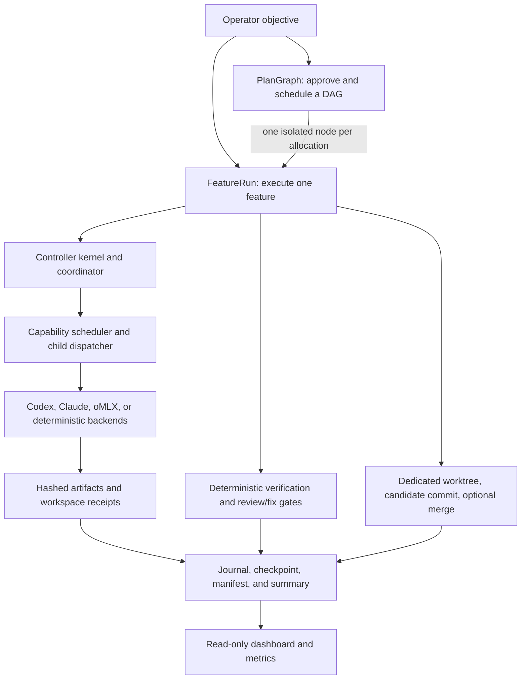

# Harness Labs user guide

Status: active

Harness Labs is a research and engineering toolkit for building auditable,
autonomous coding harnesses. Its main composition is **GraphRun**: a PlanGraph
breaks a large change into a dependency graph, and each node runs as a
worktree-isolated FeatureRun. The repository also ships the reusable controller,
provider adapters, audit system, dashboard, project initializer, and examples.

This guide maps the implemented capability families and supported operator
entry points. “Implemented” does not necessarily mean “turnkey for every
repository”; the maturity column and limitations section make that distinction.

## System map



The normal lifecycle is:

```text
orient -> plan -> implement -> verify -> review -> integrate -> report
```

A PlanGraph-bound FeatureRun skips only `orient` and `plan`; the graph supplies
the approved planning packet. All later FeatureRun gates remain in force.

## Feature map

| Capability | What it provides | Primary interface | Maturity |
| --- | --- | --- | --- |
| GraphRun | PlanGraph plus FeatureRun with role-by-role provider selection | `harness_labs.graphrun` and top-level exports | Current composition; integration code |
| FeatureRun | Isolated branch/worktree, coordinator phases, deterministic verification, bounded repair, review/fix, scoped commit, optional guarded merge | `run_feature_worktree(...)`, `run_plan_graph_feature_worktree(...)` | Production-shaped library API |
| PlanGraph | Immutable DAG registration, dependency scheduling, parallel allocation, path ownership, node sealing, integration, retry/reuse, and resume | `scripts/run_plan_graph.py`, `harness_labs.plangraph` | Shipped CLI and API; needs a FeatureRun launcher |
| Plan approval | Binds a committed decomposition to repository identity, base commit, scopes, gates, timeouts, and executable evidence | `scripts/approve_plan.py` | Shipped operator CLI |
| Hybrid controller | Typed command kernel, revision/idempotency checks, task tree, criteria, findings, evidence queries, segmented coordinators, durable resume | `harness_labs.core.controller_*` | Implemented prototype and substrate |
| Agent scheduling | Fresh executor per attempt, repeated roles, capability matching, bounded subchildren, parallel batches, ordered joins | `CapabilityScheduler`, `ChildDispatcher` | Reusable API |
| Agent mixtures | Declarative `provider:model@effort` choices for coordinator and worker roles | `harness_labs.graphrun.agent_mixture` | Codex and Claude providers |
| Provider adapters | Deterministic poem, isolated Codex, tool-less Claude, resident Codex/Claude sessions, loopback oMLX | `harness_labs.core.backends` and session classes | Test, local, and live adapters |
| Capability broker | Deny-by-default browser, network, and external effects with allowlists, authorization, idempotency, and receipts | `CapabilityBroker` | Implemented; application supplies real handlers |
| Git transactions | Clean-base validation, dedicated worktree/branch, path grants, candidate commit, stale-base protection, merge read-back | `GitWorktreeTransaction` | Reusable API |
| Review and recovery | Stable finding ledger, review/fix cycles, cross-node transfers, deterministic reruns, bounded repair | `ReviewFixLoop`, FeatureRun policies | Integrated in FeatureRun |
| Audit and evidence | Private append-only hash chain, content-addressed artifacts, atomic checkpoints, terminal manifests, recovery | `AuditJournal`, `scripts/audit_run.py` | Shipped API and CLI |
| Usage and metrics | Tokens, cache reads, tool calls, durations, explicit pricing, summaries, catalogs, projections | `harness_labs.observability` | Integrated when source events exist |
| Dashboard | Read-only DAG state, liveness, lineage, evidence references, retry history, and metrics | `scripts/run_dashboard.py` plus React/Vite | Shipped local UI |
| Project initializer | Creates a repository from base plus `python`, `web`, or `regulated-health`; installs workflows and module docs | `bin/initialize-project` | Shipped CLI |
| Portable workflows | Module docs, learning capture, local review, and PR review | `skills/` copied by initializer | Opt-in templates; deprecated implementation skills are not supported workflows |
| Contracts and policy | Schemas for commands, runs, events, receipts, approvals, graph state, integration, and recovery | `schemas/`, `docs/architecture/` | Versioned static plane |
| Examples and experiments | Deterministic attempts, delegated tools, worktree survey, sample FeatureRuns, real research PlanGraphs | `examples/`, `experiments/` | Demonstrations, not universal CLIs |

## Prerequisites and health checks

Run commands from the repository root. This is a source-based Python project;
there is no package installation step.

- Python 3.11 or later and Git are required. Install `pytest` into the selected
  Python environment for the complete red/green contract tests, even when the
  outer suite is launched with `unittest`.
- Node.js and npm are required only for the dashboard.
- Install and authenticate `codex` or `claude` only for routes using that provider.
- Start an oMLX-compatible loopback server only for oMLX examples.

Check the checkout:

```sh
git status --short
python3 scripts/check_repository_contracts.py
python3 -m unittest discover -s tests -v
```

Browser certification additionally requires Chrome. Set
`DASHBOARD_E2E_CHROME` when it is not in a standard path.

## Choose a starting point

| Goal | Start here |
| --- | --- |
| Seed a harness-aware project | `bin/initialize-project` |
| Learn execution without a live model | `examples/run_poem_attempt.py` |
| Test parent/child delegation | `examples/run_delegated_treasure_attempt.py` |
| Run live analysis/planning against a checkout | `harness_labs.core.controller_live_scenarios` |
| Develop one feature programmatically | `run_feature_worktree(...)` |
| Run a multi-feature program | approval CLI, then PlanGraph CLI |
| Inspect existing runs | audit CLI and dashboard |

## 1. Initialize a new project

The target directory must not already exist. Overlays are ordered and repeated
as separate `--template` flags.

```sh
python3 bin/initialize-project /absolute/path/to/new-project \
  --name "Example Service" \
  --purpose "An auditable autonomous development harness" \
  --template python \
  --module src/example_service \
  --skill-surface codex
```

Available overlays are `python`, `web`, and `regulated-health`. The default
skill surface is `both`; choose `claude`, `codex`, or `both`. Codex skills go to
`.agents/skills/`, Claude commands to `.claude/commands/`, and module docs are
`context.md` plus `API.md`.

The initializer rejects traversal, symlinks, undeclared collisions, unsafe
metadata, and existing targets. It stages all content before atomic publication.

## 2. Run the small examples

Start with deterministic execution:

```sh
python3 -m examples.run_poem_attempt
python3 -m examples.compare_poem_backends
```

Exercise parent/child delegation and retained sessions:

```sh
python3 -m examples.run_delegated_treasure_attempt --backend codex
python3 -m examples.run_delegated_treasure_attempt --parent all --child all
```

The Codex child follows a locator through its granted `read_file` capability.
The oMLX child lacks that capability and must refuse. Each route records the
session, tool exchange, child causality, follow-up turn, and termination.

With an oMLX server at `127.0.0.1:8100/v1`:

```sh
python3 -m examples.run_omlx_poem_attempt
python3 -m examples.run_delegated_treasure_attempt --backend all
```

The adapter rejects non-loopback endpoints. To survey registered worktrees with
parallel read-only Codex children:

```sh
python3 -m examples.parallel_worktree_survey /absolute/path/to/repository \
  --max-parallelism 4
```

## 3. Run the hybrid controller

A deterministic fixture exercises the real kernel, scheduler, coordinator,
checkpoint, and manifest without a live model:

```sh
python3 -m harness_labs.core.controller_run \
  --fixture /absolute/path/to/fixture.json \
  --run-dir /absolute/path/to/new-run-directory
```

For live, read-only Codex analysis against an explicitly selected clean checkout:

```sh
python3 -m harness_labs.core.controller_live_scenarios \
  --repository /absolute/path/to/repository-worktree \
  --scenario all \
  --model gpt-5.6-terra \
  --reasoning medium
```

Scenarios are `history-plan`, `dark-mode-ui`, and `idealized-product`. They are
research fixtures with fixed objectives. Build custom runs with `RunContract`,
`RoleProfile`, `run_controller(...)`, and `resume_controller(...)`.

## 4. Integrate FeatureRun

FeatureRun is primarily a Python API. Import from `harness_labs` or the narrower
`harness_labs.featurerun` package:

```python
from harness_labs import (
    run_feature_worktree,
    standard_feature_run_dispatch_schema,
    standard_feature_run_policy,
)
from harness_labs.featurerun.feature_run import VerificationGate
```

A caller supplies:

1. a clean base repository, base branch/commit, feature branch, and worktree;
2. a `RunContract` with objective, criteria, repository identity, phases, and limits;
3. a coordinator dispatch schema and session factory;
4. role profiles with explicit capabilities and writable paths;
5. allowed commit paths and a deterministic verification command; and
6. optional repair, review/fix, recovery-agent, pricing, and merge settings.

`run_feature_worktree(...)` owns worktree creation, coordinator segments,
workspace receipts, deterministic verification, configured repair and rerun,
review/fix, scoped staging, candidate commit, and optional guarded merge. Merge
defaults off. Exhausted repair preserves the candidate worktree for inspection.

Complete wiring examples live in `experiments/run_archimedes_feature.py`,
`run_retinology_demo_feature.py`, `run_rocketship_feature.py`, and
`run_trebuchet_feature.py`. They contain experiment-specific paths and prompts;
copy the construction pattern, not the command unchanged.

### Select agents by role

```python
from harness_labs import BackendSpec, parse_backend_spec

worker = parse_backend_spec("codex:gpt-5.6-terra@medium")
reviewer = BackendSpec("claude", "claude-opus-5", "medium")
```

`build_role_profiles(...)` binds a mapping such as `{"builder":
"codex:gpt-5.6-terra@medium", "reviewer":
"claude:claude-opus-5@medium", "*": "codex:gpt-5.6-terra@low"}` to declared
`WorkerRole` contracts.

## 5. Approve and run a PlanGraph

PlanGraph consumes committed JSON using `plan-graph-plan/1`. It defines
acceptance criteria, nodes, dependencies, owned paths, path intents,
verification commands/timeouts, and graph-level functionality tests. See
`docs/development/*-decomposition.json` for complete examples and validate with
`schemas/plan-graph-plan.schema.json`.

### Recommended approval flow

The decomposition and referenced artifacts must be committed. Prepare the
immutable subject and gate evidence:

```sh
python3 scripts/approve_plan.py prepare \
  docs/development/my-feature-decomposition.json \
  --repository "$PWD" \
  --output-directory /absolute/private/path/approval
```

Review both outputs, then create an attestation matching
`schemas/plan-operator-approval.schema.json`:

```json
{
  "protocol": "plan-operator-approval/1",
  "subject_sha256": "<prepare output subject_sha256>",
  "actor": "<operator identity>",
  "approved_at": "<RFC 3339 timestamp>",
  "statement": "I approve this exact repository-bound plan subject."
}
```

Issue the receipt:

```sh
python3 scripts/approve_plan.py issue \
  --repository "$PWD" \
  --subject /absolute/private/path/approval/subject.json \
  --gate-evidence /absolute/private/path/approval/gate-evidence.json \
  --operator-approval /absolute/private/path/approval/operator-approval.json \
  --receipt /absolute/private/path/approval/receipt.json
```

Run with a Python `module:callable` launcher:

```sh
python3 scripts/run_plan_graph.py run \
  --repository "$PWD" \
  --approval-receipt /absolute/private/path/approval/receipt.json \
  --decomposition docs/development/my-feature-decomposition.json \
  --graph-attempt-id my-feature-attempt-1 \
  --launcher my_package.feature_launcher:launch
```

Use `--launcher-command ...` for an executable. The repository does not ship a
universal launcher: it is the project-specific binding from a typed graph node
request to `run_plan_graph_feature_worktree(...)`.

### Registration, resume, and budgets

Direct registration remains available:

```sh
python3 scripts/run_plan_graph.py register \
  docs/development/my-feature-decomposition.json \
  --repository "$PWD" \
  --logical-graph-id my-feature
```

Pass the printed path to `run --registration`. Approval receipts are recommended
for new operator-controlled runs.

Resume by adding `--resume`, `--logical-graph-id`,
`--predecessor-attempt-id`, and one or more `--retry-frontier NODE_ID` options.
Only verified, identity-matching sealed nodes are reused. Retry allowance is
durable per lineage and can be explicitly extended:

```sh
python3 scripts/run_plan_graph.py budget extend \
  --repository "$PWD" \
  --lineage-id LINEAGE_ID \
  --node NODE_ID \
  --launches 1 \
  --reason "operator-authorized additional attempt"
```

`scripts/plan_graph_recover.py` consumes a durable block escalation and applies
bounded recovery. `scripts/import_plan_graph_state.py` is deliberately retired:
legacy sequential state lacks enough evidence for safe reuse.

## 6. Verify and recover run evidence

Runtime output normally lives at `logs/runs/<run-id>/`:

```text
events.jsonl       append-only hash-chained events
decisions.jsonl    material decisions
checkpoint.json    resumable state and phase authority
summary.json       terminal outcome and metrics
manifest.json      chain head and artifact inventory
artifacts/         content-addressed evidence
liveness.json      optional ephemeral local liveness
```

```sh
python3 -m scripts.audit_run verify logs/runs/<run-id>
python3 -m scripts.audit_run recover logs/runs/<run-id> \
  --reason "controller process disappeared"
```

Recovery validates before terminalizing as interrupted; it does not replay
model or tool effects. Never log credentials, authentication headers, private
prompts, raw reasoning, sensitive personal data, or unredacted third-party data.

## 7. Run the dashboard

```sh
npm --prefix dashboard/plan-graph install
npm --prefix dashboard/plan-graph run build
python3 scripts/run_dashboard.py \
  --audit-root logs/runs \
  --assets-root dashboard/plan-graph/dist
```

Open `http://127.0.0.1:8000`. Repeat `--audit-root` for multiple roots or use:

```json
{
  "protocol": "harness-dashboard-audit-root-registry/1",
  "audit_roots": [
    "/absolute/path/to/project-a/logs/runs",
    "/absolute/path/to/project-b/logs/runs"
  ]
}
```

```sh
python3 scripts/run_dashboard.py \
  --audit-root-registry /absolute/path/to/roots.json \
  --assets-root dashboard/plan-graph/dist
```

The dashboard is read-only. It verifies journals, isolates malformed runs,
detects duplicate IDs, polls with ETags, and shows absent facts as unavailable.
It has no authentication, mutation controls, raw-artifact view, or remote
hosting layer; retain the loopback bind unless you add a security boundary.

```sh
npm --prefix dashboard/plan-graph run verify
DASHBOARD_E2E_CHROME=/absolute/path/to/chrome \
  python3 -m unittest tests.test_dashboard_e2e
```

## Extension points

- Implement `TextBackend` for text completion or `AgentSession` for a resident
  native-tool transport.
- Implement `Executor` for a task boundary and return a matching `TaskResult`.
- Add `RoleProfile` for a role, capabilities, schema, sandbox, and executor factory.
- Inject capability-broker handlers for browser, HTTP, email, or other systems.
- Supply a FeatureRun launcher connecting PlanGraph requests to project roles,
  gates, and worktree policy.
- Consume `RunCatalog`, `RunMetricsProjector`, or the dashboard HTTP API for a
  custom read-only view.

Public convenience exports are in `harness_labs`; boundaries live in
`harness_labs.core`, `featurerun`, `plangraph`, `observability`, and `graphrun`.
Dependency direction is checked by `scripts/dev/check_import_boundaries.py`.

## Current limitations

- This remains a research repository. `docs/development/NEXT_STEPS.md` lists an
  uninterrupted live FeatureRun certification and full-entrypoint gates as open.
- FeatureRun is an API, not a universal CLI; repositories bind their own roles,
  allowed paths, sessions, and gates.
- PlanGraph needs an application-specific FeatureRun launcher.
- Capability policies exist, but real external handlers are host-supplied.
- Live controller scenarios have fixed research objectives.
- Cost is complete only when authoritative prices are supplied.
- Depth and direct-child limits default to five; other limits may be unbounded
  unless the run contract sets them.
- The dashboard observes but never controls runs.
- Experiments can contain machine-specific assumptions.
- `skills/codex/implement-v13-codex/` is a deprecated, non-functional historical
  template. Do not install, invoke, or use it as evidence of a supported
  FeatureRun path. The initializer excludes it; its remaining checked-in files
  are cleanup debt, not a usable feature.

## Further reference

- [Architecture contract](architecture/harness-contract.md)
- [Context engineering](architecture/context-engineering.md)
- [Coordinator dispatch](architecture/coordinator-dispatch.md)
- [Capability brokers](architecture/capability-brokers.md)
- [Logging and metrics](observability/logging-and-metrics.md)
- [PlanGraph operations](development/plan-graph-operations.md)
- [Dashboard operations](development/live-plangraph-dashboard-operations.md)
- [Development status](development/NEXT_STEPS.md)
- [Portable skill inventory](../skills/README.md)
