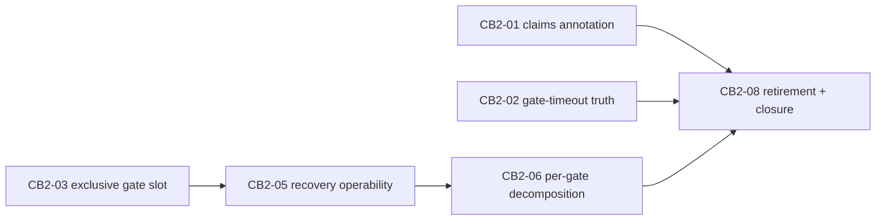

# Contract-burden relaxation 2 — PlanGraph program plan

**Status:** revised after a three-lens adversarial Opus review (NECESSITY /
FRAME / MECHANISM); lens summaries and the adjudication — including the
review-ledger probe that withdrew item 15 — are committed under
`docs/development/plan-review-cb2/`.
**Provenance:** every node cites `docs/development/contract-burden-reduction.md`
items verified GENUINELY OPEN by the adversarial verification pass of
2026-08-13 and surviving lens review: item 8 (second half — CB2-06), item 11
(CB2-01), item 14 (CB2-02 + CB2-03), item 16 (CB2-05). Item 15 was withdrawn
after the blocked run's own review ledger showed recurrence, not new-scope
discovery (its node CB2-04 is deleted). Item 10's general half was found
already landed by construction at RED_BASE
(`tests/test_feature_run.py:939` drives the direct path with gate criteria +
argv to `succeeded`); its node CB2-07 is deleted and CB2-08 records the
composition recipe as the closure. Node ids are retained without renumbering;
CB2-04 and CB2-07 are tombstones.
**Backend:** claude mixture, pinned — coordinator `claude:claude-fable-5@medium`,
implementers `claude-sonnet-5`, reviewers `claude-opus-5`.

## Preconditions (all satisfied before decomposition freeze)

1. **CB-1 candidate adopted.** `8afa0190` merged into
   `contract-burden-relaxation` at `e605fff`, keeping the branch side of: the
   reuse-custody fixes (`plan_graph_audit.py`, item 12), the parallel-shape
   checkpoint validator (`plan_graph.py`, item 13), the `claims_rule` pin in
   the CB-1 launcher, and the resume launcher operability fixes. FRAME lens
   verified each assertion holds at `e605fff`. Union suite: 417 passed,
   1 skipped.
2. **`RED_BASE` frozen at the merge commit** —
   `e605fffc90d880fc7e5bb3d779b82b29f74f8e20` — and recorded mechanically as
   `RED_BASE` in the CB-2 runner (Precondition 3). Every node's red phase runs
   against it via `scripts/dev/red_green_check.py --base`.
3. **The CB-2 runner exists as frozen program infrastructure.**
   `experiments/run_burden2_plan_graph.py` (commit `838c162`) is a copy of the
   CB-1 launcher retargeted to this plan (`## CB2-\d\d` sections,
   `AC-CB2\d\d-\d+` criteria, `RED_BASE = e605fff…`, `--timeout 1400`,
   `verification_timeout_seconds` 3600, `max_parallelism=2`, run root
   `logs/runs/cb2-graph`, logical id `contract-burden-relaxation-2`, `claims_rule`
   pin retained verbatim). It is in NO node's owned paths and is frozen for the
   program's duration. Note: the registration's `base_commit` is the HEAD at
   registration time (which includes this plan and the runner) and therefore
   differs from `RED_BASE`; the red phase is pinned to `RED_BASE` explicitly by
   argv, not by the registration base.

## Program rules

1. **Red/green is the contract, enforced mechanically.** Each node ships a
   single-file, self-contained finding test that fails behaviorally on the
   frozen base (pytest exit 1, ≥1 FAILED, 0 errors) and passes on the candidate
   together with the full suite, gated by `scripts/dev/red_green_check.py`.
   Additional evidence discipline (MECHANISM lens): the red gate proves only
   "≥1 FAILED", so each node's implementation summary MUST paste the base
   phase's `red.tail` and the FAILED node ids, which MUST match the AC's
   enumeration — a red for the wrong reason is grounds for review rejection.
   Multi-defect nodes use one test method per defect class, each independently
   red on base. Red-phase constructions that provoke exceptions must live
   inside test methods or `unittest` `setUp` (both count as FAILED); module
   scope raises are collection errors and are rejected by the gate; pytest
   fixtures must not be used in finding tests (a fixture raise counts as an
   error, not a failure). **Sole exemption:** CB2-08 is a retirement/closure
   node with no finding test; its gate is the dual-phase retirement check plus
   the full suite (see its ACs).
2. **Gate budgets are hang detectors, not load estimates.** Measured on the
   frozen base: full suite 42s; a complete red+green gate cycle 2.2s. Node
   gates run with `--timeout 1400` per phase and `verification_timeout_seconds`
   3600 — ~600× headroom; a gate that hits these budgets is a defect or a
   hang, not congestion. Until CB2-03 seals, at most two nodes are admitted
   concurrently (lesson of CB-06). A third consecutive gate timeout on one node
   means the machine is unusable — recover via `resume`/`extend_budget`, never
   by dispatching a repair worker at a timeout.
3. **Relaxation never widens authority.** The keep-list (receipt/digest
   binding, write-grant enforcement, controller-owned deterministic
   verification, hash-chained journals) is out of bounds. In particular:
   registered `verification_argv`, `verification_timeout_seconds`, and every
   digest bound by the approval are never rewritten at runtime; per-gate repair
   never certifies a tree that the full declared verification has not passed.
4. **Recovery discipline.** The graph registers `automatic_recovery` (`resume`,
   `extend_budget`) on the RB ledger with a lineage-stable run root, passes the
   stable `logical_graph_id` from the first attempt, imports structured
   verification evidence per node, and recovers blocked nodes by
   `PlanGraph.resume` — never whole-graph relaunch.
   `verification_repair_limit=3`. A lineage started under `RED_BASE` resume
   semantics MUST be resumed under those semantics: do not merge CB2-05's
   candidate into the branch the runner executes from until every open attempt
   lineage is terminal.
5. **Claims-pin lifecycle.** The `claims_rule` pin stays in the live CB-2
   runner for the entire program — the running harness is frozen at `RED_BASE`
   and no candidate affects it mid-program. CB2-08 retires the pin only from
   the inert CB-1 launcher (`experiments/run_burden_plan_graph.py`); retiring
   the CB-2 runner's own pin is a post-program operator step, tracked in the
   living doc.
6. **Ownership covers consequences.** Every node's owned paths include the
   existing test modules for the sources it touches, so an assertion
   invalidated by a legitimate relaxation is repairable inside the node rather
   than blocking at an unownable green phase.
7. **Explicitly deferred:** item 6's provenance acceptance being narrower than
   its closure text; CB-05's dirty-baseline grant helper silently no-opping
   for grant-unaware executors; node-level `RecoveryAgent`; verdict-field
   classification of red_green JSON beyond the timeout case (MECHANISM M11).

## Dependencies and parallelism

Edges exist only where nodes share owned files or consume another node's
mechanism. Shared-file chains: `plan_graph.py` and `plan_graph_audit.py` —
CB2-03 → CB2-05 → CB2-06; `feature_run.py` — CB2-03 → … → CB2-06;
`tests/test_plan_graph.py` — same chain. Roots CB2-01, CB2-02, CB2-03 are
mutually file-disjoint and may run concurrently (≤2 admitted). The sink
CB2-08 depends on every surviving node and runs the full suite in its own
gate, so the final join is verified inside a repairable node, never first at
the graph functionality stage.

## CB2-01 — Claims vocabulary becomes annotation, not violation

Objective: Implement one shared helper, consumed by both live executors, that records out-of-assignment entries in a worker result's satisfied_criteria field as an audited annotation and drops them from the accepted payload instead of raising "worker claimed unassigned criteria", so review/fix/verify workers that echo criterion vocabulary can no longer kill a gate-passing node. (Item 11.)

Owned paths: `harness_labs/controller_live.py`, `harness_labs/claude_task_executor.py`, `tests/test_controller_live.py`, `tests/test_claude_task_executor.py`, `tests/test_relax_claims.py`.

- AC-CB201-1: a worker result whose `satisfied_criteria` names criteria outside the task's assigned set completes the task; the out-of-assignment ids are removed from the recorded satisfied set and journaled as a distinct annotation event carrying the dropped ids; the comparison-and-drop rule is implemented once in a shared helper and neither `controller_live.py` nor `claude_task_executor.py` retains its own copy.
- AC-CB201-2: entries within the assigned set are validated and recorded exactly as before; `criterion_coverage` is derived from the filtered set, and the kernel's own rejection of criterion coverage outside the task's assignment is unchanged.
- AC-CB201-3: tests/test_relax_claims.py fails behaviorally against the frozen base harness (a review-shaped dispatch with empty acceptance_criteria dies with "worker claimed unassigned criteria" in each executor) and passes on the candidate together with the full suite.

## CB2-02 — Gate timeouts tell the truth to the classifier

Objective: Make a red_green_check phase timeout machine-readable to the existing verification-failure classifier — the script exits 124 and emits a top-level timed_out marker in its JSON verdict when either phase times out — so the already-landed structured rules (timed_out flag, exit 124) classify gate timeouts infrastructure_transient with zero change to feature_run.py. (Item 14, classification half.)

Owned paths: `scripts/dev/red_green_check.py`, `tests/test_relax_gate_timeout_classification.py`.

- AC-CB202-1: red_green_check.py exits with code 124 and emits a top-level "timed_out": true field in its JSON verdict when either phase times out; non-timeout verdicts keep their current exit codes and shape byte-for-byte.
- AC-CB202-2: `classify_verification_failure` is not modified; the finding test proves the existing `timeout-exit-124` structured rule fires on the new verdict and asserts the emitted rule id.
- AC-CB202-3: tests/test_relax_gate_timeout_classification.py fails behaviorally against the frozen base harness — a phase-timeout verdict (exit 1, no top-level timed_out) classifies as something other than infrastructure_transient (base yields product or indeterminate depending on captured tail length; both charge the repair class) — and passes on the candidate together with the full suite.

## CB2-03 — Exclusive gate execution slot under parallel admission

Objective: Serialize deterministic gate execution across the ready set — when more than one node is admitted, at most one node's verification command runs at a time under a graph-owned exclusive slot, with acquisition and release journaled per node — so admitting siblings can never silently halve a gate's effective wall-clock budget, while the registered verification_argv, verification_timeout_seconds, and every approval-bound digest remain untouched at runtime. (Item 14, load half; the CB-06 failure mode.)

Owned paths: `harness_labs/plan_graph.py`, `harness_labs/plan_graph_audit.py`, `harness_labs/feature_run.py`, `tests/test_plan_graph.py`, `tests/test_plan_graph_parallel_run.py`, `tests/test_feature_run.py`, `tests/test_relax_gate_concurrency.py`.

- AC-CB203-1: when max_parallelism exceeds 1, verification-command execution is mutually exclusive across concurrently admitted nodes via a graph-held slot threaded through the feature-run request; node work outside the verification stage (dispatch, review, fix) remains parallel; slot acquisition and release are journaled per node through a typed PlanGraphAudit method carrying the admitted-concurrency count.
- AC-CB203-2: with max_parallelism=1 behavior is byte-identical to today — no slot events, no runtime value diverging from the registered plan run payload; the registered verification_argv and its gate digest are unchanged by admitted concurrency.
- AC-CB203-3: tests/test_relax_gate_concurrency.py fails behaviorally against the frozen base harness (two admitted nodes' stub verification commands are observed executing with overlapping spans and no slot events in the graph journal) and passes on the candidate together with the full suite.

## CB2-04 — (deleted)

Withdrawn after adjudication: the blocked run's review ledger proved the
ceiling bound on recurring findings (non-convergence), not new-scope
discovery, and the plan's red scenario is unreachable by code reading
(`review_fix.py:239-247, 302-304, 532-544`). Item 15 is withdrawn in the
living doc. See `plan-review-cb2/adjudication.md` §1.

## CB2-05 — Recovery API operability

Objective: Remove the verified resume-operability defects — blocker evidence refs resolve through child-run journals reachable from the graph journal, the logical graph id defaults from the registration and is resolved from the predecessor's persisted binding on resume, a graph_run_id kwarg is rejected with a typed error, and a partial successor directory left by an admission crash is safely reclaimed through the existing append-only reconciliation instead of inflating the attempt ordinal. (Item 16.)

Owned paths: `harness_labs/plan_graph.py`, `harness_labs/plan_graph_audit.py`, `tests/test_plan_graph.py`, `tests/test_plan_graph_recover.py`, `tests/test_plan_graph_reuse_chain.py`, `tests/test_relax_resume_operability.py`.

- AC-CB205-1: a RepairResumeDirective whose blocker_evidence_ref names an artifact recorded in a child run's journal (reachable from the predecessor graph journal, resolved through the existing child-evidence indexing) is accepted; refs recorded nowhere in the lineage are still rejected.
- AC-CB205-2: absent an explicit logical_graph_id, the graph defaults to registration.logical_graph_id — never to graph_run_id and never to a freshly minted value — and RepairResumeDirective.logical_graph_id becomes optional, resolved from the predecessor attempt's persisted registration binding, with a typed PlanGraphError if the binding is absent or disagrees with an explicitly supplied id; successor directory naming and lock ids are unchanged.
- AC-CB205-3: PlanGraph.resume called with a graph_run_id kwarg raises PlanGraphError naming the conflict before any lock or directory is created.
- AC-CB205-4: a successor attempt directory carrying no successor-allocation event is reclaimed only when (i) that event is absent, (ii) the child liveness probe reports no live process for it, and (iii) the exclusive lineage flock is held; reclaim renames the directory (never deletes a journal), appends a reclamation event through the existing append-only reconciliation path, makes the ordinal re-allocatable, and AuditJournal verification passes over the lineage afterwards; absent any condition the resume deterministically declines and mints the next ordinal as today.
- AC-CB205-5: tests/test_relax_resume_operability.py fails behaviorally against the frozen base harness with one test method per defect class above, each independently red, and passes on the candidate together with the full suite.

## CB2-06 — Per-gate verification decomposition

Objective: Allow a node's deterministic verification to be declared as an ordered tuple of named gates each with its own argv and timeout — expressible through the canonical plan contract, capped per gate by the approval policy, digest-covered as a total function of the declared shape — executed and classified per gate with per-gate strict-subset repair renewal, while a single flat verification_argv remains valid and byte-identical in behavior. (Item 8, second half.)

Owned paths: `harness_labs/plan_graph.py`, `harness_labs/feature_run.py`, `harness_labs/plan_graph_budget.py`, `harness_labs/plan_graph_contract.py`, `harness_labs/plan_approval.py`, `tests/test_plan_graph.py`, `tests/test_feature_run.py`, `tests/test_plan_graph_budget.py`, `tests/test_relax_gate_decomposition.py`.

- AC-CB206-1: the canonical run payload accepts an optional verification_gates key (ordered tuple of named gates, each with argv and timeout); its absence produces a byte-identical canonical payload and plan digest for every existing decomposition, and each gate's timeout is checked against the approval policy's MAX_TIMEOUT_SECONDS in prepare_approval.
- AC-CB206-2: a node declaring multiple named gates runs them in order, records one command attempt with classification and evidence per gate, and each gate's failing-identifier set drives the existing strict-subset repair renewal scoped to the gate that motivated the repair; an infrastructure_transient failure on one gate does not void the passing evidence of the others.
- AC-CB206-3: a repair dispatch is scoped to the failing gate's evidence and identifiers, but re-verification after any repair re-runs the full gate tuple from the first gate, so a passing certification always reflects one consistent tree state; only infrastructure_transient retries (no tree mutation) may resume at the failed gate.
- AC-CB206-4: gate_digest becomes a total function over the declared verification shape — flat argv or gate tuple — such that a flat-argv node's digest is byte-identical to today's and two distinct gate tuples never collide; registration, reservation, and resume revalidation all route through it, and the ledger's gate-change authorization is proven to fire on a gate-tuple edit.
- AC-CB206-5: nodes declaring the existing single verification_argv are unaffected — same events, same budget accounting — and tests/test_relax_gate_decomposition.py fails behaviorally against the frozen base harness (a gate-tuple declaration is rejected by the canonical contract; per-gate classification is impossible) and passes on the candidate together with the full suite.

## CB2-07 — (deleted)

Withdrawn after adjudication: no restriction exists to lift —
`tests/test_feature_run.py:939` drives the direct path with gate-backed
criteria plus verification_argv to `succeeded` at RED_BASE, and
`completion_failures` excludes gate-backed criteria unconditionally. The
residual is a composition recipe (pair gate criteria with a verify-free
segment schema, as the plan-graph binding composes), recorded by CB2-08's doc
closure of item 10. See `plan-review-cb2/adjudication.md` §2.

## CB2-08 — Workaround retirement and diagnosis closure

Objective: Retire the claims_rule pin from the inert CB-1 launcher now that CB2-01 lands the executor-side fix, extend the retirement check into a dual-phase gate that fails against the pre-program tree and passes on the candidate, and close items 8, 10, 11, 14, and 16 in the living diagnosis with commit-bound status entries — leaving behind neither the pins nor the stale statuses this program made obsolete.

Owned paths: `experiments/run_burden_plan_graph.py`, `docs/development/contract-burden-reduction.md`, `scripts/dev/check_workaround_retirement.py`.

- AC-CB208-1: the claims_rule block and its injection into review/fix/verify instructions are removed from experiments/run_burden_plan_graph.py (the inert CB-1 launcher); the live CB-2 runner is explicitly exempt while the program runs, and the living doc records its post-program retirement as an operator step.
- AC-CB208-2: docs/development/contract-burden-reduction.md statuses for items 8, 10, 11, 14, and 16 are closed with the sealing node and a 40-hex commit named; item 10's closure records the direct-path composition recipe and cites the base test; the strike-through history rule is preserved.
- AC-CB208-3: scripts/dev/check_workaround_retirement.py gains a dual-phase mode — run against a RED_BASE checkout it exits non-zero naming each pending retirement and closure; run against the candidate worktree it exits zero — asserting per item in {8, 10, 11, 14, 16} the presence of a landed (CB2- marker with a commit sha and the absence of a residual open or landed-in-part status, with regexes that count CB2-era closures.
- AC-CB208-4: this node's verification gate runs the dual-phase retirement check AND the full test suite over its joined tree (the union of every surviving node's candidate), so the program's final join is verified inside a repairable node.
