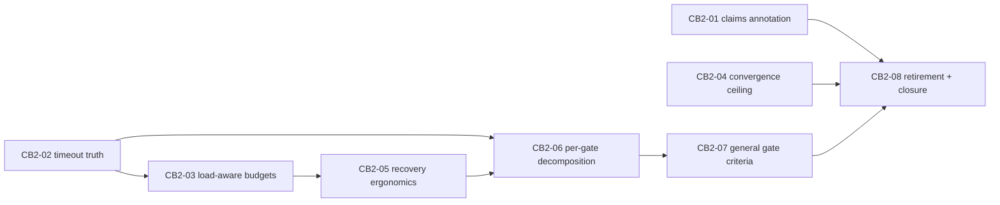

# Contract-burden relaxation 2 — PlanGraph program plan

**Status:** authored for PlanGraph approval; awaiting decomposition and
adversarial lens review.
**Provenance:** every node cites `docs/development/contract-burden-reduction.md`
items verified GENUINELY OPEN by the adversarial verification pass of
2026-08-13 (agent report bound into this plan's approval artifacts): items 8
(second half), 10 (general half), 11, 14, 15, and 16 — each confirmed absent
from BOTH the `contract-burden-relaxation` working tree and the sealed CB
program candidate `8afa0190`. Items 1–7 and 9 are landed and are NOT in scope.
**Backend:** claude mixture, pinned — coordinator `claude:claude-fable-5@medium`,
implementers `claude-sonnet-5`, reviewers `claude-opus-5`.

## Preconditions (before decomposition freeze)

1. **Adopt the CB-1 candidate first.** Merge `8afa0190` into
   `contract-burden-relaxation`. This is a true merge (merge-base `0effd53`;
   neither side contains the other). The merge MUST take the branch side of:
   the reuse-custody fixes in `harness_labs/plan_graph_audit.py` (item 12,
   `0ecc5ce`), the parallel-shape checkpoint validator in
   `harness_labs/plan_graph.py` (item 13, `60cc13f`), the `claims_rule` pin in
   `experiments/run_burden_plan_graph.py` (the candidate predates it and the
   executor rejection it compensates for is still fatal), and the resume
   launcher fixes (`--logical-id`, no `graph_run_id` kwarg). It must take the
   candidate side of the CB-01..CB-08 relaxations and doc-status closures, then
   reconcile the doc's §11–16 and item-9 additions from the branch.
2. **Full suite green on the merge result**, then freeze `RED_BASE` at that
   merge commit. All red phases in this program run against it.

## Program rules

1. **Red/green is the contract, enforced mechanically** — identical to the CB-1
   program: each node ships a single-file, self-contained finding test that
   fails behaviorally on the frozen base (pytest exit 1, ≥1 FAILED, 0 errors)
   and passes on the candidate together with the full suite, gated by
   `scripts/dev/red_green_check.py`.
2. **Gate budgets sized for parallel load (lesson of CB-06).** Until CB2-03
   seals, node gates run with `--timeout 1400` per phase and
   `verification_timeout_seconds` 3600, and at most two nodes are admitted
   concurrently. The CB-1 program lost a node attempt purely to two gates
   sharing one machine under a 700s wall clock.
3. **Relaxation never widens authority.** The keep-list (receipt/digest
   binding, write-grant enforcement, controller-owned deterministic
   verification, hash-chained journals) is out of bounds. Every node deletes or
   supersedes a rule the diagnosis proved non-load-bearing while keeping the
   adjacent load-bearing checks.
4. **Recovery discipline.** The graph registers `automatic_recovery` (`resume`,
   `extend_budget`) on the RB ledger with a lineage-stable run root, passes an
   explicit stable `logical_graph_id` from the first attempt, imports
   structured verification evidence per node, and recovers blocked nodes by
   `PlanGraph.resume` — never whole-graph relaunch. `verification_repair_limit=3`.
5. **The claims pin stays until CB2-08 retires it** — retirement is legal only
   after CB2-01 lands the executor-side fix.
6. **Explicitly deferred (out of scope, tracked in the living doc):** the two
   minor G-probe findings from verification — item 6's provenance acceptance
   being narrower than its closure text (rejected-dispatch refs only, not
   arbitrary journal events) and CB-05's dirty-baseline grant helper silently
   no-opping for grant-unaware executors — plus any node-level `RecoveryAgent`.

## Dependencies and parallelism

Edges exist only where nodes share owned files or consume another node's
mechanism. `harness_labs/plan_graph.py` and `harness_labs/feature_run.py` are
each owned by several nodes and are serialized through the dependency spine;
disjoint-file nodes run as parallel roots under `max_parallelism=2`.

Roots CB2-01, CB2-02, CB2-04 are file-disjoint and may run concurrently.

## CB2-01 — Claims vocabulary becomes annotation, not violation

Objective: Record out-of-assignment satisfied-criteria entries in worker results as an audited annotation and drop them from the accepted payload in both live executors, instead of failing the task with "worker claimed unassigned criteria", so review/fix/verify workers that echo criterion vocabulary can no longer kill a gate-passing node.

Owned paths: `harness_labs/controller_live.py`, `harness_labs/claude_task_executor.py`, `tests/test_relax_claims.py`.

- AC-CB201-1: a worker result whose satisfied_criteria (or claims-derived equivalent) names criteria outside the task's assigned set completes the task; the out-of-assignment entries are removed from the recorded satisfied set and journaled as a distinct annotation event carrying the dropped ids, in both `controller_live.py` and `claude_task_executor.py`.
- AC-CB201-2: satisfied-criteria entries within the assigned set are still validated and recorded exactly as before, and a task dispatched WITH acceptance criteria still has its claims checked against that assignment.
- AC-CB201-3: tests/test_relax_claims.py fails behaviorally against the frozen base harness (a review-shaped dispatch with empty acceptance_criteria dies with "worker claimed unassigned criteria") and passes on the candidate together with the full suite.

## CB2-02 — Gate timeouts tell the truth to the classifier

Objective: Make a red_green_check phase timeout machine-readable to verification-failure classification — the script exits 124 with a top-level timed_out marker in its JSON verdict, and classify_verification_failure reads structured verdict fields before text rules — so a gate timeout is classified infrastructure_transient and earns the free-retry class instead of being mislabeled a product defect by the "failed" text rule matching the verdict JSON itself.

Owned paths: `scripts/dev/red_green_check.py`, `harness_labs/feature_run.py`, `tests/test_relax_gate_timeout_classification.py`.

- AC-CB202-1: red_green_check.py exits with code 124 and emits a top-level "timed_out": true field in its JSON verdict when either phase times out; non-timeout verdicts keep their current exit codes and shape.
- AC-CB202-2: classify_verification_failure classifies a red_green timeout verdict as infrastructure_transient via structured evidence (exit 124 or the parsed verdict field), and no longer applies bare text rules such as "failed" to output that parses as a red_green JSON verdict.
- AC-CB202-3: tests/test_relax_gate_timeout_classification.py fails behaviorally against the frozen base harness (a timeout verdict is classified product and charges the repair budget) and passes on the candidate together with the full suite.

## CB2-03 — Verification budgets aware of admitted concurrency

Objective: Couple node verification budgets to graph-level parallelism so admitting siblings cannot silently halve a gate's effective budget — the graph either scales the verification timeout it passes to concurrently admitted nodes or serializes gate execution across the ready set — making the CB-06 failure mode (behaviorally-failing red phase killed by wall clock under sibling load) structurally impossible.

Owned paths: `harness_labs/plan_graph.py`, `experiments/run_burden_plan_graph.py`, `tests/test_relax_gate_concurrency.py`.

- AC-CB203-1: when more than one node is admitted concurrently, each node's effective verification budget is adjusted for the admitted concurrency (scaled timeout or exclusive gate execution slot), and the adjustment is recorded in the graph journal per node.
- AC-CB203-2: serial execution (max_parallelism=1) budgets are byte-identical to today's behavior.
- AC-CB203-3: tests/test_relax_gate_concurrency.py fails behaviorally against the frozen base harness (two admitted nodes each receive the full unscaled wall-clock budget with no journaled adjustment) and passes on the candidate together with the full suite.

## CB2-04 — Review ceiling counts non-convergence, not cycles

Objective: Charge the review-fix mechanical cycle ceiling only for non-converging cycles — cycles whose fix keys recur from earlier cycles — so a gate-passing candidate whose every cycle resolves its findings and surfaces only new-scope findings is not blocked by a raw cycle count, while the existing hard bound on total cycles is retained as a backstop.

Owned paths: `harness_labs/review_fix.py`, `harness_labs/development_policy.py`, `tests/test_relax_review_convergence.py`.

- AC-CB204-1: a cycle whose findings are all addressed and verified, and whose finding keys are disjoint from every earlier cycle's keys, does not consume the mechanical cycle allowance; a cycle re-fixing a previously seen finding key does.
- AC-CB204-2: a hard upper bound on total cycles remains and terminates the loop regardless of convergence accounting; the policy schema exposes the convergence behavior without breaking existing policy documents.
- AC-CB204-3: tests/test_relax_review_convergence.py fails behaviorally against the frozen base harness (three all-resolving, disjoint-key cycles exhaust mechanical_cycle_limit=3 and block) and passes on the candidate together with the full suite.

## CB2-05 — Recovery API operability

Objective: Remove the four verified resume-operability defects — blocker evidence refs resolve transitively through child-run journals recorded in the graph journal, root attempts mint and persist a stable logical graph id, resume rejects a graph_run_id kwarg with a typed PlanGraphError instead of a bare TypeError, and admission reclaims a partial successor directory left by an admission crash instead of skipping an attempt ordinal.

Owned paths: `harness_labs/plan_graph.py`, `harness_labs/plan_graph_audit.py`, `tests/test_relax_resume_operability.py`.

- AC-CB205-1: a RepairResumeDirective whose blocker_evidence_ref names an artifact recorded in a child run's journal (reachable from the predecessor graph journal) is accepted; refs recorded nowhere in the lineage are still rejected.
- AC-CB205-2: a root attempt constructed without an explicit logical_graph_id mints a stable logical id distinct from its attempt id, persists it in graph state, and resume resolves predecessors by it without an operator-supplied id.
- AC-CB205-3: PlanGraph.resume called with a graph_run_id kwarg raises PlanGraphError with a message naming the conflict; a successor attempt directory containing no successor-allocation event is reclaimed (or deterministically reported reclaimable) at the next resume instead of inflating the attempt ordinal.
- AC-CB205-4: tests/test_relax_resume_operability.py fails behaviorally against the frozen base harness on each of the three defect classes above and passes on the candidate together with the full suite.

## CB2-06 — Per-gate verification decomposition

Objective: Allow a node's deterministic verification to be declared as an ordered tuple of named gates each with its own argv and timeout, executed and classified per gate with per-gate failure digests on the RB ledger, aggregated into the existing single verification result, while a single flat verification_argv remains valid and byte-identical in behavior.

Owned paths: `harness_labs/plan_graph.py`, `harness_labs/feature_run.py`, `harness_labs/plan_graph_budget.py`, `tests/test_relax_gate_decomposition.py`.

- AC-CB206-1: a node declaring multiple named gates runs them in order, records one command attempt with classification and evidence per gate, and fails/repairs at gate granularity — a repair after gate 2 fails re-runs from the failed gate's evidence, not by rerunning a monolithic command blind.
- AC-CB206-2: per-gate failing-identifier digests feed the RB ledger so delta-scoped budget renewal (item 7 machinery) operates per gate rather than across a single serialized command.
- AC-CB206-3: nodes declaring the existing single verification_argv are unaffected — same events, same budget accounting, full suite green.
- AC-CB206-4: tests/test_relax_gate_decomposition.py fails behaviorally against the frozen base harness (gate tuples are not expressible; a two-gate declaration cannot produce per-gate classification) and passes on the candidate together with the full suite.

## CB2-07 — Gate-backed criteria for direct feature runs

Objective: Lift the plan-graph-only pairing restriction so a direct run_feature_worktree caller may declare gate-backed acceptance criteria together with its own verification command, with the kernel adjudicating those criteria from controller-owned command evidence and the completion path accepting build-complete with gate-backed criteria pending — closing the general build-segment verification dead-end for runs outside the plan-graph binding.

Owned paths: `harness_labs/feature_run.py`, `harness_labs/controller_kernel.py`, `tests/test_relax_direct_gate_criteria.py`.

- AC-CB207-1: a direct (non-plan-graph) run_feature_worktree call declaring deterministic-verification criteria plus a verification_argv is accepted at construction and reaches a successful terminal status once the controller-owned command passes, with the gate-backed criteria satisfied from command evidence and never from a coordinator claim.
- AC-CB207-2: a build-segment coordinator holding only gate-backed pending criteria can complete its segment without run.block_request on the direct path, matching the plan-graph-bound behavior sealed by CB-06.
- AC-CB207-3: declaring gate-backed criteria with no verification command anywhere is still rejected at construction.
- AC-CB207-4: tests/test_relax_direct_gate_criteria.py fails behaviorally against the frozen base harness (construction rejects the pairing on the direct path) and passes on the candidate together with the full suite.

## CB2-08 — Workaround retirement and diagnosis closure

Objective: Retire the claims_rule pin from the experiment launcher now that CB2-01 makes it unnecessary, raise this program's interim gate-timeout headroom back to the load-aware defaults landed by CB2-03, and close items 8, 10, 11, 14, 15, and 16 in the living diagnosis with commit-bound status entries, so the program leaves behind neither the pins nor the stale statuses its nodes made obsolete.

Owned paths: `experiments/run_burden_plan_graph.py`, `docs/development/contract-burden-reduction.md`, `scripts/dev/check_workaround_retirement.py`.

- AC-CB208-1: the claims_rule block and its injection into review/fix/verify instructions are removed from experiments/run_burden_plan_graph.py, and scripts/dev/check_workaround_retirement.py deterministically verifies their absence alongside the CB-1 retirements.
- AC-CB208-2: docs/development/contract-burden-reduction.md statuses for items 8, 10, 11, 14, 15, and 16 are closed with the sealing node and commit named, preserving the doc's strike-through history rule.
- AC-CB208-3: the deterministic retirement check passes as this node's gate together with the full suite.
