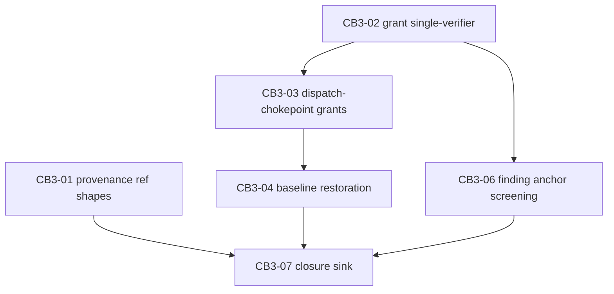

# Contract Burden Relaxation 3 — recovery-path repair program (CB3)

**Program id:** `contract-burden-relaxation-3`
**Version:** v2 — post three-lens adversarial review (`plan-review-cb3/adjudication.md`, 2026-08-14). v1 nodes CB3-05 deleted; CB3-01/03/04 re-aimed; CB3-02/06 re-scoped; DAG rebuilt.
**Diagnosis source:** `docs/development/contract-burden-reduction.md` items 6 (residual ref-shape half), 17, 18 (screening half), 19 (restoration half), 20 (evidence: CB-2 program journals under `logs/runs/cb2-graph/`).
**Character:** unlike CB-1/CB-2, this program does not relax overzealous gates. Items 17, 19, 20 are *recovery-path defects*: the contract's failure handling cannot return to a working state without a human operator. Item 6's residual and item 18's screening gap amplified them.

## Preconditions (all satisfied before decomposition freeze)

1. The CB-2 final candidate is adopted: merge `76eafa6` on `contract-burden-relaxation`, full suite green.
2. **RED_BASE is frozen at `b49c194e1df1a895eba5d10548dcab27a4a9e772`** (adoption + doc reconciliation + pin retirement). Every finding test's red phase runs against this tree.
3. The program runner `experiments/run_burden3_plan_graph.py` is authored **before decomposition freeze**, cloned from the CB-2 runner's final pin-retired shape with the evidence, path-grant, and summary-floor instruction pins restored from birth (the harness executing this program still has the item-19 dead-end). The runner is frozen unowned infrastructure: no node's allowed_paths include it; mid-program changes are operator instruction pins only; pin retirement post-adoption is a tracked operator step. Verified by operator inspection at approval — a plan AC cannot bind unowned infrastructure.
4. The running harness is the RED_BASE harness: every defect this program fixes is still live in the machinery executing the program. The rules below are shaped by that fact.

## Program rules

1. **Red-tail evidence discipline.** Every node's implementation summary carries a "Red-phase evidence" heading quoting the gate verdict's red.tail and each FAILED test node id; reviewers accept that section or the controller-owned gate receipt in the journal — either discharges the obligation.
2. **Findings anchor inside the grant.** Reviewers must anchor every finding's file and required_paths inside the node's writable paths; out-of-grant observations go in the report narrative. (Instruction-pin form of the defect CB3-06 fixes mechanically.)
3. **Budgets are hang detectors.** Measured baseline at RED_BASE: full suite ~61 s, red/green gate cycle ~2.5 s. Node gate `--timeout 1400`, `verification_timeout_seconds` 3600. A third consecutive timeout is a recover-don't-repair signal.
4. **Keep-list (may not be weakened by any node):** approval receipt/digest binding at admission; post-hoc write-grant enforcement; controller-owned deterministic verification; hash-chained journals; the deliverable-content floor; the executor's refusal of a dirty baseline **absent a valid grant or journaled restoration** (CB3-02/03/04 change who can satisfy the precondition, never whether it exists); the landed item-9 finding-transfer mechanism.
5. **Recovery discipline.** On a node block: diagnose from the child journal, resume with the terminal attempt as predecessor and the blocked node as frontier, blocker ref from the graph journal's escalation artifact. Lineages resume under the semantics they started with.
6. **Red constructions live inside test methods/`setUp` only** — no pytest fixtures the frozen base cannot collect.
7. **Every node owns the existing test modules asserting on its owned sources**, so an assertion-invalidating change is fixable in-node.
8. **Deferred out of this program:** discharge-by-receipt review verb (item 18's second half — requires evidence-ownership schema; no live specimen once anchoring is screened); node-level RecoveryAgent automation; MECHANISM M11 verdict-aware classifier mapping; dispatcher SIGTERM cosmetic noise after an orderly block (rc 143 `aborted_streaming`); general provenance ledger beyond kernel-entity refs.

## Dependencies and parallelism

`max_parallelism = 2`. Every same-file sibling overlap is ordered (non-disjoint sibling joins are a hard `PlanGraphError`, plan_graph.py:1782-1788).

Admissible pairs: (CB3-01 ∥ CB3-02) — disjoint paths; (CB3-03 ∥ CB3-06) after CB3-02 — disjoint paths; CB3-04 alone after CB3-03; CB3-07 sink join.

## CB3-01 — Provenance resolution reaches existing kernel entities

Objective: Extend kernel provenance-reference resolution so refs naming entities that already exist in kernel state — a task (`task:<id>`), a system result (`system-result:<id>:<n>`), a decision (`decision:<id>`) — resolve wherever a provenance reference is accepted, and the unknown-reference rejection message enumerates the valid ref shapes, so a coordinator recovering a failed task can cite the task itself instead of dying on "unknown provenance reference" or guessing undiscoverable ref spellings. (Item 6, residual half — the landed `command:<id>` rejection refs stay as-is; all 9 live CB-2 provenance failures cited these unresolvable shapes.)

Owned paths: `harness_labs/controller_kernel.py`, `tests/test_controller_kernel.py`, `tests/test_relax_kernel.py`, `tests/test_relax_ref_resolution.py`.

- AC-CB301-1: `_validate_envelope`'s provenance resolution accepts a ref naming an existing kernel entity — a dispatched task id, a recorded system result, a recorded decision — in addition to the already-landed `command:<id>` rejection refs; resolution is read-only against existing kernel state and mints no new records.
- AC-CB301-2: an unresolvable ref is still rejected, and the rejection detail now enumerates the accepted ref shapes with the syntax of each, so a coordinator's first wrong guess teaches the correct spelling instead of burning attempts blind.
- AC-CB301-3: accepted-ref semantics elsewhere are byte-for-byte unchanged: no change to retry/supersede admission rules, frozen-authority comparison, budget machinery (none exists in the kernel), or the existing `rejected_task_dispatch_refs` behavior and its tests.
- AC-CB301-4: tests/test_relax_ref_resolution.py fails behaviorally against the frozen base harness (a retry request citing `task:<failed-task-id>` — the exact CB2-08 live specimen shape — is rejected with "unknown provenance reference") and passes on the candidate together with the full suite.

## CB3-02 — One verifier for the dirty-baseline grant

Objective: Unify dirty-baseline grant verification — issuer sites (agent_mixture's `_controller_dirty_baseline_grant`, feature_run's review-fix controller grant path) and enforcer sites (the byte-identical `_resolve_dirty_baseline_grant` copies in claude_task_executor and controller_live) all consume one shared helper that checks receipt resolution, changed-path coverage, AND per-file content state — so a grant journaled as granted is the same decision enforced at preflight, and a genuine divergence (workspace drifted between issue and preflight) journals a typed refusal naming the offending paths instead of the generic clean-baseline message. (Item 20: the issuer checks paths only while the enforcer also checks content — four divergent copies.)

Owned paths: `harness_labs/agent_mixture.py`, `harness_labs/claude_task_executor.py`, `harness_labs/controller_live.py`, `harness_labs/feature_run.py`, `tests/test_agent_mixture.py`, `tests/test_claude_task_executor.py`, `tests/test_controller_live.py`, `tests/test_feature_run.py`, `tests/test_relax_adoption.py`, `tests/test_relax_grant_verification.py`.

- AC-CB302-1: grant verification (receipt resolution, changed-path coverage, per-file content-state comparison against the workspace state at time-of-check) is implemented exactly once; all four current sites — agent_mixture.py's issuer, feature_run.py's review-fix controller issuer, and the enforcer copies in claude_task_executor.py and controller_live.py — consume it; issuers run the full check (including content) at issue time so a grant that will fail preflight is never journaled as granted against the same workspace state.
- AC-CB302-2: when preflight verification fails for a supplied grant, the refusal is typed and journaled, naming the specific paths that are uncovered or content-mismatched (workspace drift between issue and preflight is thereby diagnosable from the journal); the generic "writable worker requires a clean repository baseline" message remains only for the no-grant-supplied case.
- AC-CB302-3: forged or stale grants still refuse: a receipt_ref that does not resolve, resolves to a non-receipt kind, under-covers the dirty set, or mismatches on-disk content is refused by the shared helper exactly as the strictest current layer refuses it — unification levels *up*; the clean-baseline precondition itself is intact.
- AC-CB302-4: tests/test_relax_grant_verification.py fails behaviorally against the frozen base harness (the feature_run review-fix grant path issues-and-journals a grant on path coverage alone that the executor preflight then refuses on content state — reproducing the CB2-03 attempt-1 `dirty_baseline_adoption_grant_supplied | granted` → preflight-refusal specimen) and passes on the candidate together with the full suite.

## CB3-03 — Dispatch-chokepoint adoption grants

Objective: Mint dirty-baseline adoption grants at the controller's dispatch chokepoint — when any writable dispatch (fresh, retry, or superseding) is scheduled in a workspace whose dirty state is exactly covered by an existing workspace-change receipt in the run's evidence, the scheduler resolves that receipt through CB3-02's shared verifier and attaches the grant — so a successful attempt's uncommitted receipted work no longer strands the node behind a clean-baseline refusal, in every program using the controller path rather than only launchers that hand-wire executors. (Item 17; the per-role mechanism exists in agent_mixture but the dispatch chokepoint never invokes it.)

Owned paths: `harness_labs/controller_scheduler.py`, `harness_labs/controller_live.py`, `harness_labs/agent_mixture.py`, `tests/test_controller_scheduler.py`, `tests/test_controller_live.py`, `tests/test_agent_mixture.py`, `tests/test_relax_followup_grants.py`.

- AC-CB303-1: a writable dispatch scheduled while the workspace is dirty receives a dirty-baseline grant when some workspace-change receipt in the run's evidence catalog covers the dirty state exactly (every dirty path receipted with matching content, via CB3-02's shared verifier); selection is content-determined — a receipt qualifies by coverage, not recency, and the catalog needs no ordering — and grant issuance is journaled with the receipt ref.
- AC-CB303-2: when no single receipt covers the dirty state, no grant is minted and the dispatch refuses exactly as today (CB3-02's typed refusal); receipts are never unioned to synthesize coverage.
- AC-CB303-3: on dispatch paths where role profiles govern eligibility, a role without `allow_dirty_baseline` receives no grant regardless of receipts; grant flow is through CB3-02's shared verifier only — no second verification implementation appears.
- AC-CB303-4: tests/test_relax_followup_grants.py fails behaviorally against the frozen base harness (a coordinator follow-up writable dispatch through the scheduler chokepoint after a receipted successful attempt fails with the clean-baseline refusal — the CB2-02 root-attempt specimen) and passes on the candidate together with the full suite.

## CB3-04 — Journaled baseline restoration after failed writable attempts

Objective: When a writable attempt terminates failed in a workspace the attempt itself dirtied, and no receipt covers the residue for adoption, the controller restores the attempt-start baseline via git — reverting tracked modifications and removing attempt-created untracked files, journaled per-path — so a single failed task no longer deadlocks the node behind a dirty tree no in-system actor may clean. Restoration works from the controller's recorded attempt-start baseline (a clean tree at a known commit), not receipt pre-images, which do not exist; it therefore also covers attempts that failed before writing any receipt — the live CB2-05 shape. (Item 19, restoration half; the dominant amplifier.)

Owned paths: `harness_labs/controller_live.py`, `harness_labs/claude_task_executor.py`, `tests/test_controller_live.py`, `tests/test_claude_task_executor.py`, `tests/test_relax_baseline_restoration.py`.

- AC-CB304-1: at writable-dispatch time the controller records the attempt-start baseline (the verified-clean tree and its commit) in its attempt bookkeeping; restoration triggers only when ALL hold: the attempt's terminal status is failed; the attempt started clean per that record; no newer attempt has started (controller-local bookkeeping, not catalog ordering); and no workspace-change receipt covers the current dirty state (a covering receipt means CB3-03 adoption is available and the work is preserved instead).
- AC-CB304-2: restoration reverts tracked modifications to the recorded baseline commit and removes untracked files created since the attempt started, journaling a typed restoration event carrying the baseline commit, the per-path actions taken, and the trigger conditions' evaluations; any condition unmet → no restoration, state untouched, and a journaled restoration-declined event naming the failed condition. Restoration never deletes journals, evidence artifacts, or paths outside the attempt's residue; a subsequent preflight sees either a clean tree or the unchanged dirty tree — never a partial revert.
- AC-CB304-3: successful attempts' residue is never restored (it is adoption material); the clean-baseline precondition is unchanged — restoration satisfies it, never bypasses it. The accepted residual cost: a failed-but-gate-passing attempt (e.g. a deliverable-floor refusal) is reverted when unreceipted — that work is equally lost today plus the node deadlocks; the no-covering-receipt gate minimizes the destructive case.
- AC-CB304-4: tests/test_relax_baseline_restoration.py fails behaviorally against the frozen base harness (after a writable attempt fails leaving unreceipted residue — the CB2-05 shape, where the out-of-grant refusal precedes any receipt write — the next dispatch preflight refuses with the clean-baseline message and no restoration or restoration-declined event exists in the journal) and passes on the candidate together with the full suite.

## CB3-05 — (deleted)

Withdrawn after adjudication: the claimed defect does not exist at RED_BASE.
The kernel already resolves `operator_input.requested` to `status = "blocked"`
(controller_kernel.py:1320-1322); the dispatcher then terminates the session
and the run reaches an orderly terminal `blocked` with the question journaled
— the CB2-08 attempt-3 journal shows this end state verbatim. The
`error_during_execution` transport line is SIGTERM noise after the block, not
a session death awaiting input; no operator-channel code exists, so the
attended/headless distinction was vacuous. Item 19's escalation half is
withdrawn in the living doc at closure. See `plan-review-cb3/adjudication.md`
§1. (Precedent: CB2-04, CB2-07.)

## CB3-06 — Out-of-grant findings screened at ingest, transfer preserved

Objective: Close the review-deadlock gap: extend the existing ingest screening so a finding whose `file` anchor (not only `required_paths`) falls outside the node's writable paths is screened rather than entered as an open obligation — excluded from fix_keys and cycle-limit arithmetic, exempt from the `contract_violation`/`requires_disposition` escape into `open_required()`, journaled with its full payload, and still eligible for the landed item-9 cross-node transfer — so review cycles can no longer deadlock on obligations unfixable by contract, without losing the finding. (Item 18, screening half; the discharge-by-receipt verb is deferred — see program rule 8.)

Owned paths: `harness_labs/review_fix.py`, `tests/test_review_fix.py`, `tests/test_feature_run.py`, `tests/test_relax_review_discharge.py`.

- AC-CB306-1: ingest screening evaluates the finding's `file` anchor in addition to `required_paths`; a finding anchored outside the writable paths is recorded through the existing screening outcome with its full payload journaled, and no `contract_violation`/`requires_disposition` flag on such a finding can route it into `open_required()` or cycle-limit blocking arithmetic.
- AC-CB306-2: screened out-of-grant findings remain visible in cycle reports and remain eligible for the landed item-9 cross-node transfer exactly as today's transferable findings are — the transfer mechanism's existing behavior and its assertions (including those in tests/test_feature_run.py) are preserved or extended, never reduced.
- AC-CB306-3: in-grant findings flow exactly as today: discovery freeze after cycle 1, deferred handling, fix/verify semantics, and the cycle ceiling are unchanged for tree-bound obligations.
- AC-CB306-4: tests/test_relax_review_discharge.py fails behaviorally against the frozen base harness (a finding whose `file` is outside the writable paths, with `required_paths` empty or in-grant — the CB2-02 attempt-1 shape — enters the ledger as an open obligation and recurs to the cycle ceiling) and passes on the candidate together with the full suite.

## CB3-07 — Closure sink

Objective: Close the diagnosis: update `docs/development/contract-burden-reduction.md` — items 17, 19 (restoration half landed, escalation half withdrawn with the adjudication evidence), 20 to landed with node ids and 40-hex commit shas; item 6's residual and item 18's screening half recorded as landed with their deferred remainders explicit; append the CB-3 change-log entry; record the CB-3 runner pin-retirement operator step; verify the joined candidate with the full suite. (Closure for items 6-residual, 17, 18-screening, 19-restoration, 20.)

Owned paths: `docs/development/contract-burden-reduction.md`.

- AC-CB307-1: items 17, 19, 20 carry struck-through prior status and a landed (or, for 19's escalation half, withdrawn-with-evidence) status naming the closing node and its full 40-hex candidate commit; items 6 and 18 record their landed halves with the deferred remainders (general provenance ledger; discharge-by-receipt verb) explicitly tracked as open threads, not silently closed.
- AC-CB307-2: the change-log entry records the program id, final candidate, and which CB-2 operational failure modes are now mechanically impossible (grant-issue/preflight divergence, follow-up-dispatch stranding, unreceipted-residue deadlock, out-of-grant review deadlock, unresolvable recovery refs); the CB-3 runner pin-retirement operator step is tracked in the operator-follow-up section.
- AC-CB307-3: the full suite passes on the joined candidate (verification gate for this node is `python3 -m pytest tests/ -q` — the sink join is verified in a repairable node).
