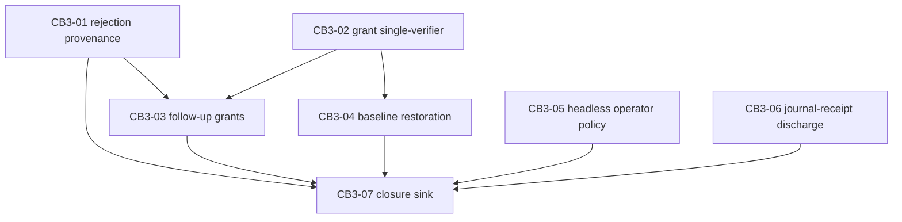

# Contract Burden Relaxation 3 — recovery-path repair program (CB3)

**Program id:** `contract-burden-relaxation-3`
**Diagnosis source:** `docs/development/contract-burden-reduction.md` items 6, 17, 18, 19, 20 (evidence: CB-2 program journals under `logs/runs/cb2-graph/`).
**Character:** unlike CB-1/CB-2, this program does not relax overzealous gates. Items 17–20 are *recovery-path defects*: the contract's failure handling cannot return to a working state without a human operator. Item 6 is the one remaining classic relaxation, included because its absence (unreferencable rejected dispatches) directly amplified item 17's specimen.

## Preconditions (all satisfied before decomposition freeze)

1. The CB-2 final candidate is adopted: merge `76eafa6` on `contract-burden-relaxation`, full suite green (445 passed).
2. **RED_BASE is frozen at `b49c194e1df1a895eba5d10548dcab27a4a9e772`** (adoption + doc reconciliation + pin retirement). Every finding test's red phase runs against this tree.
3. The program runner (a new `experiments/run_burden3_plan_graph.py`, cloned from the CB-2 runner's final shape) is frozen unowned infrastructure: no node's allowed_paths include it; mid-program changes to it are operator instruction pins only.
4. The running harness is the RED_BASE harness. Every defect this program fixes is therefore still **live in the machinery executing the program**. The program rules below are shaped by that fact.

## Program rules

1. **Red-tail evidence discipline.** Every node's implementation summary carries a "Red-phase evidence" heading quoting the gate verdict's red.tail and each FAILED test node id; reviewers accept that section or the controller-owned gate receipt in the journal — either discharges the obligation. (Carried from CB-2; the CB-3 runner is born with the evidence, path-grant, and summary-floor instruction pins that CB-2 acquired mid-program, because the harness executing this program still has the item-19 dead-end. Pins retire post-adoption as an operator step.)
2. **Findings anchor inside the grant.** Reviewers must anchor every finding's file and required_paths inside the node's writable paths; out-of-grant observations go in the report narrative. (Instruction-pin form of the very defect CB3-06 fixes mechanically.)
3. **Budgets are hang detectors.** Measured baseline at RED_BASE: full suite ~52 s, red/green gate cycle ~2.5 s. Node gate `--timeout 1400`, `verification_timeout_seconds` 3600. A third consecutive timeout is a recover-don't-repair signal.
4. **Keep-list (may not be weakened by any node):** approval receipt/digest binding at admission; post-hoc write-grant enforcement; controller-owned deterministic verification; hash-chained journals; the deliverable-content floor; the executor's refusal of a dirty baseline **absent a valid grant or restoration receipt** (CB3-02/04 change who can satisfy the precondition, never whether it exists).
5. **Recovery discipline.** On a node block: diagnose from the child journal, resume with the terminal attempt as predecessor and the blocked node as frontier, blocker ref from the graph journal's escalation artifact. Lineages resume under the semantics they started with.
6. **Red constructions live inside test methods/`setUp` only** — no pytest fixtures the frozen base cannot collect.
7. **Every node owns the existing test modules for its owned sources**, so an assertion-invalidating change is fixable in-node.
8. **Deferred out of this program:** node-level RecoveryAgent automation; MECHANISM M11 verdict-aware classifier mapping; item 6's general provenance ledger beyond dispatch rejections.

## Dependencies and parallelism

`max_parallelism = 2`.

Roots CB3-01, CB3-02, CB3-05, CB3-06 admit in any pair order; CB3-03 needs both CB3-01 and CB3-02; CB3-04 needs CB3-02; CB3-07 is the sink join.

## CB3-01 — Rejected dispatches become referenceable provenance

Objective: Record every kernel-refused task command as a referenceable provenance entry — a journaled rejection record whose id the retry and supersede paths accept wherever a predecessor task reference is required — so a coordinator recovering from a refused dispatch can cite the refusal itself instead of dying on "unknown provenance reference". (Item 6.)

Owned paths: `harness_labs/controller_kernel.py`, `tests/test_controller_kernel.py`, `tests/test_relax_rejection_provenance.py`.

- AC-CB301-1: when the kernel rejects a `task.dispatch` (or superseding/retry dispatch) command, it journals a typed rejection record carrying a stable provenance id, the rejection reason, and the refused command's payload digest; the record is appended through the existing hash-chained journal, not a side channel.
- AC-CB301-2: the provenance-resolution path that today raises `unknown provenance reference: <ref>` (controller_kernel.py:559) resolves a rejection-record id to that record, and the retry/supersede admission logic accepts a rejection record as a valid predecessor reference with semantics "re-attempt of a never-started dispatch" — no retry-budget charge is spent for the attempt that never ran.
- AC-CB301-3: accepted-dispatch provenance, budget charging for genuinely failed attempts, and the rejection reasons themselves are byte-for-byte unchanged; only referenceability is added.
- AC-CB301-4: tests/test_relax_rejection_provenance.py fails behaviorally against the frozen base harness (a retry citing a rejected dispatch's command id raises "unknown provenance reference") and passes on the candidate together with the full suite.

## CB3-02 — One verifier for the dirty-baseline grant

Objective: Make the controller-issued dirty-baseline grant and the executor preflight share a single verification implementation, so a grant that the controller journals as granted can never be refused by an executor re-deriving coverage independently; on genuine mismatch the refusal is a typed, journaled event naming the uncovered or content-mismatched paths rather than the generic clean-baseline message. (Item 20.)

Owned paths: `harness_labs/agent_mixture.py`, `harness_labs/claude_task_executor.py`, `harness_labs/controller_live.py`, `tests/test_agent_mixture.py`, `tests/test_claude_task_executor.py`, `tests/test_controller_live.py`, `tests/test_relax_grant_verification.py`.

- AC-CB302-1: grant coverage verification (receipt resolution, changed-path coverage, per-file content-state comparison) is implemented exactly once in a shared helper; `_controller_dirty_baseline_grant` (agent_mixture.py) and `_resolve_dirty_baseline_grant` (claude_task_executor.py, controller_live.py) both consume it, and the decision journaled at grant time is the same decision enforced at preflight because both run the same code over the same receipt.
- AC-CB302-2: when verification genuinely fails, the executor raises a typed refusal that names the specific dirty paths not covered (or content-mismatched) by the receipt and journals a classified refusal event; the generic "writable worker requires a clean repository baseline" message remains only for the no-grant-supplied case.
- AC-CB302-3: forged or stale grants still refuse: a receipt_ref that does not resolve, resolves to a non-receipt kind, under-covers the dirty set, or mismatches on-disk content is refused by the shared helper exactly as the strictest current layer refuses it — the unification levels *up*, and the keep-list's clean-baseline precondition is intact.
- AC-CB302-4: tests/test_relax_grant_verification.py fails behaviorally against the frozen base harness (a grant the controller layer accepts is refused by the executor layer for the same workspace state, reproducing the CB2-03 attempt-1 `dirty_baseline_adoption_grant_supplied | granted` → preflight-refusal specimen) and passes on the candidate together with the full suite.

## CB3-03 — Coordinator follow-up dispatches carry adoption grants

Objective: Wire the dirty-baseline adoption grant into coordinator-initiated writable dispatches — when the coordinator dispatches follow-up, superseding, or retry writable work in a run whose workspace is dirty from a receipted prior attempt, the controller resolves the covering workspace-change receipt and attaches the grant automatically — so a successful implementer's uncommitted work no longer strands the node behind a clean-baseline refusal the coordinator cannot satisfy. (Item 17.)

Owned paths: `harness_labs/controller_kernel.py`, `harness_labs/controller_live.py`, `harness_labs/agent_mixture.py`, `tests/test_controller_kernel.py`, `tests/test_controller_live.py`, `tests/test_agent_mixture.py`, `tests/test_relax_followup_grants.py`.

- AC-CB303-1: a coordinator-initiated writable dispatch (fresh, retry, or superseding) in a workspace whose dirty state is exactly covered by an existing workspace-change receipt from this run receives a dirty-baseline grant naming that receipt, resolved and attached by the controller without coordinator action; grant issuance is journaled with the receipt ref.
- AC-CB303-2: when the dirty state is *not* covered by any single receipt in the run's evidence, no grant is minted and the dispatch refuses exactly as today (the typed refusal from CB3-02); the controller never synthesizes coverage by unioning receipts.
- AC-CB303-3: the grant flows through CB3-02's shared verifier; role-level `allow_dirty_baseline` eligibility (agent_mixture.py) is still required — a role without eligibility gets no grant regardless of receipts.
- AC-CB303-4: tests/test_relax_followup_grants.py fails behaviorally against the frozen base harness (a coordinator follow-up writable dispatch after a receipted successful attempt fails with the clean-baseline refusal, reproducing the CB2-02 root-attempt specimen) and passes on the candidate together with the full suite.

## CB3-04 — Journaled baseline restoration after failed writable attempts

Objective: When a writable attempt terminates as failed and its residue is attested by a workspace-change receipt, the controller restores the receipted paths to their attempt-start state — a conjunctively-gated, journaled restoration that reverts exactly the receipted change set and records a restoration receipt — so a single failed task no longer deadlocks the node behind a dirty tree no in-system actor may clean. (Item 19, restoration half; the dominant amplifier.)

Owned paths: `harness_labs/controller_live.py`, `harness_labs/claude_task_executor.py`, `tests/test_controller_live.py`, `tests/test_claude_task_executor.py`, `tests/test_relax_baseline_restoration.py`.

- AC-CB304-1: restoration triggers only when ALL hold: the attempt's terminal status is failed; a workspace-change receipt attests its residue; every currently dirty path is inside the receipted change set with matching content state; and no newer attempt has started. Restoration reverts exactly the receipted paths to their receipt-recorded pre-attempt state and journals a typed restoration event carrying the source receipt ref and the per-path actions taken.
- AC-CB304-2: any condition unmet → no restoration, state untouched, and a journaled restoration-declined event naming the failed condition; restoration never touches paths outside the receipted change set, never deletes journals or evidence artifacts, and a subsequent dispatch preflight sees either a clean tree (restored) or the unchanged dirty tree (declined) — never a partial revert.
- AC-CB304-3: successful attempts' residue is never restored (it is adoption-grant material for CB3-03); the clean-baseline precondition itself is unchanged — restoration satisfies it, it does not bypass it.
- AC-CB304-4: tests/test_relax_baseline_restoration.py fails behaviorally against the frozen base harness (after a failed writable attempt with receipted residue, the next dispatch preflight refuses with the clean-baseline message and no restoration event exists in the journal, reproducing the CB2-05/CB2-08 specimens) and passes on the candidate together with the full suite.

## CB3-05 — Headless operator-input policy

Objective: Give `operator_input.request` a deterministic headless resolution — when no operator channel is configured, the kernel immediately answers with a typed operator-unavailable response and the run escalates through the existing blocker path with the pending question preserved as evidence — so a coordinator waiting on a human in an unattended run produces a diagnosable terminal blocker instead of an `error_during_execution` session death. (Item 19, escalation half.)

Owned paths: `harness_labs/controller_kernel.py`, `harness_labs/controller_coordinator.py`, `harness_labs/controller_live.py`, `tests/test_controller_kernel.py`, `tests/test_controller_coordinator.py`, `tests/test_controller_live.py`, `tests/test_relax_headless_operator.py`.

- AC-CB305-1: a run is explicitly headless (constructor/config declares no operator channel); in that mode `operator_input.request` is processed, journaled as requested today, and immediately answered with a typed `operator_unavailable` response event carrying the question id — the command does not hang and the session does not die awaiting input.
- AC-CB305-2: on receiving `operator_unavailable`, the run terminates through the existing block-escalation path with the unanswered question's journal ref included in the blocker evidence; terminal status is the same `blocked` an operatorless CB-2 run eventually reached, minus the session-error death and with the question preserved as first-class evidence.
- AC-CB305-3: attended runs are byte-for-byte unchanged — with an operator channel configured, request/response semantics, journaling, and coordinator behavior are untouched.
- AC-CB305-4: tests/test_relax_headless_operator.py fails behaviorally against the frozen base harness (an operator_input.request in a channel-less run leaves the question unanswered and the run dies on session error rather than resolving to a typed response) and passes on the candidate together with the full suite.

## CB3-06 — Review obligations discharged by journal receipt; grant-anchored findings enforced

Objective: Extend the review-fix ledger with a second discharge verb — an obligation whose satisfying evidence is a controller-owned journal artifact is discharged by citing that receipt, verified mechanically by resolving the ref — and reject at ingest any finding anchored outside the node's writable paths, recording it as a journaled narrative annotation instead of an open obligation, so review cycles can no longer deadlock on obligations that are unfixable by contract or already proven satisfied. (Item 18.)

Owned paths: `harness_labs/review_fix.py`, `tests/test_review_fix.py`, `tests/test_relax_review_discharge.py`.

- AC-CB306-1: a finding may be discharged by a journal-receipt citation: the fix stage returns the receipt ref, the ledger resolves it through the evidence catalog, verifies the artifact exists and is controller-owned (not worker-authored), and marks the obligation discharged-by-receipt — journaled with the ref — without requiring a working-tree change.
- AC-CB306-2: at ingest, a finding whose file or required_paths fall outside the node's writable paths is not entered as an open obligation; it is journaled as an out-of-grant annotation carrying the full finding payload, visible in the cycle report, and excluded from fix_keys and from cycle-limit blocking arithmetic.
- AC-CB306-3: ordinary findings (in-grant, tree-fixable) flow exactly as today: discovery freeze after cycle 1, deferred handling, fix/verify semantics, and the cycle ceiling are unchanged for obligations that remain tree-bound; a worker cannot self-discharge by citing its own output artifact.
- AC-CB306-4: tests/test_relax_review_discharge.py fails behaviorally against the frozen base harness (an out-of-grant-anchored finding enters the ledger as an open obligation and recurs to the cycle ceiling, reproducing the CB2-02 attempt-1 deadlock in miniature) and passes on the candidate together with the full suite.

## CB3-07 — Closure sink

Objective: Close the diagnosis: update `docs/development/contract-burden-reduction.md` items 6, 17, 18, 19, 20 to landed status with node ids and 40-hex commit shas, append the CB-3 change-log entry, record the operator follow-up for retiring the CB-3 runner's own instruction pins post-adoption, and verify the joined candidate with the full suite. (Closure for items 6, 17, 18, 19, 20.)

Owned paths: `docs/development/contract-burden-reduction.md`.

- AC-CB307-1: each of items 6, 17, 18, 19, 20 carries a struck-through prior status and a landed status naming the closing node (CB3-01…CB3-06) and its full 40-hex candidate commit; no item this program claims remains marked open.
- AC-CB307-2: the change-log entry records the program id, final candidate, and the operational deltas (which CB-2 failure modes are now mechanically impossible); the CB-3 runner pin-retirement operator step is tracked in the operator-follow-up section.
- AC-CB307-3: the full suite passes on the joined candidate (verification gate for this node is `python3 -m pytest tests/ -q` — the sink join is verified in a repairable node).
