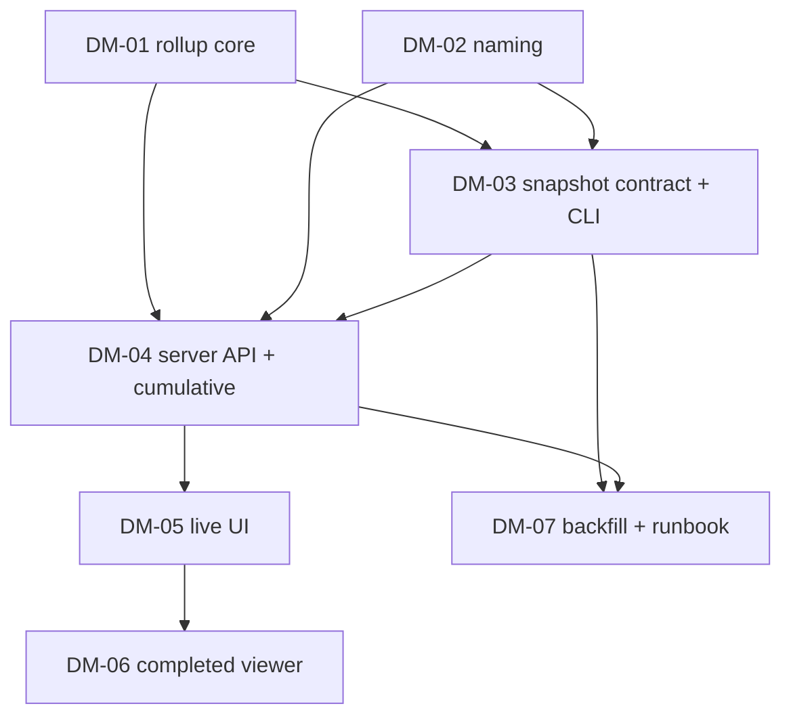

# Dashboard Observability Metrics Plan

Status: draft for plan approval
Decomposition: `docs/development/dashboard-observability-metrics-decomposition.json`

## Problem

The live PlanGraph dashboard (`harness_labs/observability/dashboard_server.py` +
`dashboard/plan-graph/`) surfaces per-FeatureRun metrics but has no
PlanGraph-level view of totals, no persistent record of a completed graph's
metrics, and no way to compare graphs. Specific gaps, each bound to code:

1. **No graph-level rollup.** `run_catalog._detail_metrics` computes
   per-FeatureRun totals; nothing aggregates a graph's children. Graph-level
   `summary.json.usage` token counts are zero by construction (tokens are
   recorded only on child runs).
2. **Cumulative retry accounting is asymmetric.**
   `dashboard_server._merge_detail_metrics` accumulates tokens/cost/duration
   across node tries but copies `quality` (review cycles, verification
   repairs, findings) from the latest try only, so those counters silently
   reset on each retry.
3. **No completion snapshot.** When a graph reaches a terminal status the
   dashboard's view of it is recomputable but never persisted; historical
   graphs are only viewable while their raw journals remain on disk and
   parseable by current code.
4. **No completed-graph viewer or comparison.** The SPA renders one selected
   attempt; there is no view over completed graphs and no cross-graph
   comparison surface.
5. **Machine IDs dominate the UI.** Graph selectors show `plan_path`,
   FeatureRun lists show raw `run_id`s. Node `objective` prose exists in the
   checkpoint (`state.nodes[node_id].objective`) but `run_catalog._nodes`
   drops it, and PlanGraph records carry no display name.
6. **In-flight discovery is adequate server-side but weak in the UI.** The
   catalog rescans audit roots every ~2 s, so new in-flight graphs do appear;
   the UI, however, defaults to a single selection and gives no at-a-glance
   list of every graph currently in flight.

## Goals

- The dashboard server exposes, and the UI shows, **every PlanGraph in
  flight** across the configured audit roots, with live per-graph totals.
- Retry-related counters (verification repairs, review-fix cycles, findings)
  are **cumulative across node tries**, matching the existing cumulative
  token/cost/duration behaviour, with per-try detail retained.
- A **PlanGraph totals panel** (rendered beneath the graph canvas) reports:
  total tokens (with cached share), estimated API cost, retries and
  recoveries, blockers, peak context, wall time, busy time and utilization,
  number of FeatureRuns, and per-FeatureRun derived stats (wall time, tokens,
  cost per FeatureRun), plus model/backend breakdowns.
- On completion, a **metrics snapshot** for the graph is written to disk under
  a documented, schema-validated contract, capturing everything the live view
  showed plus an outcome summary (what was attempted, what was accomplished,
  and the delta).
- A **completed-PlanGraph viewer** in the same SPA loads any saved snapshot
  and renders it with the same metric components as a live run, and offers a
  **comparison table** across all snapshots, sortable by each metric.
- All **prior completed PlanGraphs are reconstructable** into snapshots by an
  offline CLI that tolerates the known historical data gaps (runs without
  `summary.json`, runs without token records, graph dirs whose tokens live
  only in child dirs), marking derived metrics with explicit data-quality
  flags instead of fabricating values.
- **Human-readable names** for graphs and FeatureRuns are projected through
  the catalog and used across the UI.

## Non-goals

- No change to how runs execute, retry, or finalize (except a best-effort
  snapshot emission hook in the runner script after terminal finalization).
- No mutation surface on the dashboard server; it stays GET/HEAD-only and
  read-only over journals. Snapshot *writing* happens in the runner script
  and the offline CLI, never in the server.
- No remote hosting, auth, or artifact-content viewing (unchanged deliberate
  exclusions).
- No re-pricing authority: recorded `cost_usd` stays authoritative; estimates
  remain clearly labelled estimates from `_ESTIMATED_MODEL_PRICES`.

## Design

### Metric semantics (shared by live rollup and snapshots)

All aggregation follows the existing tri-state availability convention
(`available | estimated/partial | unavailable` with reasons); absent data is
never rendered as zero.

- **Total tokens** — sum of child FeatureRun cumulative totals
  (`input_tokens`, `cached_input_tokens` reported separately, `output_tokens`,
  `total_tokens = input + output`), using the existing per-run collection
  precedence (backend_transport → codex artifacts → claude stream artifacts).
- **Est. API cost** — sum of child cost aggregates with the existing
  degrade-to-unavailable rule; state is `available` only if every child is,
  `estimated` if any child is estimated, else `unavailable` with reason.
- **Retries / recoveries** — cumulative across all tries of all nodes:
  verification repair dispatches, review-fix cycles, recovery decisions
  (from checkpoint `state.recovery.decisions`), node tries beyond the first,
  and graph attempt lineage length (repair successors).
- **Blockers** — count of blocked nodes with their evidence reasons, plus
  graph block escalations (`escalation.json` presence / block event).
- **Peak ctx** — max `peak_input_tokens` across children; `unavailable` when
  no child can report a true per-invocation peak (cumulative claude-print
  records), never approximated from cumulative counters.
- **Wall time** — terminal graphs: `summary.json.usage.wall_clock_ms`;
  live graphs: `now - checkpoint.started_at`, labelled `elapsed (running)`.
- **Busy time** — union of child busy intervals when every child reports
  monotonic spans, else `unavailable`; utilization = busy / wall when both
  are available.
- **# FeatureRuns** — count of distinct child FeatureRun directories
  (node tries each count as their own run; distinct logical nodes reported
  separately).
- **Per-FeatureRun derived stats** — wall time, tokens, and cost per
  FeatureRun (graph totals divided by FeatureRun count), plus a per-node
  table (objective, status, tries, tokens, cost, wall time) so outliers are
  visible rather than averaged away.
- **Extras** — cache-hit share (`cached_input / input`), calls, per-model /
  per-backend / per-phase breakdowns reusing `_breakdown` shapes.

### Cumulative quality counters (DM-04)

`_merge_detail_metrics` keeps `quality` from the latest try (criteria and
open findings are legitimately current-state) but adds summed
`review_cycles`, `verification_repairs`, and `findings_total` across tries in
a clearly labelled cumulative block; `by_try` rows retain per-try values. The
UI labels these "cumulative across N tries" exactly as it already does for
tokens.

### Snapshot contract (DM-03)

New schema `schemas/plangraph-metrics-snapshot.schema.json`, protocol
`plangraph-metrics-snapshot/1`:

- `identity` — `logical_graph_id`, `graph_attempt_id`, `run_id`, `plan_path`,
  `plan_digest`, `base_commit`, `repository_id` when available.
- `display_name` — human-readable graph name (see naming below).
- `status` + `timing` (`started_at`, `finished_at`, `wall_clock_ms`).
- `graph_metrics` — the full rollup above.
- `feature_runs[]` — per logical node: `node_id`, `objective`, display name,
  status, tries, cumulative detail metrics (same shape the live
  `/api/feature-runs/<id>` cumulative merge returns), per-try rows.
- `outcome` — the attempted-vs-accomplished summary: per node `objective`,
  terminal status, criteria satisfied / total, evidence reason for
  non-success; graph-level counts (nodes attempted / succeeded / blocked /
  failed), acceptance-criteria text map for the satisfied and unsatisfied
  sets, and a short generated narrative string.
- `data_quality` — explicit flags: `summary_missing`, `token_records_missing`,
  `cost_state`, `busy_unavailable_reason`, `reconstructed: true|false`,
  `reconstruction_notes[]`.
- `provenance` — `generated_at`, generator version, source run directories,
  snapshot builder options.

Snapshots are written atomically to `<run-root>/.plan-graph-snapshots/
<graph_attempt_id>.json` (dot-prefixed so `build_run_catalog`'s existing
dot-dir skip keeps them out of run scanning). Writers: (a)
`scripts/run_plan_graph.py` best-effort after terminal finalization — a
snapshot failure logs and never alters run status; (b) the offline CLI
`scripts/build_plangraph_snapshot.py` for reconstruction and backfill.

### Server API (DM-04)

- `GET /api/plan-graphs/<id>/metrics` — live graph rollup (works for live and
  terminal graphs), recomputed per catalog revision and cached in the
  snapshot object like existing details.
- `GET /api/snapshots` — list of snapshot summaries (identity, display name,
  status, headline metrics for the comparison table) from
  `--snapshot-root` directories plus auto-discovered
  `.plan-graph-snapshots/` under each audit root.
- `GET /api/snapshots/<id>` — one full snapshot document.
- Same bounds/hygiene as existing endpoints: GET/HEAD only, size caps,
  no symlinks, ETag on list responses.

### Naming (DM-02)

- PlanGraph display name: plan file stem, title-cased with separators
  (`RETRY_BUDGET_RECOVERY_AUTHORITY_PLAN.md` → "Retry Budget Recovery
  Authority"), suffixed with the attempt ordinal when
  `graph_attempt_id != logical_graph_id` ("… — attempt 2").
- FeatureRun display name: the node `objective` (first sentence, truncated),
  falling back to `descriptor.objective`, then `node_id`, then `run_id`.
- `run_catalog._nodes` projects `objective`; plan-graph and feature-run
  catalog records gain `display_name` (and feature runs `objective`).
  `schemas/run-catalog-snapshot.schema.json` is extended accordingly.

### UI (DM-05, DM-06)

- **Live view** (existing page): an "In flight" strip lists every live graph
  (display name, state, elapsed) and switches selection; a `GraphTotals`
  panel under the canvas polls `/api/plan-graphs/<id>/metrics`; retry
  counters gain cumulative labels; selectors and lists use display names.
- **Completed viewer** (new view, toggle in the header): left rail lists all
  snapshots with display name, status, finished date, and the outcome
  narrative; selecting one renders the same `GraphTotals` + per-node metric
  components from the snapshot document; a **Compare** mode renders one row
  per snapshot with sortable columns (total tokens, est cost, wall time,
  busy/utilization, retries, recoveries, blockers, # FeatureRuns, tokens /
  cost / wall per FeatureRun, cache share, status) — click a column header to
  sort, click a row to open the snapshot.

### Historical reconstruction (DM-07 + operator step)

The CLI must reproduce correct, honestly-flagged snapshots for the known
historical corpus shapes (verified against `logs/runs` in the primary
checkout, 77 dirs, 2026-07-23 → 2026-08-11):

- graph dirs whose tokens live only in `-PG-*` child dirs;
- runs with no `summary.json` (wall time derived from first/last event
  timestamps, flagged `summary_missing`);
- runs with zero token records (tokens `unavailable`, not zero);
- launcher-style dirs with no `events.jsonl` (skipped with a diagnostic);
- interrupted / stale-running checkpoints (snapshot allowed only for
  terminal statuses; `--include-interrupted` opt-in).

Because `logs/runs` is populated only in the primary checkout, the actual
backfill is a post-merge operator step documented in the runbook:

```sh
python3 scripts/build_plangraph_snapshot.py --run-root logs/runs --all-completed
python3 scripts/run_dashboard.py --audit-root logs/runs \
  --assets-root dashboard/plan-graph/dist
```

## DM-01 — Graph metrics rollup core

Create `harness_labs/observability/graph_metrics.py` exposing a pure
function that aggregates a PlanGraph catalog record, its graph detail, and
its children's cumulative FeatureRun detail-metric documents into the
graph-level rollup defined above (protocol `plan-graph-metrics/1`), following
the existing tri-state availability and no-None-summing rules, including
derived per-FeatureRun statistics and a per-node table. Unit tests cover
mixed availability (missing wall clock, unavailable cost, absent peaks),
live vs terminal wall-time semantics, and retry/blocker counting.

- AC-DM01-1: A rollup over synthetic children with full data reports exact
  totals for tokens, cost, calls, wall, busy, utilization, peak, retries,
  recoveries, blockers, FeatureRun count, and per-FeatureRun derived stats.
- AC-DM01-2: Any child with unavailable cost or missing monotonic spans
  degrades the corresponding aggregate to the documented tri-state instead of
  zero, with a reason string.
- AC-DM01-3: Live graphs report elapsed wall time from checkpoint
  `started_at`; terminal graphs report `summary.json` wall clock.

## DM-02 — Human-readable naming projection

Project node `objective` through `run_catalog._nodes`, add `display_name` to
plan-graph and feature-run catalog records (and `objective` to feature-run
records) per the naming rules above, and extend
`schemas/run-catalog-snapshot.schema.json` plus catalog contract tests.

- AC-DM02-1: Catalog plan-graph records carry a deterministic
  `display_name` derived from the plan path and attempt ordinal; feature-run
  records carry `display_name` and `objective`; node projections carry
  `objective`.
- AC-DM02-2: Records lacking source prose (missing descriptor or checkpoint
  fields) fall back deterministically (objective → node_id → run_id) and
  still validate against the extended snapshot schema.

## DM-03 — Snapshot contract, builder, CLI, and completion emission

Create `schemas/plangraph-metrics-snapshot.schema.json` and
`harness_labs/observability/plangraph_snapshot.py` (builder that assembles
the snapshot document from run directories via the catalog machinery,
read-only), plus `scripts/build_plangraph_snapshot.py`
(`--run-root`, `--graph <id>`/`--all-completed`, `--output-dir`, `--force`,
idempotent, atomic writes to `<run-root>/.plan-graph-snapshots/`). Hook
best-effort snapshot emission into `scripts/run_plan_graph.py` after
terminal finalization. Include the `outcome` attempted-vs-accomplished
summary and `data_quality` flags.

- AC-DM03-1: Building a snapshot for a terminal fixture graph produces a
  document that validates against the new schema and matches the live
  rollup's numbers for the same fixture.
- AC-DM03-2: The CLI is idempotent (unchanged inputs produce no rewrite
  without `--force`), writes atomically, refuses non-terminal graphs by
  default, and never writes inside run directories.
- AC-DM03-3: After a terminal PlanGraph run through the runner script, a
  snapshot exists for the attempt; a snapshot-write failure leaves run
  status and journals untouched and is reported as a warning.
- AC-DM03-4: The `outcome` block reports per-node objective, status,
  criteria satisfied/total, and non-success evidence reasons, plus
  graph-level attempted/succeeded/blocked/failed counts and a narrative
  string.

## DM-04 — Server API and cumulative retry counters

Extend `dashboard_server.py` with `/api/plan-graphs/<id>/metrics`,
`/api/snapshots`, and `/api/snapshots/<id>` (bounds and read-only hygiene
matching existing endpoints), add `--snapshot-root` to
`scripts/run_dashboard.py` with auto-discovery of `.plan-graph-snapshots/`
under audit roots, and make `_merge_detail_metrics` report cumulative
`review_cycles` / `verification_repairs` / `findings_total` across node tries
in a labelled cumulative block while retaining latest-try `quality` and
per-try rows.

- AC-DM04-1: `/api/plan-graphs/<id>/metrics` serves the DM-01 rollup for
  both live and terminal graphs and recomputes only when the catalog
  revision changes.
- AC-DM04-2: `/api/snapshots` lists snapshots from configured roots and
  auto-discovered snapshot dirs with headline metrics;
  `/api/snapshots/<id>` returns schema-valid full documents; malformed
  snapshot files yield diagnostics, not failures of healthy listings.
- AC-DM04-3: For a node with multiple tries, the FeatureRun detail response
  reports cumulative retry/review/findings counters across tries alongside
  latest-try quality and per-try rows, covered by API tests.

## DM-05 — Frontend: live totals, in-flight visibility, naming

Add the `GraphTotals` panel beneath the graph canvas (polling the metrics
endpoint on the catalog cadence), an "In flight" strip listing every live
graph with display name / state / elapsed and click-to-select, display names
across selectors, cards, and lists, and cumulative labels on retry counters.
Rebuild `dashboard/plan-graph/dist`.

- AC-DM05-1: With multiple live graphs in the catalog, the strip lists all
  of them and switches selection without a reload; new in-flight graphs
  appear within one polling interval.
- AC-DM05-2: The totals panel renders every DM-01 headline metric with
  explicit unavailable/estimated states and cumulative labelling, and
  updates while the graph is running.
- AC-DM05-3: `npm --prefix dashboard/plan-graph run verify` passes and the
  committed `dist/` build reflects the source changes.

## DM-06 — Frontend: completed-PlanGraph viewer and comparison

Add the Live / Completed view toggle, the snapshot browser (list with
display names, status, finished date, outcome narrative; detail rendering of
a full snapshot via the shared metric components), and the sortable
comparison table across all snapshots. Rebuild `dist/`.

- AC-DM06-1: The completed viewer lists every snapshot the API serves and
  renders a selected snapshot's graph totals, per-node metrics, and outcome
  summary as in a live run, from the snapshot document alone.
- AC-DM06-2: The comparison table shows one row per snapshot with the
  headline metric columns and sorts ascending/descending by any column,
  including data-quality-degraded values placed last.
- AC-DM06-3: `npm --prefix dashboard/plan-graph run verify` passes and the
  committed `dist/` build reflects the source changes.

## DM-07 — Historical reconstruction hardening and runbook

Harden the snapshot builder/CLI against the historical corpus shapes with
fixture-based tests (missing `summary.json`, zero token records,
graph-with-child-token split, launcher dirs without `events.jsonl`,
interrupted checkpoints), and write the operations runbook
`docs/observability/completed-plangraph-viewer.md` (backfill command,
snapshot layout, data-quality flag meanings, viewer usage) plus an update to
`docs/observability/logging-and-metrics.md`.

- AC-DM07-1: Backfill over a fixture corpus reproducing each historical
  degradation yields schema-valid snapshots with the correct
  `data_quality` flags and derived wall times, and skips
  launcher-style dirs with a diagnostic instead of failing the corpus.
- AC-DM07-2: The runbook documents the exact post-merge operator commands to
  reconstruct all prior completed PlanGraphs and view them, and
  logging-and-metrics.md documents the snapshot artifact and its protocol.

## Dependencies and parallelism



DM-01 and DM-02 run in parallel (disjoint write fences). DM-07 runs in
parallel with DM-05/DM-06.

## Post-merge operator step (outside the graph)

Run the backfill in the primary checkout (where `logs/runs` is populated)
and launch the dashboard as documented in the DM-07 runbook. This step is
operational because worktrees do not carry `logs/runs` and the plan's write
fences are repository-relative.
