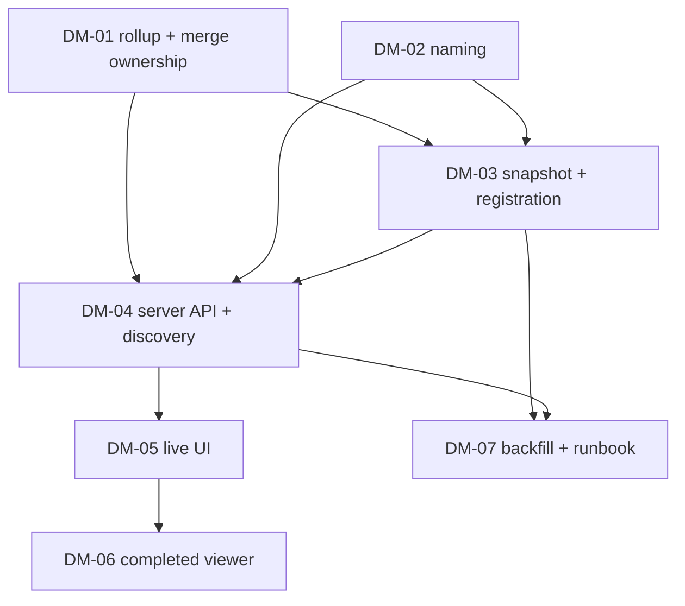

# Dashboard Observability Metrics Plan

Status: revised after three-lens review, ready for plan approval
Decomposition: `docs/development/dashboard-observability-metrics-decomposition.json`

## Problem

The live PlanGraph dashboard (`harness_labs/observability/dashboard_server.py` +
`dashboard/plan-graph/`) surfaces per-FeatureRun metrics but has no
PlanGraph-level view of totals, no persistent record of a completed graph's
metrics, and no way to compare graphs. Specific gaps, each bound to code:

1. **In-flight graphs are undiscoverable in the operator's real workflow.**
   `scripts/run_plan_graph.py` resolves its run root to
   `<repository>/logs/runs`, and `logs/runs/*` is gitignored, so every git
   worktree has its own empty `logs/runs`. `scripts/run_dashboard.py`
   hard-errors unless the operator hand-passes `--audit-root` /
   `--audit-root-registry`. In a worktree-per-run workflow a dashboard
   started against the primary checkout shows none of the in-flight graphs.
   There is no self-registration of run roots anywhere.
2. **No graph-level rollup.** `run_catalog._detail_metrics` computes
   per-FeatureRun totals; nothing aggregates a graph's children. Graph-level
   `summary.json.usage` token counts are zero by construction (tokens are
   recorded only on child runs).
3. **Cumulative retry accounting is asymmetric.**
   `dashboard_server._merge_detail_metrics` accumulates tokens/cost/duration
   across node tries but copies `quality` (review cycles, verification
   repairs, findings) from the latest try only, so those counters silently
   reset on each retry.
4. **No completion snapshot.** When a graph reaches a terminal status the
   dashboard's view of it is recomputable but never persisted; historical
   graphs are only viewable while their raw journals remain on disk and
   parseable by current code.
5. **No completed-graph viewer or comparison.** The SPA renders one selected
   attempt; there is no view over completed graphs and no cross-graph
   comparison surface.
6. **Machine IDs dominate the UI.** Graph selectors show `plan_path`,
   FeatureRun lists show raw `run_id`s. Node `objective` prose exists in the
   checkpoint (`state.nodes[node_id].objective`) but `run_catalog._nodes`
   drops it, and PlanGraph records carry no display name.

## Goals

- A PlanGraph launched in any worktree **self-registers its run root** at
  graph start, and a dashboard started with no arguments discovers it —
  every in-flight graph is loaded and listed.
- Retry-related counters (verification repairs, review-fix cycles, findings)
  are **cumulative across node tries**, matching the existing cumulative
  token/cost/duration behaviour, with per-try detail retained.
- A **PlanGraph totals panel** (rendered beneath the graph canvas) reports:
  total tokens (with cached share), estimated API cost, retries and
  recoveries (budget-ledger-sourced), blockers, peak context, wall time,
  agent-busy time and parallelism achieved, number of FeatureRuns, and
  per-FeatureRun derived stats (wall time, tokens, cost per logical node;
  mean/median/max), plus model/backend/phase breakdowns, per-node wait
  time, and critical-path time.
- On completion, a **metrics snapshot** for the graph is written to disk under
  a documented, schema-validated contract, capturing everything the live view
  showed plus an outcome summary (what was attempted, what was accomplished,
  and the concrete delta including git-level change stats).
- A **completed-PlanGraph viewer** in the same SPA loads any saved snapshot
  and renders it with the same metric components as a live run, and offers a
  **comparison table** across snapshots, grouped by logical graph and
  sortable by each metric.
- All **prior completed PlanGraphs are reconstructable** into snapshots by an
  offline CLI that tolerates the known historical data gaps (runs without
  `summary.json`, runs without token records, graph dirs whose tokens live
  only in child dirs), marking derived metrics with explicit data-quality
  flags instead of fabricating values.
- **Human-readable names** for graphs and FeatureRuns are projected through
  the catalog and used across the UI, unique within a catalog even for the
  historical corpus that lacks lineage IDs.

## Non-goals

- No change to how runs execute, retry, or finalize (except best-effort
  snapshot emission and run-root registration hooks in the runner and
  recovery scripts, which can never alter run status).
- No mutation surface on the dashboard server; it stays GET-only (HEAD and
  all mutating verbs return 405) and read-only over journals. Snapshot
  *writing* happens in the runner/recovery scripts and the offline CLI,
  never in the server.
- No remote hosting, auth, or artifact-content viewing (unchanged deliberate
  exclusions).
- No re-pricing authority: recorded `cost_usd` stays authoritative; estimates
  remain clearly labelled estimates from `_ESTIMATED_MODEL_PRICES`.
- `scripts/check_repository_contracts.py` is not part of this graph's
  functionality gate: it fails at base with 24 pre-existing errors (stale
  post-restructure README/INDEX links, missing Status lines) that are out of
  scope here and tracked separately. New docs created by this plan must
  still satisfy its rules (Status line, resolvable relative links).

## Design

### Discovery and self-registration (DM-03 writer, DM-04 reader)

`schemas/dashboard-audit-root-registry.schema.json`
(`harness-dashboard-audit-root-registry/1`) already defines a closed root
registry, and `run_dashboard.py` already accepts `--audit-root-registry`.
We add the missing wiring:

- `scripts/run_plan_graph.py` registers its resolved run root in a
  user-level registry at `~/.harness_labs/dashboard-audit-roots.json`
  (override via `HARNESS_DASHBOARD_AUDIT_ROOT_REGISTRY`) **at graph start**,
  before dispatching nodes: atomic write, deduplicated, pruning entries
  whose directories no longer exist, best-effort (a registration failure is
  a warning, never a run failure).
- `scripts/run_dashboard.py`, when invoked with no `--audit-root` and no
  `--audit-root-registry`, loads the default user-level registry if it
  exists (still bounded by the existing 16-root cap).

Result: start a graph in any worktree, start `run_dashboard.py` with no
arguments, and the graph appears within one polling interval.

### Metric semantics (shared by live rollup and snapshots)

All aggregation follows the existing tri-state availability convention
(`available | estimated/partial | unavailable` with reasons); absent data is
never rendered as zero.

**Attempt scoping (prevents cross-attempt double-counting).** The existing
cumulative node metrics (`scope: "cumulative_plan_graph_node"`) accumulate
across the node's *entire* try history keyed by `(plan_digest, node_id)`,
which spans graph repair attempts. The graph rollup must therefore consume
**attempt-scoped** child totals — tries belonging to this `graph_attempt_id`
only — for `totals`, and report cross-attempt history separately in a
labelled `lineage_totals` block. Otherwise attempt 2 of a repaired graph
counts attempt 1's tokens, and the comparison table double-counts.

- **Total tokens** — sum of attempt-scoped child totals (`input_tokens`,
  `cached_input_tokens` reported separately, `output_tokens`,
  `total_tokens = input + output`), using the existing per-run collection
  precedence. Token availability is derived from
  `provenance.usage_records == 0` (and `summary.usage.records == 0`), never
  from totals being zero — the existing aggregator sums an empty row list to
  literal zeros, which must surface as `unavailable`, not `0`.
- **Est. API cost** — sum of child cost aggregates with the existing
  degrade-to-unavailable rule; state is `available` only if every child is,
  `estimated` if any child is estimated, else `unavailable` with reason.
- **Retries / recoveries** — bound to sources that exist:
  - *Budget consumed* per classification from the retry-budget ledger
    `<run-root>/.plan-graph-budgets/<lineage_id>.jsonl`
    (`retry-budget-ledger/1`), read as plain JSONL (no
    `harness_labs.plangraph` import); `unavailable` when the ledger is
    absent (true for pre-ledger historical runs). The ledger's four counters
    (`graph_launches`, `gate_invocations`, `repair_dispatches`,
    `structural_decisions`) are reported distinctly, never conflated.
  - *Verification repairs* and *review-fix cycles* cumulative across tries
    (see cumulative quality below); free infrastructure retries reported
    separately from budget-consuming repairs where the events distinguish
    them.
  - *Recovery activity* from `execution.recovery.dispositions`,
    `execution.recovery.attempt_lineage`, and
    `execution.recovery.retry_state.invalidations` on the catalog record.
    (`state.recovery.decisions` exists only on FeatureRun checkpoints, not
    PlanGraph checkpoints, and is not used at graph level.)
  - *Node retries* — tries beyond the first per logical node — and *graph
    attempts* — attempt lineage length.
- **Blockers** — count of nodes with `status == "blocked"` with their
  evidence reasons, plus blocked entries in
  `execution.recovery.dispositions`, plus the block-escalation indicator
  projected by DM-02.
- **Peak ctx** — max `peak_input_tokens` across children with three states:
  `available` (all children report a true per-invocation peak), `partial`
  (some report — value is a lower bound, reason
  `"lower bound: N of M FeatureRuns report per-invocation peaks"`, rendered
  with a `≥` prefix), `unavailable` (none report). Never approximated from
  cumulative counters.
- **Wall time** — terminal graphs: `summary.json.usage.wall_clock_ms`;
  live graphs: elapsed from checkpoint `started_at`, computed client-side
  from the served `started_at` (never cached server-side — see caching).
- **Agent-busy time and parallelism** — children expose only scalar
  `busy_ms` (their internal interval union); cross-process monotonic clocks
  cannot be unioned. Define **agent-busy** = `sum(child.busy_ms)`
  (`unavailable` if any child's is `None`) and **parallelism achieved** =
  agent-busy / graph wall, documented as "≥1 means concurrent FeatureRuns".
  No metric is labelled "utilization".
- **# FeatureRuns** — both counts, named: `logical_nodes` (distinct nodes)
  and `feature_run_tries` (distinct child run directories including
  retries).
- **Per-FeatureRun derived stats** — headline per-FeatureRun figures (wall
  time, tokens, cost per FeatureRun) divide by **`logical_nodes`**; tries
  appear as their own column. Mean, median, and max are all reported
  (distributions are heavy-tailed; a mean alone describes no actual run).
  The per-node table (objective, status, tries, tokens, cost, wall, wait)
  is default-sorted by cost descending so the outlier leads.
- **Scheduling** — per-node `wait_ms` = child descriptor `created_at` −
  max(dependency finish), and graph `critical_path_ms` = longest dependency
  chain by wall time. (Time-to-first-token is deliberately absent: 
  `backend_transport` records completed-invocation durations only.)
- **Cache** — raw counts plus **cache savings USD**
  (`cached_input × (input_rate − cached_input_rate)`). Note:
  `input_tokens = uncached + cache_read + cache_creation` while
  `cached_input_tokens = cache_read` only, so a naive `cached/input` share
  undercounts; the share is reported against the read-eligible denominator
  and labelled.
- **Breakdowns** — per-model / per-backend / per-phase reusing `_breakdown`
  shapes (`by_phase` already classifies implement/verify/repair/review).

### Cumulative merge ownership and quality counters (DM-01)

The cumulative-across-tries merge currently lives in the HTTP server module
(`dashboard_server._apply_cumulative_node_metrics` /
`_merge_detail_metrics`). DM-01 **moves it** into
`harness_labs/observability/graph_metrics.py` as public functions, leaving
thin delegating shims in `dashboard_server.py`, so the live API, the graph
rollup, and the snapshot builder share one implementation (this is what
makes "snapshot matches live" structurally true rather than
coincidentally). DM-01 also makes the merged document report cumulative
`review_cycles` / `verification_repairs` / `findings_total` across tries in
a labelled cumulative block while retaining latest-try `quality` (criteria
and open findings are legitimately current-state) and per-try rows. The UI
labels these "cumulative across N tries" exactly as it already does for
tokens. Doing this in DM-01 — before DM-03 — means the snapshot builder is
born against the final merged shape.

### Snapshot contract (DM-03)

New schema `schemas/plangraph-metrics-snapshot.schema.json`, protocol
`plangraph-metrics-snapshot/1`:

- `identity` — `logical_graph_id`, `graph_attempt_id`, `run_id`, `plan_path`,
  `plan_digest`, `base_commit`, `repository_id` when available.
- `display_name` — human-readable graph name (see naming below).
- `status` + `timing` (`started_at`, `finished_at`, `wall_clock_ms`).
- `graph_metrics` — the full rollup above (attempt-scoped, with
  `lineage_totals`).
- `feature_runs[]` — per logical node: `node_id`, `objective`, display name,
  status, tries, cumulative detail metrics (the shared merged shape),
  per-try rows.
- `outcome` —
  - per node: `objective`, terminal status, criteria ids
    satisfied / total, evidence reason for non-success;
  - graph level: nodes attempted / succeeded / blocked / failed;
  - `delta`: `base_commit`, final integrated commit, `files_changed`,
    `insertions`, `deletions`, and per-node `candidate_commit` — computed
    from git at snapshot time when the repository is available,
    `unavailable` with reason otherwise (reconstructed snapshots of
    deleted branches will legitimately be unavailable);
  - criteria/section **text**: read via plain `json.load` of the
    decomposition file recorded in checkpoint `state.plan`, only when its
    digest matches `plan_digest`; otherwise ids only plus a
    `criteria_text_unavailable` data-quality flag. The builder must not
    import `harness_labs.plangraph.*` (import boundaries: `observability`
    may import `{core, observability}` only);
  - `narrative`: a **templated** string whose slots are drawn exclusively
    from fields already present and validated elsewhere in the document —
    no free-form generation.
- `data_quality` — explicit flags: `summary_missing`,
  `token_records_missing`, `cost_state`, `busy_unavailable_reason`,
  `criteria_text_unavailable`, `reconstructed`, `reconstruction_notes[]`,
  and a single derived `completeness` grade for the comparison table.
- `provenance` — `generated_at`, generator version, source run directories,
  builder options.

Snapshots are written atomically to
`<run-root>/.plan-graph-snapshots/<graph_attempt_id>.json` (dot-prefixed:
`build_run_catalog` skips dot-dirs exactly like the existing
`.plan-graph-budgets` / `.plan-graph-locks`). Writers:

- `scripts/run_plan_graph.py` best-effort after terminal finalization;
- `scripts/plan_graph_recover.py` best-effort after a recovery
  finalization (graphs terminalized outside the runner would otherwise
  never get snapshots);
- the offline CLI `scripts/build_plangraph_snapshot.py` for reconstruction
  and backfill.

A snapshot failure logs a warning and never alters run status or journals.
Terminal graphs visible in the catalog that have no snapshot on disk are
listed by the server flagged `snapshot_missing`, so emission holes are
visible instead of silent.

### Server API (DM-04)

- `GET /api/plan-graph-metrics/<id>` — graph rollup for live and terminal
  graphs. (A separate top-level route: the existing
  `/api/plan-graphs/<id>` dispatch validates the trailing segment with
  `_RUN_ID`, so a `/metrics` suffix under it would 404; a distinct prefix
  avoids touching the dispatch order.) Revision-derived aggregates are
  cached per catalog revision; time-derived values (`elapsed`) are **not
  served** — the client derives elapsed from `started_at`. A metrics
  computation failure for one graph degrades to a diagnostic for that
  graph and must never propagate out of `_build_snapshot` (an exception
  there would leave the whole dashboard serving 503).
- `GET /api/snapshots` — snapshot summaries (identity, display name,
  status, `completeness`, headline metrics) plus `snapshot_missing` stubs
  for snapshotless terminal graphs. Because snapshot files are invisible
  to the catalog revision (dot-dir skip), this listing is computed
  **per request** from a bounded `os.scandir` of
  `.plan-graph-snapshots/` under each audit root, with its own ETag
  derived from file names/sizes/mtimes — a snapshot written while the
  server is running appears within one refresh interval.
- `GET /api/snapshots/<id>` — one full snapshot document.
- Bounds, named: at most `MAX_SNAPSHOT_FILES = 512` snapshot files per
  root; per-file cap reuses `MAX_FILE_BYTES` (4 MiB); symlinked snapshot
  files rejected; oversize/malformed files become diagnostics in the
  listing, never handler exceptions. `_validate_audit_tree` gains an
  explicit dot-dir skip so `.plan-graph-snapshots` is neither walked nor
  counted toward `MAX_RUN_DIRECTORIES`. GET-only (HEAD and mutating verbs
  405), no query strings — unchanged.
- Default-registry loading in `scripts/run_dashboard.py` (see discovery).

### Naming (DM-02)

- PlanGraph display name: plan file stem (basename without extension,
  separator-split on `-`/`_`, title-cased; the recorded `plan_path` may be
  absolute and hyphenated), suffixed with the attempt ordinal when
  `graph_attempt_id != logical_graph_id`. **Historical descriptors carry
  `logical_graph_id = graph_attempt_id = None`** (the catalog defaults both
  to `run_id`), so the ordinal rule alone would render ~16 identical names
  for the parallelization corpus; when lineage is absent, append a
  deterministic disambiguator (`created_at` date + short `run_id` suffix).
  Display names must be unique within a merged catalog.
- FeatureRun display name: the node `objective` (first sentence, truncated),
  falling back to `descriptor.objective`, then `node_id`, then `run_id`.
- `run_catalog._nodes` projects `objective`; plan-graph and feature-run
  catalog records gain `display_name` (and feature runs `objective`);
  a block-escalation indicator is projected into `execution` from the
  `plan_graph_block_escalated` event. All schema additions to
  `schemas/run-catalog-snapshot.schema.json` are **optional** properties —
  existing committed fixtures must continue to validate unchanged.

### UI (DM-05, DM-06)

- **Live view** (existing page): an "In flight" strip lists every live graph
  (display name, state, elapsed) and switches selection; a `GraphTotals`
  panel under the canvas polls `/api/plan-graph-metrics/<id>`; retry
  counters gain cumulative labels; selectors and lists use display names.
  `GraphTotals` and the per-node table land as **standalone components**
  under `dashboard/plan-graph/src/components/` because DM-06 must reuse
  them verbatim against snapshot documents.
- **Completed viewer** (new view, toggle in the header): left rail lists
  snapshots with display name, status, finished date, and the outcome
  narrative; selecting one renders the shared components from the snapshot
  document alone; a **Compare** mode renders the comparison table:
  - grouped by `logical_graph_id` by default (attempt count as a column,
    expandable per-attempt child rows), switchable to per-attempt;
  - sortable ascending/descending by every metric column (total tokens,
    est cost, wall time, agent-busy, parallelism, retries, recoveries,
    blockers, logical nodes, tries, tokens / cost / wall per FeatureRun,
    cache savings, completeness, status);
  - **default sort: `finished_at` descending** (the only column every row
    populates);
  - degraded values render as an em-dash with a hover reason, sort last,
    and a default-on "metrics-complete only" filter shows the hidden-row
    count (a large fraction of the pre-2026-08-05 corpus has no token
    records — the table must say so rather than quietly showing empty
    stats).
- `tests/test_dashboard_e2e.py` pins exact DOM structure (tab labels,
  inspector contents) and **does run** on this machine (Chrome fallback
  path), so it is inside both frontend nodes' fences and their
  verification, and is updated alongside the UI changes.
- The built bundle must stay under the server's 1 MiB per-response ceiling
  (`MAX_RESPONSE_BYTES`); `asset()` silently 404s larger files.

### Historical reconstruction (DM-07 + operator step)

The CLI must reproduce correct, honestly-flagged snapshots for the known
historical corpus shapes (verified against `logs/runs` in the primary
checkout: 77 dirs, 2026-07-31 → 2026-08-11):

- graph dirs whose tokens live only in `-PG-*` child dirs;
- 25 runs with no `summary.json` (wall time derived from first/last event
  timestamps, flagged `summary_missing`);
- runs with zero token records (tokens `unavailable` via
  `usage_records == 0`, not zero);
- 3 launcher-style dirs with no `events.jsonl` (skipped with a diagnostic);
- interrupted / stale-running checkpoints (snapshot allowed only for
  terminal statuses; `--include-interrupted` opt-in).

Because `logs/runs` is populated only in the primary checkout, the actual
backfill is a post-merge operator step; the runbook makes it accountable
rather than invisible: `build_plangraph_snapshot.py --dry-run` prints
reconstructed / skipped / failed counts over a real root, and the runbook
states explicitly that the "reconstruct all prior completed PlanGraphs"
requirement completes at this step:

```sh
python3 scripts/build_plangraph_snapshot.py --run-root logs/runs --dry-run
python3 scripts/build_plangraph_snapshot.py --run-root logs/runs --all-completed
python3 scripts/run_dashboard.py --assets-root dashboard/plan-graph/dist
```

## DM-01 — Graph metrics rollup core and cumulative-merge ownership

Create `harness_labs/observability/graph_metrics.py`: (a) move
`_apply_cumulative_node_metrics` / `_merge_detail_metrics` out of
`dashboard_server.py` into public functions with thin delegating shims left
behind; (b) extend the merged document with the labelled cumulative quality
block (summed `review_cycles` / `verification_repairs` / `findings_total`
across tries, latest-try `quality` retained, per-try rows kept); (c) the
graph rollup per the metric-semantics section (attempt scoping,
`lineage_totals`, budget-ledger retries, tri-state everywhere, per-node
table, wait/critical-path, cache savings), as pure functions over catalog
records, child merged metrics, and the budget-ledger file. No
`harness_labs.plangraph` imports.

- AC-DM01-1: A rollup over synthetic children with full data reports exact
  attempt-scoped totals for tokens, cost, calls, wall, agent-busy,
  parallelism, peak, budget-ledger retries, recovery dispositions,
  blockers, `logical_nodes` and `feature_run_tries`, and per-FeatureRun
  derived stats divided by `logical_nodes` with mean/median/max.
- AC-DM01-2: Any child with unavailable cost, missing busy, or zero usage
  records degrades the corresponding aggregate to the documented tri-state
  (never zero) with a reason string; a mixed peak population yields the
  `partial` lower-bound state.
- AC-DM01-3: Live graphs expose `started_at` for client-side elapsed;
  terminal graphs report `summary.json` wall clock.
- AC-DM01-4: For a node whose try history spans two graph attempts, the
  attempt-2 rollup excludes attempt-1 usage from `totals` and reports it
  only under `lineage_totals`.
- AC-DM01-5: The cumulative merge is served through `graph_metrics` public
  functions with `dashboard_server` delegating; the merged document carries
  the labelled cumulative quality block alongside latest-try quality and
  per-try rows, covered by API tests.

## DM-02 — Human-readable naming projection

Project node `objective` through `run_catalog._nodes`, add `display_name`
to plan-graph and feature-run catalog records (and `objective` to
feature-run records) per the naming rules (including the
lineage-absent disambiguator and uniqueness requirement), project the
block-escalation indicator into `execution`, and extend
`schemas/run-catalog-snapshot.schema.json` with **optional** properties
plus catalog contract tests (existing fixtures must validate unchanged).

- AC-DM02-1: Catalog plan-graph records carry deterministic `display_name`s
  that are unique within a merged catalog even when descriptors lack
  lineage IDs; feature-run records carry `display_name` and `objective`;
  node projections carry `objective`.
- AC-DM02-2: Schema additions are optional properties; the existing
  committed fixtures validate unchanged; records lacking source prose fall
  back deterministically (objective → node_id → run_id).

## DM-03 — Snapshot contract, builder, CLI, emission, and run-root registration

Create `schemas/plangraph-metrics-snapshot.schema.json` and
`harness_labs/observability/plangraph_snapshot.py` (read-only builder over
run directories using the shared `graph_metrics` functions; criteria text
via digest-checked `json.load` of the recorded decomposition; git-derived
`delta`; templated narrative). Create `scripts/build_plangraph_snapshot.py`
(`--run-root`, `--graph <id>` / `--all-completed`, `--output-dir`,
`--force`, `--dry-run`, `--include-interrupted`; idempotent, atomic writes
to `<run-root>/.plan-graph-snapshots/`). Hook best-effort snapshot emission
into `scripts/run_plan_graph.py` (after terminal finalization) and
`scripts/plan_graph_recover.py` (after recovery finalization), and run-root
self-registration into `scripts/run_plan_graph.py` at graph start.

- AC-DM03-1: A snapshot for a terminal fixture graph validates against the
  new schema and matches the live rollup's numbers for the same fixture
  (both computed by the shared `graph_metrics` functions).
- AC-DM03-2: The CLI is idempotent, writes atomically, refuses non-terminal
  graphs by default, never writes inside run directories, and `--dry-run`
  reports reconstructed / skipped / failed counts without writing.
- AC-DM03-3: Terminal runs through the runner script and recovery
  finalizations through `plan_graph_recover.py` both yield snapshots; a
  snapshot or registration failure leaves run status and journals
  untouched and is reported as a warning.
- AC-DM03-4: The `outcome` block reports per-node objective, status,
  criteria ids satisfied/total, and non-success evidence reasons;
  graph-level attempted/succeeded/blocked/failed counts; a `delta` block
  with base/final commits and change stats (or `unavailable` with reason);
  criteria text only when the recorded decomposition's digest matches,
  else the `criteria_text_unavailable` flag; and a narrative containing no
  value not present elsewhere in the document.
- AC-DM03-5: A graph launched via the runner registers its run root in the
  default user-level registry at graph start (atomic, deduplicated,
  pruned); registration failure is a warning only.

## DM-04 — Server API and default discovery

Extend `dashboard_server.py` with `/api/plan-graph-metrics/<id>`,
`/api/snapshots`, and `/api/snapshots/<id>` per the server-API design
(per-request bounded snapshot listing with own ETag, `snapshot_missing`
stubs, named bounds, dot-dir skip in `_validate_audit_tree`, no
exception propagation out of `_build_snapshot`), and make
`scripts/run_dashboard.py` load the default user-level registry when no
roots are passed.

- AC-DM04-1: `/api/plan-graph-metrics/<id>` serves the DM-01 rollup for
  live and terminal graphs; revision-derived aggregates recompute only when
  the catalog revision changes; no stale time-derived value is served.
- AC-DM04-2: `/api/snapshots` lists snapshots discovered under audit roots
  with headline metrics and `snapshot_missing` stubs; a snapshot written
  after the server started is listed within one refresh interval;
  oversize, symlinked, or malformed snapshot files yield diagnostics, not
  failures of healthy listings or handler exceptions.
- AC-DM04-3: With no `--audit-root` and no `--audit-root-registry`,
  `run_dashboard.py` loads the default user-level registry, and a graph
  launched in a fresh worktree appears in the catalog within one polling
  interval.

## DM-05 — Frontend: live totals, in-flight visibility, naming

Add the `GraphTotals` panel beneath the graph canvas (polling the metrics
endpoint on the catalog cadence; elapsed derived client-side), an
"In flight" strip listing every live graph with display name / state /
elapsed and click-to-select, display names across selectors, cards, and
lists, and cumulative labels on retry counters. `GraphTotals` and the
per-node table are standalone components under
`dashboard/plan-graph/src/components/`. Update
`tests/test_dashboard_e2e.py` for the new DOM. Rebuild
`dashboard/plan-graph/dist`.

- AC-DM05-1: With multiple live graphs in the catalog, the strip lists all
  of them and switches selection without a reload; new in-flight graphs
  appear within one polling interval.
- AC-DM05-2: The totals panel renders every DM-01 headline metric with
  explicit unavailable/estimated/partial states (including the `≥` peak
  rendering) and cumulative labelling, and updates while the graph runs.
- AC-DM05-3: `npm --prefix dashboard/plan-graph run verify` and
  `tests/test_dashboard_e2e.py` pass; the committed `dist/` build reflects
  the source changes and each built asset stays under the 1 MiB response
  ceiling.

## DM-06 — Frontend: completed-PlanGraph viewer and comparison

Add the Live / Completed view toggle, the snapshot browser (list with
display names, status, finished date, outcome narrative; detail rendering
of a full snapshot via the shared components), and the comparison table
per the UI design (logical-graph grouping with per-attempt expansion,
default sort `finished_at` descending, em-dash degraded cells with
reasons, default-on metrics-complete filter with hidden count). Update
`tests/test_dashboard_e2e.py`. Rebuild `dist/`.

- AC-DM06-1: The completed viewer lists every snapshot and
  `snapshot_missing` stub the API serves and renders a selected snapshot's
  graph totals, per-node metrics, and outcome summary from the snapshot
  document alone, via the same components as the live view.
- AC-DM06-2: The comparison table groups by logical graph by default with
  expandable attempt rows and a per-attempt toggle, sorts
  ascending/descending by every metric column with degraded values last,
  defaults to `finished_at` descending, and shows the metrics-complete
  filter with its hidden-row count.
- AC-DM06-3: `npm --prefix dashboard/plan-graph run verify` and
  `tests/test_dashboard_e2e.py` pass; the committed `dist/` build reflects
  the source changes and each built asset stays under the 1 MiB response
  ceiling.

## DM-07 — Historical reconstruction hardening and runbook

Harden the snapshot builder/CLI against the historical corpus shapes with
fixture-based tests (missing `summary.json`, zero token records,
graph-with-child-token split, launcher dirs without `events.jsonl`,
interrupted checkpoints), and write the operations runbook
`docs/observability/completed-plangraph-viewer.md` (with a `Status:` line
and resolvable links; post-merge backfill and viewing commands, snapshot
layout, data-quality flag meanings), update
`docs/observability/logging-and-metrics.md` with the snapshot artifact and
protocol, and register this plan in `docs/development/INDEX.md`.

- AC-DM07-1: Backfill over a fixture corpus reproducing each historical
  degradation yields schema-valid snapshots with correct `data_quality`
  flags (including the `completeness` grade), derived wall times, tokens
  `unavailable` (not zero) for zero-record runs, and skips launcher-style
  dirs with a diagnostic instead of failing the corpus.
- AC-DM07-2: The runbook documents the exact post-merge operator commands
  (including `--dry-run` count verification) to reconstruct all prior
  completed PlanGraphs and view them, states that the reconstruction
  requirement completes at that step, and logging-and-metrics.md and
  INDEX.md are updated.

## Dependencies and parallelism



DM-01 and DM-02 run in parallel (disjoint write fences). DM-07 runs in
parallel with DM-05/DM-06 (disjoint fences; DM-05/DM-06 serialized on the
shared frontend fence).

## Post-merge operator step (outside the graph)

Run the backfill in the primary checkout (where `logs/runs` is populated)
and launch the dashboard as documented in the DM-07 runbook. The
"reconstruct all prior completed PlanGraphs" requirement completes at this
step; the `--dry-run` count report is its verification.

## Review resolution

Three-lens review (architecture/contract, source-binding/feasibility,
product) returned two structural blockers and a set of majors, all resolved
in this revision: `check_repository_contracts.py` removed from the
functionality gate (red at base, out of scope — tracked separately);
DM-07's `modify` intents on DM-03-created files removed (plan approval
validates intents against `base_commit`); cumulative-merge ownership moved
into DM-01 so the snapshot builder and API share one implementation built
before DM-03; run-root self-registration added (in-flight discovery was
broken in the worktree-per-run workflow); attempt scoping added to prevent
cross-attempt double counting; retries re-bound to the retry-budget ledger
and existing recovery projections (`state.recovery.decisions` does not
exist on PlanGraph checkpoints); busy-union replaced with agent-busy +
parallelism; peak/cache/zero-token semantics corrected; the metrics
endpoint moved off the colliding `/api/plan-graphs/` prefix; snapshot
listing made per-request with its own ETag and named bounds; e2e DOM test
brought inside the frontend fences; naming disambiguated for the
lineage-less historical corpus; outcome gained a git-derived delta and a
templated narrative; comparison table gained grouping, default sort, and
degraded-data presentation rules.
