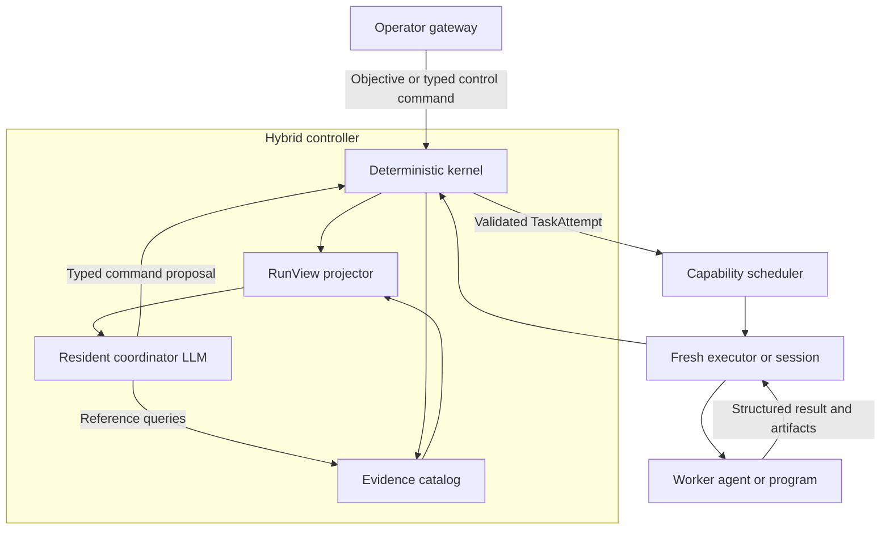

# Hybrid controller and coordinator implementation plan

Status: proposed
Date: 2026-08-03

## Objective

Build the smallest production-shaped hybrid controller that can autonomously
decompose, execute, evaluate, and recover across materially different kinds of
repository work. It must pass three flexibility scenarios:

1. a bounded history-to-plan workflow with adversarial review;
2. a multimodal UI diagnosis whose parallel breadth is chosen at runtime; and
3. an open-ended, hierarchical product appraisal and ideal-state proposal.

The scenarios must use the same kernel, command language, task/result envelope,
evidence catalog, projection mechanism, and coordinator loop. Scenario-specific
objectives, context, schemas, capability requirements, and acceptance criteria
are data supplied in run and task contracts, not new controller code paths.

The implementation must preserve the current provider-neutral execution boundary.
Codex, oMLX, deterministic test sessions, and later backends may transport the
coordinator or worker conversations, but none may own authoritative run state.

## Acceptance criteria

1. One deterministic kernel is the sole writer of authoritative run state.
2. A resident coordinator LLM selects tasks, context, decisions, and recovery
   actions through a fixed, versioned command language.
3. Replaying the same accepted commands from the same initial state produces the
   same authoritative state and event sequence, without replaying model calls.
4. Commands have actor, expected revision, idempotency key, and provenance.
   Duplicate commands do not duplicate tasks or effects, and stale commands are
   rejected.
5. The coordinator automatically receives a compact `RunView`, structured child
   results, and anomaly notices. Full artifacts and normalized events remain
   available through reference-based query tools.
6. The coordinator may dynamically choose decomposition, roles, hierarchy, and
   subagent count within run-level depth, concurrency, capability, and budget limits.
7. Parallel tasks may share a role profile while receiving distinct identities,
   context, executor sessions, and evidence ownership.
8. Every required deliverable is stored as a typed, hashed artifact. Every
   material finding has stable identity and provenance through deduplication,
   synthesis, disposition, and revision.
9. Completion is refused when a required criterion lacks evidence, a critical
   finding remains open, or any run-contract terminal deliverable is missing.
10. A coordinator or process interruption resumes from the last valid state
    without rerunning completed research or duplicating child dispatch.
11. A synthesis-only planner result is not failed merely because it executed no
    shell command. Evidence requirements are role- and task-specific.
12. One real entrypoint completes all three scenarios with deterministic model
    fixtures and the real kernel, command handlers, scheduler, audit journal,
    projections, artifacts, and coordinator tool loop.
13. Adding scenarios two and three requires no scenario-specific command type,
    phase transition handler, coordinator backend branch, or hard-coded task
    graph.

## Architecture and terminology

The **hybrid controller** is the accountable runtime subsystem. It contains two
parts:

- The **kernel** owns state, identities, authorization, scheduling, budgets,
  events, checkpoints, artifact registration, and gate enforcement.
- The **coordinator** is a resident reasoning agent. It interprets objectives,
  proposes criteria and tasks, evaluates structured results, selects evidence to
  inspect, adjudicates findings, and proposes recovery.

An **executor** realizes one validated `TaskAttempt` through a model session or
deterministic program. A **worker agent** reasons inside such an attempt. Neither
an executor nor worker may mutate run state directly.

A **role profile** describes instructions and required capabilities; it is not an
executor singleton. The scheduler allocates a fresh executor/session for every
concurrent attempt. This permits, for example, five independent `ui_inspector`
attempts without pre-registering five artificial role names.



## Controller goal

The coordinator is given the run objective plus the following ordered priorities:

1. preserve authority, safety, and audit integrity;
2. satisfy the operator's objective and binding acceptance criteria;
3. support material claims with sufficient evidence;
4. recover from uncertainty or failure without discarding verified work; and
5. minimize unnecessary agents, tokens, latency, and duplicated work.

The priorities are not reduced to a scalar reward. The kernel enforces hard
constraints; the coordinator exercises judgment only within them.

## Information model

### Authoritative state

The kernel checkpoint contains only durable operational state:

- run identity, objective reference, repository identity, and recorded HEAD;
- monotonic revision and current phase;
- criteria and their source, status, and evidence references;
- task graph, attempts, dependencies, leases, and terminal results;
- accepted facts and decisions;
- finding ledger and dispositions;
- artifact catalog;
- active sessions;
- budgets and consumption;
- pending commands, anomalies, and operator questions.

The append-only event stream remains the historical source for reconstruction.
The checkpoint is the compact state needed to continue.

### Coordinator projection

The `RunView` is a deterministic projection, not an LLM-authored summary. It
contains:

- objective and current phase goal;
- phase exit criteria and their status;
- ready, running, completed, failed, and blocked tasks;
- concise structured result summaries;
- accepted facts and their evidence references;
- open decisions, unresolved findings, anomalies, and missing evidence;
- available budgets and allowed command types; and
- a cursor identifying the latest included event.

The coordinator does not automatically receive complete transcripts or raw
transport logs. It may inspect authorized evidence through typed read tools:

```text
run.get_view
task.get_result
artifact.open
event.query
decision.list
acceptance.get_matrix
finding.list
```

The controller subsystem retains and indexes the evidence; the coordinator
loads only what is necessary for its next judgment. Raw private model reasoning
is neither required nor retained as contractual evidence.

### Structured worker results

Extend the current `TaskResult` with one domain-neutral, schema-validated semantic
envelope:

- terminal status and concise outcome summary;
- claims classified as observed or inferred;
- findings with stable IDs, category, severity, confidence, scope, and evidence;
- produced artifact references and media types;
- coverage of assigned acceptance criteria;
- decisions or recommendations, which remain advisory;
- unresolved questions, missing context, risks, and blockers;
- usage and execution receipts; and
- a tagged `details` object validated against the task's declared output schema.

The kernel understands the common envelope. Scenario-specific structures are
versioned detail schemas selected by task contract, initially:

- `commit-survey-details/1` for an ordered, HEAD-anchored history survey;
- `implementation-plan-details/1` for a plan and its verification strategy;
- `visual-inspection-details/1` for viewport, route, theme, screenshot, DOM,
  computed-style, UI-graph, and source-code observations;
- `repository-appraisal-details/1` for architectural, functional, and UI
  assessments;
- `ideal-product-details/1` for an explicit target product model;
- `gap-analysis-details/1` for current-to-target traceability;
- `website-proposal-details/1` for audience, positioning, information
  architecture, page concepts, and visual direction.

Every material claim is either `observed` or `inferred` and carries evidence
references. The kernel validates identities, references, digests, and required
fields; it does not judge whether prose is insightful. New detail schemas do not
add kernel verbs or state-transition semantics.

## Initial command language

All state-changing tools produce a provider-neutral envelope:

```yaml
protocol: harness-command/1
command_id: command-47
run_id: run-123
type: task.dispatch
actor:
  id: coordinator-1
  role: run_coordinator
expected_revision: 18
idempotency_key: run-123/coordinator-1/task-4
provenance:
  trigger_event: event-92
  evidence_refs:
    - result:commit-survey/1
payload: {}
```

The vertical slice implements only:

```text
criterion.propose
task.dispatch
task.send_message
task.close_session
decision.record
finding.disposition
phase.advance_request
retry.request
replan.request
operator_input.request
run.complete_request
run.block_request
```

Administrative operator commands are a separate authority class:

```text
run.pause
run.resume
run.cancel
budget.change
permission.grant
permission.revoke
decision.approve
decision.reject
```

The coordinator may invent command contents but not command types. Each handler
declares its schema, allowed actors and phases, possible events, and invariants.
A command receipt reports accepted, rejected, or duplicate status and references
the events it caused. A request to advance or complete never bypasses gates.

## Scenario 1 — history-to-plan reference control loop

### 1. Dispatch and orient

The operator gateway records the original objective, repository, base HEAD,
reviewer maximum, backend policy, and budget. It starts one resident coordinator
session and presents the initial `RunView`.

The coordinator proposes derived acceptance criteria. Each criterion records
whether it is operator-supplied, repository-supplied, or coordinator-derived,
plus the source instruction and rationale. Unsupported generic requirements do
not silently become gates.

The kernel validates structure, provenance, authority, and conflicts with binding
policy. It records accepted proposals but does not claim their semantic wisdom.

### 2. Research the ten commits

The coordinator dispatches the smallest useful set of independent research
tasks. It may use one child or a bounded parallel batch; it need not create one
child per commit.

The task contract pins the repository HEAD and requires exactly ten ordered
commit SHAs. Research results are stored and summarized in the next `RunView`.
If reports agree and carry sufficient evidence, the coordinator proceeds. If
they conflict, it opens the relevant artifacts or issues one targeted follow-up.

### 3. Select the immediate gap

The coordinator records a decision containing:

- selected gap;
- material alternatives;
- rationale;
- commit-survey and repository evidence;
- consequences and uncertainty.

The kernel checks provenance and persists the decision. It does not choose the
gap itself.

### 4. Draft the plan

The coordinator dispatches a planner with the selected-gap decision, accepted
facts, relevant repository references, constraints, output schema, and plan
acceptance checks. The planner may gather additional authorized context.

The kernel verifies the returned schema, artifact identity, digest, and assigned
criteria. It does not require irrelevant command activity from a synthesis-only
task.

### 5. Run adversarial review

The coordinator submits one parallel batch of at most two independent reviewers.
The kernel rejects a larger batch, role aliasing that breaks independence, or
dispatch based on a stale plan digest.

Both reviewers receive the same objective, criteria, selected-gap decision,
plan, and relevant evidence, with distinct review lenses. Their structured
findings enter one finding ledger with stable IDs.

### 6. Adjudicate and revise

The coordinator reviews the combined finding index and opens deeper evidence
only for disputed or ambiguous findings. It records a disposition for each
material finding: accepted, rejected, duplicate, deferred, or needs-evidence.
The disposition includes rationale and references.

The coordinator then sends the accepted findings to a retained planner session
or dispatches a revision attempt. The revision result maps each accepted finding
to a plan change or explicit residual risk.

### 7. Complete

The coordinator issues `run.complete_request`. The kernel independently checks:

- the survey is anchored to the recorded HEAD and names exactly ten commits;
- a selected-gap decision cites valid evidence;
- initial and final plans exist and their hashes resolve;
- no more than two independent reviews occurred;
- all material findings have dispositions;
- no accepted critical finding remains unresolved;
- every required acceptance criterion has valid evidence; and
- no active task or session remains.

If all gates pass, the kernel closes sessions, writes the terminal checkpoint
and manifest, and returns a completion receipt. Otherwise it rejects completion
with machine-readable unmet predicates for the coordinator to address.

## Scenario 2 — dark-mode UI inconsistency diagnosis

### Objective

Determine visual inconsistencies in the Retinology dark-mode UI on the Import and
Process tabs. Deduplicate and synthesize the findings, diagnose likely causes,
and propose fixes.

### Required flexibility

The coordinator chooses the number, roles, lenses, and context packets for
parallel inspectors. The run contract supplies only global depth, concurrency,
time, and cost limits; it does not prescribe `N`. Inspectors may combine:

- repository and stylesheet inspection;
- browser walks at coordinator-selected viewport sizes;
- Playwright DOM, accessibility, and computed-style inspection;
- screenshots or bounded visual crops;
- UI-graph inspection; and
- comparison between Import and Process tab states.

The coordinator may dispatch homogeneous inspectors with distinct assignments or
heterogeneous specialists. The scheduler matches each task's capability
requirements to a fresh executor. A missing browser or UI-graph capability is a
dispatch mismatch, not an invitation to fabricate observations.

### Expected information flow

1. Orient to the runnable UI, dark-mode activation, relevant routes, UI graph,
   source revision, and available browser capabilities.
2. Propose a parallel inspection batch at runtime.
3. Collect evidence-backed visual findings. Each observation records route,
   viewport, theme, element locator, expected/observed behavior, and screenshot,
   DOM, computed-style, graph, or source evidence.
4. Deduplicate findings without erasing provenance. A synthesized finding retains
   all contributing finding IDs and evidence.
5. Correlate visual symptoms with likely source causes.
6. Produce a diagnosis and proposed-fix artifact, clearly distinguishing observed
   inconsistency from inferred cause.

### Scenario assertions

- No test fixture or kernel handler specifies the number of inspectors.
- At least two independent inspections overlap in the deterministic test, while
  the live coordinator may choose another bounded number.
- Repeated role profiles are accepted and receive distinct tasks and sessions.
- Browser, code, screenshot, and UI-graph artifacts remain traceable to producing
  attempts.
- Duplicated seeded findings collapse into one synthesized finding without losing
  source finding IDs.
- Import-only, Process-only, and cross-tab inconsistencies remain distinguishable.
- The final diagnosis maps each proposed fix to findings and evidence.
- A worker lacking required visual capabilities cannot satisfy a visual
  observation merely through prose.

## Scenario 3 — critical appraisal, ideal product, and website proposal

### Objective

Critically appraise Retinology's architecture, functionality, and UI design;
propose an idealized version of the product; identify the gaps between current
and ideal states; and propose a website that promotes the idealized product.

### Required flexibility

The coordinator chooses a bounded hierarchical task graph and appropriate roles.
Children may propose their own children when their grants allow it. No test
hard-codes a required agent count, role list, decomposition, or hierarchy shape.
The kernel continues to enforce global depth, subagent count, concurrency, budget, and
capability limits.

Plausible decompositions include architecture, product workflow, clinical/user
functionality, UI/interaction design, ideal-product synthesis, gap analysis,
positioning, and website concept—but these are examples, not controller phases.
The coordinator remains responsible for deciding which independent work merits
delegation and which synthesis must remain centralized.

### Expected information flow

1. Gather evidence about current architecture, functionality, and UI behavior.
2. Build a critical appraisal that separates observed properties from evaluative
   judgments and unsupported aspirations.
3. Define one coherent idealized product, including intended users, workflows,
   capabilities, architecture qualities, UI principles, and constraints.
4. Construct a gap matrix linking every material ideal-state claim to current
   evidence, gap severity, dependencies, and a plausible path forward.
5. Derive the website proposal from the ideal product rather than from generic
   marketing language.
6. Produce a final portfolio of linked artifacts: appraisal, ideal product, gap
   analysis, and website proposal.

### Scenario assertions

- The coordinator creates a task graph not isomorphic to scenarios one or two.
- At least one child may delegate a bounded subtask in the deterministic test,
  proving depth greater than one without requiring delegation in every live run.
- Cross-domain synthesis cites upstream result and artifact references.
- Contradictions between architecture, functionality, and UI appraisals become
  explicit decisions or unresolved questions.
- Every gap names a current-state source and an ideal-state target.
- The website proposal identifies target audiences, positioning, information
  architecture, page concepts, calls to action, and visual direction, all linked
  to the ideal-product artifact.
- The coordinator cannot complete with three disconnected essays lacking the
  required traceability between current state, ideal state, gaps, and promotion.

## Cross-scenario anti-overfitting tests

The same controller build must satisfy the following:

1. **No scenario switch in the kernel.** Searching kernel and command-handler code
   reveals no branch on scenario name, Retinology, commit history, dark mode, or
   website proposal.
2. **One command algebra.** All scenarios use the same registered commands. A new
   detail schema or role profile may be introduced without a new command.
3. **Dynamic task graphs.** Deterministic coordinators produce three different
   task-graph shapes, including variable subagent counts and depth.
4. **Capability-based dispatch.** Replacing a capable executor with an incapable
   one fails at scheduling for the affected task only.
5. **Generic projections.** `RunView` renders all task states, findings,
   decisions, criteria, artifacts, and budgets without scenario-aware code.
6. **Evidence-selective context.** Each scenario completes without placing every
   prior artifact or event in the coordinator's automatic context.
7. **Backend neutrality.** Scripted and live coordinator sessions use identical
   query and command schemas.
8. **Recovery neutrality.** Duplicate delivery, coordinator replacement, stale
   revision, malformed result, and child failure follow the same mechanisms in
   every scenario.

## Recovery model

Use three recovery classes:

1. **Mechanical recovery:** reconnect a resumable session, retry a transient
   transport failure, reconcile journal-ahead checkpoint state, or redispatch an
   expired lease. The kernel follows fixed policy.
2. **Semantic recovery:** conflicting evidence, a plan aimed at the wrong gap,
   weak review, or changed repository meaning. The coordinator receives the
   anomaly and proposes targeted inspection, retry, or replanning.
3. **Authority recovery:** missing permission, exhausted budget, ambiguous
   operator intent, or a proposed scope expansion. The kernel blocks the action
   and the coordinator requests operator input.

A changed method, hypothesis, input, or provider creates a new attempt linked to
the failed attempt. Completed results remain reusable. If the resident
coordinator dies, a replacement receives the deterministic `RunView` and may
open referenced evidence; it does not reconstruct state from chat history.

## Implementation sequence

### Slice 1 — command kernel and receipts

Add:

- immutable command, receipt, event-effect, criterion, decision, finding, task,
  and run-state data structures;
- a registry of versioned command handlers;
- structural, referential, authority, phase, revision, idempotency, budget, and
  invariant validation;
- one serialized transaction boundary around event append and checkpoint update;
- deterministic state reduction from accepted events.

Initially implement `criterion.propose`, `task.dispatch`, `decision.record`,
`finding.disposition`, `phase.advance_request`, `run.complete_request`, and
`run.block_request`. Add the remaining commands only when the vertical slice
first consumes them.

Verification:

- identical state plus command produces identical effects;
- stale commands are rejected;
- repeated idempotency keys return the original receipt;
- rejected commands change no authoritative state;
- crash recovery cannot duplicate an accepted dispatch.

### Slice 2 — evidence catalog and `RunView`

Build a typed catalog over the existing hashed artifacts and event journal.
Materialize `RunView` solely from authoritative state and registered structured
results. Add bounded query tools with reference and media-type validation.

Verification:

- projections are stable for the same checkpoint;
- every displayed claim resolves to a result, decision, or artifact;
- a coordinator can start from `RunView` and selectively open one referenced
  artifact without receiving unrelated logs;
- stale or tampered references fail closed.

### Slice 3 — coordinator session

Reuse `AgentSession`, `ToolSpec`, `ToolCall`, and `ToolResult` from the existing
provider-neutral session layer. Add a controller-facing coordinator loop that:

1. opens or resumes one resident session;
2. supplies the current `RunView` and allowed query/command tools;
3. submits tool-produced commands to the kernel;
4. returns receipts and updated projections;
5. stops only at a terminal checkpoint or an operator-input request.

The backend adapter transports calls only. It contains no scenario-specific
state transitions.

Verification:

- a scripted coordinator drives the kernel without backend-specific branches;
- Codex and another existing session implementation see the same tool schemas;
- the parent remains resident across child batches;
- coordinator replacement continues from durable state.

### Slice 4 — generic results and scenario 1 vertical slice

Implement the common semantic result envelope, the history and plan detail
schemas, and one real controller entrypoint that accepts a run contract. Wire
the existing parallel batches, retained sessions, executors, and audit journal
through kernel-owned dispatch commands.

Use a disposable fixture repository with at least twelve meaningful commits.
The scripted coordinator and deterministic worker fixtures must execute the
complete history-to-plan scenario through the same entrypoint used for a live
run. Do not implement scenarios two and three until this uninterrupted path
passes.

Verification:

- exactly the latest ten commits at the recorded HEAD are surveyed;
- the gap decision cites survey evidence;
- the planner may succeed with no shell receipt when its artifact contract is
  satisfied;
- two reviewers overlap and never exceed the cap;
- findings are adjudicated and incorporated;
- incomplete evidence prevents completion;
- terminal output includes the final plan, decision record, review ledger,
  checkpoint, manifest, and metrics.

### Slice 5 — dynamic scheduling and scenario 2

Replace the current one-role-to-one-executor authorization assumption with:

- controller-owned role profiles;
- capability requirements on each task;
- an executor factory or bounded pool that creates one isolated executor/session
  per concurrent attempt; and
- scheduler reservations keyed by attempt identity rather than role name.

Preserve the current bounds and audit identities. Then add the visual-inspection
detail schema, browser/UI-graph capability declarations, finding synthesis, and
the dark-mode UI diagnosis scenario through the same entrypoint.

Use deterministic inspector fixtures with overlapping and unique seeded findings
to verify orchestration and deduplication. Use a controlled UI fixture with
seeded dark-mode defects for browser evidence tests; use live Retinology only
after the deterministic path passes.

Verification:

- the coordinator chooses `N` at runtime;
- repeated `ui_inspector` roles execute concurrently in isolated sessions;
- the configured concurrency cap is never exceeded;
- dispatch fails before execution when required visual capabilities are absent;
- deduplication retains all contributing finding and evidence references;
- the final diagnosis maps symptoms to inferred causes and proposed fixes;
- no scenario-specific command or kernel handler is added.

### Slice 6 — hierarchical composition and scenario 3

Allow a child attempt to receive a bounded delegation grant backed by the same
kernel and scheduler. Child-originated commands use the same envelope, carry the
child actor and parent attempt, and remain subject to run-level depth, subagent-count,
budget, and capability policy.

Add the appraisal, ideal-product, gap-analysis, and website-proposal detail
schemas. Execute a scripted task graph with depth greater than one, then allow a
live coordinator to choose its own bounded graph.

Verification:

- the task tree records every parent/child relationship;
- child delegation consumes the same global limits and cannot mint authority;
- sibling and subchild results use the same evidence catalog and projection;
- the final artifacts trace current state to ideal state, gaps, and website
  proposal;
- disconnected or unsupported synthesis prevents completion;
- no scenario-specific command or kernel handler is added.

### Slice 7 — live backend verification

Run the same entrypoint with a Codex coordinator and read-only Codex research and
review workers against the disposable repository. Keep the coordinator resident.
Inspect the terminal plan and audit it from stored state without relying on the
conversation transcript.

Then run all three scenarios against Retinology. Scenario two additionally uses
browser-capable inspectors and recorded UI evidence. Treat these as behavioral
evidence, not the sole correctness tests.

Verification:

- each live run terminates without an additional operator message unless it finds
  a genuine ambiguity requiring authority;
- child tasks and command effects are reconstructable;
- each deliverable satisfies its scenario rubric and traceability gates;
- task graphs and subagent counts differ across scenarios;
- audit verification passes;
- reported agent, token, tool, and wall-clock metrics have explicit units and
  denominators.

### Slice 8 — bounded failure certification

Only after all uninterrupted scenario paths pass, test:

- coordinator death and replacement;
- child crash and changed-method retry;
- duplicate command delivery;
- event written before checkpoint replacement;
- repository HEAD changing before research;
- stale plan digest at review dispatch;
- one reviewer returning malformed output;
- contradictory review findings;
- browser-capability loss during UI inspection;
- a child attempting to exceed its delegation depth;
- coordinator-selected subagent count exceeding the remaining budget;
- open critical finding at completion;
- operator pause, correction, and resume.

Do not add generalized snapshotting, arbitrary workflow definitions, dynamic
command registration, or unrelated lifecycle refactoring in this milestone.

## Expected implementation surface

The exact filenames may change during implementation, but ownership should
remain clear:

```text
harness_labs/
├── controller_commands.py      # command envelopes and registered handlers
├── controller_kernel.py        # validation, transactions and state reduction
├── controller_projection.py    # deterministic RunView
├── controller_coordinator.py   # resident LLM tool loop
├── controller_results.py       # tagged role-result validation
├── controller_scheduler.py     # capability matching and executor allocation
└── controller_run.py           # scenario-neutral production entrypoint

schemas/
├── controller-command.schema.json
├── controller-receipt.schema.json
├── controller-run-view.schema.json
└── controller-task-result.schema.json

tests/
├── test_controller_kernel.py
├── test_controller_projection.py
├── test_controller_coordinator.py
├── test_controller_scheduler.py
├── test_history_plan_scenario.py
├── test_dark_mode_diagnosis_scenario.py
└── test_product_appraisal_scenario.py
```

Existing `attempts.py`, `composition.py`, `agent_sessions.py`, and `audit.py`
remain the execution, delegation, session, and evidence primitives. Extend them
only where the production controller becomes their direct consumer.

## Explicit non-goals

- A general-purpose workflow-definition language.
- Dynamic installation of new kernel command semantics during a run.
- Automatic semantic approval of coordinator-derived requirements.
- Feeding complete event streams or model transcripts into every coordinator
  turn.
- Persisting private chain-of-thought.
- Supporting arbitrary concurrent write graphs or Git integration in this
  analysis-and-planning milestone.
- Replacing existing backend adapters. The child dispatcher may be refactored
  only to remove its demonstrated role-to-executor singleton constraint.

## Completion evidence

The milestone is complete when:

- all new schemas and deterministic tests pass;
- the same real controller entrypoint completes all three scenarios with scripted
  model fixtures;
- scenario task graphs demonstrate variable subagent counts, repeated roles, capability
  matching, and bounded subchild delegation;
- crash/retry tests demonstrate no duplicated authoritative effects;
- live Codex runs produce the reviewed implementation plan, dark-mode diagnosis,
  and linked product-appraisal portfolio;
- `scripts.audit_run verify` validates every resulting run directory;
- documentation identifies every derived requirement and its source; and
- kernel and command-handler code contain no scenario-specific branches.
