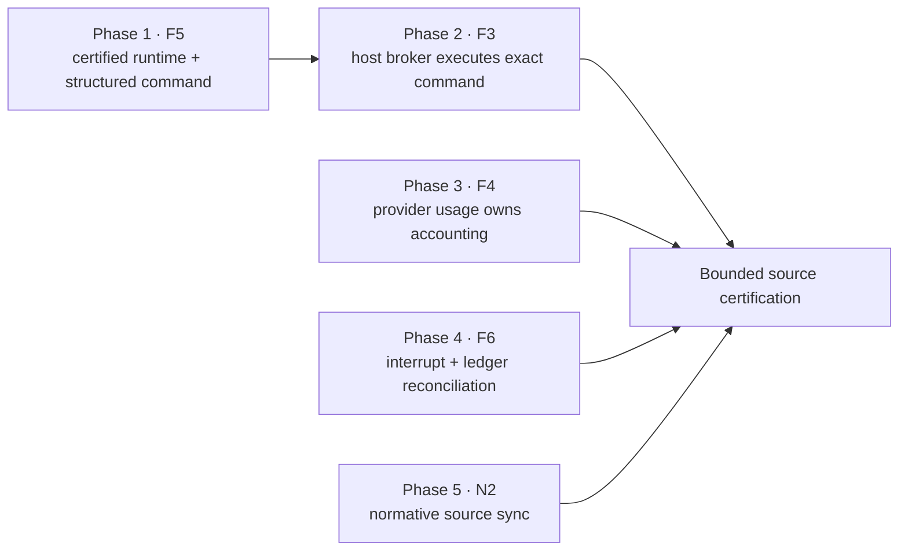

# Implement-v13-codex post-remediation remediation plan v2

Status: proposed; source-bound; implementation not started

## Authority, scope, and non-goals

This plan implements only the five actionable defects accepted in
`docs/development/implement-v13-codex-post-remediation-failure-adjudication-v2.md`:

1. `F3` — capability-manifest broker equivalence is not execution authority.
2. `F4` — provider usage is ignored and unavailable telemetry is encoded as
   zero.
3. `F5` — closure-test command interpreter identity is unbound.
4. `F6` — interruption does not finalize the owned process group, process
   receipt, and active closure attempt.
5. `N2` — normative unbound-retry text contradicts executable behavior.

The bounded implementation root is
`skills/codex/implement-v13-codex`. The paused feature run
`fr_0a8feb07a847488ea910a0ec5a2a99d7` is immutable evidence for this work; this
plan does not mutate or resume that run, its queue, checkpoint, ledger, process
receipts, feature worktree, or controller package.

The adjudication explicitly rejected `F8` and `N1`. Therefore this plan does
not rename targeted-review status fields, change their routing, alter Codex
cache handling, deduplicate stderr diagnostics, change models, change
coordinator authority, add default coordinator limits, weaken Seatbelt, or
broaden model write access. It also does not introduce a generalized execution,
snapshot, migration, or queue-E2E framework.

## Source and evidence baseline

| ID | Current contract/source | Bounded failure evidence | Intended contract |
| --- | --- | --- | --- |
| `F3` | `scripts/repair_preflight.py::_sandbox_probe_command` runs one host probe; `probe_role_capabilities` derives `same_broker_as_production` from `production_real`. `scripts/repair_gates.py::_production_sandbox` accepts that manifest without executing the dependency-mapped command through the asserted broker. `scripts/run_exec.py::_codex_argv` launches an ordinary sandboxed Codex child. | The v14 capability manifest has SHA-256 `ac68ed74cfbb65f01a2e39883fd2afc721b853e197144f31f33714c1f2087c20`; fixer output SHA-256 `7e34ce4af3b8e18fdb4306166fe8a8e537a8e1f9b0aab972404fbb3ac1a45dc5` accepts it and then records `sandbox_apply: Operation not permitted`. | A manifest attests only host capability. A controller-owned gate must execute the exact dependency-mapped command through the exact recorded broker, interpreter, and policy; its hash-bound receipt, not a model retry, authorizes read-only targeted review. |
| `F4` | `schemas/feature-coordinator-result.schema.json` gives the model token telemetry fields. `scripts/run_exec.py::_terminal_validation_errors` reads terminal events but `_finalize_receipt` does not persist their usage. `scripts/run_feature.py::drive` reads model output telemetry and defaults missing input tokens to zero. | Coordinator stdout SHA-256 `fe2359d439808605f3f83b2399c1db5fd25acae778afabfbbdf24c26d0105e06` reports 13,023,321 input, 12,185,856 cached input, and 82,501 output tokens; sibling output SHA-256 `09ad0a08b89d1b9bf7bc3a6bbbd50a130736bb779f9e581e2699ebb1aef705fa` reports zeroes. | Provider-emitted terminal usage is receipt authority. Unknown usage remains explicitly unknown. Only exact operator- or safety-authorized limits may consume it. |
| `F5` | `schemas/closure-test-result.schema.json` and `scripts/review_closure.py::record_test` persist command strings. `review_closure.py::backfill_assertion_map` reuses legacy strings. `schemas/repair-assertion-map.schema.json` also stores a string, while graph/batch commands are argv arrays without a certified runtime binding. | Targeted-review result SHA-256 `767a83ed38f391f3e5aa30cd86509955028aac48ac2f4192034c6044924cf42a` records that ambient Python 3.14 lacked pytest while the available certification interpreter passed the same immutable node. | Every new closure-test command and deterministic gate input binds an absolute preflight-probed interpreter and dependency fingerprint. Known legacy Python/pytest strings are normalized before model launch; every other unpinned legacy command is explicitly classified and fails closed. |
| `F6` | `scripts/run_exec.py::_terminate_owned_group` is called only in timeout paths. The fresh polling lifecycle has no `BaseException` finalizer. `scripts/supervised_child.py::main` blocks in `subprocess.run` and writes an exit record only after it returns. `scripts/review_closure.py::start_attempt` leaves the ledger at `fix_running` until `finish_attempt`. | Process receipt SHA-256 `92c29fe1f2d34d14a5f238029ac7ac3a7fb41bea9aff51ebfcefdc67992fc28a` remains `running` with PID/PGID 72376; its output/exit are absent and ledger revision 188 retains attempt 6 as running. | Any controller interruption fingerprint-verifies and terminates the owned group, writes a terminal interrupted receipt and scratch audit, and re-raises. Resume reconciles that receipt into the same attempt history without pretending the strategy failed or creating a duplicate attempt. |
| `N2` | `scripts/closure_driver.py::continue_without_bound_program` and `tests/test_closure_driver.py` permit unbound `next_ready`, `retry_fix`, and `redesign`; `references/protocol.md` and `references/phase-contracts.md` still say a missing same-closure continuation is a deterministic blocker. | The source conflict is bound in the adjudication; no post-v14 recurrence is claimed. | Both normative references state the exact executable route set and retain fail-closed behavior only for unknown routes. |

## Contract graph and implementation order



`F5` precedes `F3` because the host executor cannot prove that it ran the same
certification environment until the command and runtime are immutable. `F4`,
`F6`, and `N2` have no cross-dependency and may be implemented independently,
but they are certified together only after all five scoped changes are present.

## Phase 1 — bind closure-test commands to the certified runtime (`F5`)

### Exact targets

- `scripts/repair_preflight.py`
  - `probe_role_capabilities`
  - `validate_capability_manifest`
  - one small helper that constructs and validates the certification-runtime
    identity; do not create a generic environment manager.
- `schemas/capability-manifest.schema.json`
- `schemas/closure-test-result.schema.json`
- `schemas/repair-assertion-map.schema.json`
- `schemas/repair-dependency-graph.schema.json`
- `schemas/repair-batch.schema.json`
- `scripts/review_closure.py`
  - `record_test`
  - `validate_assertion_effects` call boundary
  - `backfill_assertion_map`
  - `_load_dependency_graph`
  - `_selected_tests`
  - `validate_invocation_spec`
- `tests/test_review_closure.py`
- `tests/test_repair_gates.py`
- `references/protocol.md`
- `references/phase-contracts.md`
- `references/repository-gates.md`

### Minimal change design

1. Extend the production-real capability manifest with one closed
   `certification_runtime` object containing:
   - canonical absolute `interpreter_path`;
   - interpreter executable SHA-256;
   - exact Python version;
   - pytest distribution version and resolved module location;
   - a canonical `dependency_fingerprint_sha256` over those fields.
   The probe must obtain the dependency facts by invoking that same absolute
   interpreter. Injected test runners remain `simulation_only` and cannot
   authorize production gates.
2. Define one closed test-command object used by new closure tests, assertion
   maps, dependency-graph nodes, and repair batches:
   - protocol `implement-v13-codex/test-command/1`;
   - argv as a nonempty string array whose first element is the exact absolute
     `interpreter_path` and whose Python test entry is `-m pytest`;
   - `certification_runtime_sha256`;
   - a fixed controller-owned environment profile name rather than
     caller-selected environment values.
   Keep test node/source hashes unchanged.
3. Make the new closure-test result protocol require these objects. A model may
   select test arguments but may not supply a different interpreter, dependency
   fingerprint, or scratch path. `record_test` validates each command against
   the hash-bound run-owned capability manifest before persisting it to the
   ledger and assertion map.
4. Add a narrow legacy reader in `review_closure.py`:
   - use `shlex.split` only for strings composed of optional known
     `TMPDIR`/`PYTHONDONTWRITEBYTECODE` assignments followed by `python3 -m
     pytest` or `pytest`;
   - replace only that executable prefix with the certified absolute
     interpreter plus `-m pytest`;
   - reject shell operators, substitutions, redirections, or an unknown
     executable;
   - persist whether the command was `normalized` or
     `legacy_unpinned`. A `legacy_unpinned` command blocks before a model
     launch; it is never run ambiently and is not silently rewritten.
5. Make `_selected_tests` return the validated command objects without losing
   their runtime hash. The batch schema and gate input bind that same object,
   rather than reducing it back to an argv array.
6. Preserve immutable v1 artifacts through explicit v1 readers. New writes use
   the new protocol/shape. Do not rewrite prior run artifacts in place.

### Deterministic acceptance

- `tests/test_review_closure.py`
  - new command with a relative interpreter is rejected before ledger mutation;
  - runtime SHA mismatch is rejected before ledger mutation;
  - assertion map, dependency graph, and selected batch preserve the identical
    test-command bytes/hash;
  - the observed legacy form
    `TMPDIR=/private/tmp PYTHONDONTWRITEBYTECODE=1 python3 -m pytest ...`
    normalizes to the certified interpreter while preserving the pytest
    arguments;
  - a legacy command containing `|`, `>`, `$()`, or an unknown executable is
    classified `legacy_unpinned` and no model invocation is permitted.
- `tests/test_repair_gates.py`
  - selected commands carry the exact capability runtime SHA;
  - a gate rejects a changed interpreter path, executable hash, dependency
    version, or runtime SHA before its command runner is called.
- Validate every changed schema with `jsonschema.Draft202012Validator` against
  one new artifact and one retained v1 fixture.

### Documentation, risk, and rollback

Update only the closure-test, capability, and repository-gate paragraphs in the
three named references. State that the certification interpreter is an
absolute, probed identity and that diagnostic ambient-Python execution cannot
replace it.

The main compatibility risk is unsafe parsing of legacy shell strings. The
rollback boundary is the legacy normalizer: fail closed rather than broaden its
grammar. Never fall back to ambient `python3`; leave the legacy closure
explicitly blocked with its original evidence intact.

## Phase 2 — execute certification through the controller-owned host broker (`F3`)

### Exact targets

- `scripts/repair_preflight.py`
  - `_sandbox_probe_command`
  - `probe_role_capabilities`
  - `validate_capability_manifest`
- `schemas/capability-manifest.schema.json`
- `scripts/repair_gates.py`
  - `GATE_ORDER`
  - `_production_sandbox`
  - `_dependency_regression`
  - `run_repair_gates`
  - one bounded host-certification helper local to this module
- `scripts/review_closure.py::_validated_gate_receipt`
- `scripts/closure_driver.py::run_closure_program` at its existing
  `run_repair_gates` call
- new narrow schemas:
  - `schemas/repair-gate-input.schema.json`
  - `schemas/repair-gate-receipt.schema.json`
- `tests/test_repair_gates.py`
- `tests/test_closure_driver.py`
- `references/protocol.md`
- `references/phase-contracts.md`

### Minimal change design

1. Stop emitting or consuming `same_broker_as_production` as per-invocation
   proof. The manifest records host availability and the exact broker
   executable identity only: absolute path, executable SHA-256, probe-policy
   SHA-256, and Phase 1 certification-runtime SHA.
2. Keep `run_repair_gates` controller-owned. It is already called directly by
   `closure_driver.py`, outside the model invocation handled by `run_exec.py`.
   Do not move this command into a fixer or reviewer prompt.
3. Replace the current manifest-only `production_sandbox` claim and separate
   ambient dependency command with two precise gates:
   - `capability_manifest`: validates the host broker and certified runtime as
     available, but claims no later invocation equivalence;
   - `production_certification`: for every exact Phase 1 test-command object,
     constructs one Seatbelt policy from controller-owned repository/scratch
     paths and executes
     `[broker, "-p", policy, *test_command.argv]`.
4. The production policy permits repository reads, denies repository writes,
   permits only controller-created private scratch, and retains the existing
   scratch symlink containment rules. The helper hashes policy bytes before
   launch and hashes/removes scratch at terminal. No model or gate-input field
   may select broker, policy, interpreter, repository root, or scratch.
5. The repair-gate receipt schema binds, for each command:
   - command bytes/hash and selected immutable node;
   - broker path/SHA;
   - policy SHA;
   - certification-runtime SHA;
   - cwd/repository identity;
   - return code and stdout/stderr hashes;
   - scratch-content hash and confirmed removal.
   A nonzero result fails the deterministic gate and suppresses targeted model
   review.
6. `_validated_gate_receipt` requires exact ordered gates
   `forbidden_access`, `pre_communication_output_bound`, `process_evidence`,
   `capability_manifest`, `production_certification` and validates the new
   receipt schema/hash. Read-only targeted reviewers consume only this receipt;
   they do not rerun nested Seatbelt.

### Deterministic acceptance

- `tests/test_repair_gates.py`
  - a fake host runner observes exactly one broker-wrapped invocation per
    selected command and no ambient duplicate;
  - the inner argv begins with the Phase 1 absolute interpreter;
  - manifest success without a matching host-execution result cannot set
    `targeted_review_permitted=true`;
  - broker, broker SHA, policy SHA, runtime SHA, command hash, stdout/stderr
    hash, scratch hash, and scratch removal are present in the passed receipt;
  - broker/policy/runtime mismatch and repository-write probe failure stop
    before targeted review;
  - a simulated capability manifest never authorizes the production gate.
- `tests/test_closure_driver.py`
  - one passed host-certification receipt reaches targeted review;
  - one failed receipt records deterministic gate failure and does not invoke
    targeted review;
  - the targeted reviewer is given the receipt path/hash but no instruction to
    execute `sandbox-exec`.

### Documentation, risk, and rollback

Update the two named references so “production-real” means the exact
controller-owned command execution recorded in the gate receipt, not manifest
equivalence. Preserve the broad required repository suite; this change only
moves the exact command to its valid host authority boundary.

The main risk is a policy that is broader than the current probe. Roll back by
failing the `production_certification` gate; never roll back to manifest-only
authorization or execute unsandboxed. The helper remains local to
`repair_gates.py` to prevent it becoming a generalized privileged executor.

## Phase 3 — make provider terminal usage authoritative (`F4`)

### Exact targets

- `scripts/run_exec.py`
  - `_read_events`
  - `_terminal_validation_errors`
  - `_finalize_receipt`
  - `_assert_receipt_matches`
  - one `_provider_usage` extractor
- `schemas/process-receipt.schema.json`
- `schemas/feature-coordinator-result.schema.json`
- `scripts/run_feature.py`
  - `COORDINATOR_PROTOCOL`
  - `_invoke_real`
  - `_recover_coordinator_position`
  - `_write_rollover_summary`
  - `drive`
  - one receipt-usage reader shared by fresh and recovery paths
- `schemas/coordinator-rollover.schema.json`
- `tests/test_run_exec.py`
- `tests/test_run_feature.py`
- `tests/test_production_vertical_slice.py` only where its stub emits the
  coordinator protocol
- `references/protocol.md`

### Minimal change design

1. Parse the last terminal `turn.completed.usage` in `run_exec.py`. Persist a
   closed `provider_usage` object in every terminal process receipt:
   - `status="recorded"` with nonnegative `input_tokens`,
     `cached_input_tokens`, and `output_tokens`; or
   - `status="unknown"` with all three values `null`.
   Missing usage is never converted to numeric zero. Reject malformed, Boolean,
   negative, or multiply conflicting terminal usage.
2. Hash authority remains the receipt's stdout artifact hash. Revalidation
   recomputes provider usage from the same hash-bound stdout and rejects a
   changed value. For historical v1/v2 receipts without `provider_usage`, the
   read path derives it from their already hash-bound stdout; it does not
   mutate the historical receipt.
3. Advance the coordinator result protocol so the model no longer owns token
   counts. Its optional metrics may retain only
   `coordinator_turns_avoided`; token fields are absent and
   `additionalProperties=false`. Update the coordinator protocol constant and
   stubs together.
4. Make `_invoke_real` return the receipt-derived usage with output and thread
   identity. On resume, reconstruct the context token series from contiguous
   coordinator process receipts, not `coordinator-output-*.json`.
5. Store receipt-derived values in `coordinator-rollover/1` telemetry. When no
   limits exist, unknown usage is recorded and execution may continue. When
   exact authorized limits exist, unknown usage fails closed before slope
   calculation; it is not zero and does not silently bypass the configured
   limit.
6. Leave `_coordinator_limits` authority rules unchanged. Do not infer a limit
   from observed cost and do not make limits mandatory.

### Deterministic acceptance

- `tests/test_run_exec.py`
  - a successful terminal event with the three nonzero values persists them
    exactly and validates against `process-receipt.schema.json`;
  - an event with no usage persists `status="unknown"` and nulls;
  - malformed or conflicting usage is a terminal protocol failure;
  - revalidation rejects a provider-usage value inconsistent with hash-bound
    stdout.
- `tests/test_run_feature.py`
  - model output zeroes cannot override nonzero receipt usage;
  - current coordinator output does not expose model-owned token fields;
  - recovery reads the same nonzero sequence from contiguous receipts;
  - unknown usage with no configured limit stays unknown;
  - unknown usage with an explicitly authorized slope limit blocks before
    arithmetic;
  - rollover slope and telemetry use receipt values exactly.
- Update existing production-path stubs to emit the current coordinator
  protocol and provider usage in `turn.completed`; no queue lifecycle expansion
  is authorized.

### Documentation, risk, and rollback

Update only the coordinator accounting and process-receipt paragraphs in
`references/protocol.md`. The principal risk is historical receipt recovery.
Keep the hash-checked legacy reader until all retained v1/v2 receipts are
terminally irrelevant. If legacy stdout lacks usage, preserve `unknown`; never
guess or restore model-authored zeroes.

## Phase 4 — interruption-safe process and closure-attempt recovery (`F6`)

### Exact targets

- `scripts/run_exec.py`
  - `_terminate_owned_group`
  - the fresh `subprocess.Popen` polling lifecycle in `run`
  - the nonterminal-receipt recovery branch in `run`
  - a narrow interrupted-receipt finalizer
- `scripts/supervised_child.py::main`
- `schemas/process-receipt.schema.json`
- `scripts/review_closure.py`
  - `start_attempt`
  - `finish_attempt`
  - `attempt_history_sha256`
  - one `reconcile_interrupted_attempt` transition
- `scripts/closure_driver.py::run_closure_program`
- `schemas/review-closure-ledger.schema.json`
- `tests/test_run_exec.py`
- `tests/test_review_closure.py`
- `tests/test_closure_driver.py`
- `references/protocol.md`
- `references/phase-contracts.md`

### Minimal change design

1. Wrap only the owned fresh-child polling/wait region in `try/except
   BaseException`. On interruption:
   - verify PID, PGID, and process-start fingerprint;
   - terminate the exact owned group using the existing TERM-then-KILL bound;
   - wait/reap the supervisor;
   - write a controller-owned exit record if the supervisor did not;
   - hash available stdout/stderr/child-spec/exit evidence;
   - hash and remove ephemeral scratch;
   - atomically persist a terminal `failed` receipt with an explicit
     interruption marker, timestamp, validation evidence, and incremented
     revision;
   - re-raise the original exception.
   Do not catch and continue, and never signal a group after fingerprint
   mismatch.
2. Replace `supervised_child.py`'s blocking `subprocess.run` with `Popen` plus a
   minimal `SIGINT`/`SIGTERM` handler that forwards the signal to its direct
   child and writes the durable exit record in `finally`. The controller still
   owns group termination; the wrapper must not recursively signal its own
   group.
3. Apply the same interrupted finalizer when recovery observes an owned live
   nonterminal receipt and the recovering controller itself is interrupted.
   Existing wall-timeout behavior remains separate and unchanged.
4. Add `review_closure.py::reconcile_interrupted_attempt`. It accepts only a
   run-owned, hash-matched terminal receipt whose `receipt_id` equals the
   latest running attempt's `invocation_id` and whose interruption marker is
   present. It changes that attempt from `running` to `interrupted`, records
   receipt path/hash, and returns the closure to `ready_for_fix` without:
   - deleting or replacing the attempt;
   - counting it as a rejected strategy;
   - forbidding reuse of that strategy family;
   - creating a new attempt.
5. At closure-program entry, if the active closure is `fix_running`, reconcile
   only that exact receipt, emit the existing deterministic `retry_fix` route,
   and require a newly bound attempt before another model launch. Any missing,
   nonterminal, mismatched, or unowned receipt remains a deterministic recovery
   blocker.

### Deterministic acceptance

- `tests/test_run_exec.py`
  - start `run_exec.py` with a fake Codex child that records its PID and blocks;
  - send real `SIGINT` to the controller process only;
  - assert the supervisor and fake Codex descendant no longer exist within a
    bounded poll;
  - assert the receipt is terminal, interruption-marked, revision-incremented,
    scratch-hashed/removed, and schema-valid;
  - rerun the same spec and prove recovery returns the terminal receipt without
    launching another child;
  - simulate fingerprint mismatch and prove no signal is sent.
- `tests/test_review_closure.py`
  - reconcile one exact interrupted receipt and preserve all prior attempts,
    hashes, strategy family, and ordering;
  - prove the interrupted attempt is not counted as a rejected strategy and
    the same strategy may be rebound;
  - reject a different receipt ID, changed receipt hash, nonterminal receipt,
    or path outside the artifact directory.
- `tests/test_closure_driver.py`
  - a paused `fix_running` ledger plus exact interrupted receipt returns the
    existing `retry_fix` route without a model call;
  - ambiguous or missing interruption evidence stays blocked and does not
    alter attempt history.

### Documentation, risk, and rollback

Update the process-receipt/recovery paragraph in `references/protocol.md` and
the closure-attempt paragraph in `references/phase-contracts.md`. State that
process state is liveness evidence, the receipt is child-completion authority,
and the ledger preserves attempt history.

Signal handling is the highest-risk phase. Keep TERM/KILL deadlines bounded and
the fingerprint guard mandatory. If the wrapper cannot write an exit record,
the parent still terminalizes the receipt with that absence as evidence; it
must not leave `running`. Rollback means disabling new launch after an
interruption, not reverting to unreconciled live children.

## Phase 5 — synchronize the unbound-route normative contract (`N2`)

### Exact targets

- `references/protocol.md`, only the routine-routing paragraph
- `references/phase-contracts.md`, only the corresponding REVIEWING paragraph
- `scripts/closure_driver.py`
  - expose the existing legal unbound route set as one constant used by
    `continue_without_bound_program`; do not change routing behavior
- `tests/test_closure_driver.py`

### Minimal change design

1. State in both references that unbound `next_ready`, `retry_fix`, and
   `redesign` return to the outer coordinator to bind a fresh source-hashed
   program. A missing optimization edge is not
   `routine_program_missing`.
2. Preserve fail-closed behavior for every unknown route and preserve
   cycle/path validation for any program that is supplied.
3. Add one conformance test that compares the canonical executable route set
   with the exact route names in both normative paragraphs. Parameterize the
   existing behavioral test over all three legal routes and retain the unknown
   route blocker assertion.

### Deterministic acceptance

- `tests/test_closure_driver.py` proves:
  - `next_ready` remains a normal return;
  - `retry_fix` and `redesign` require coordinator follow-up but do not block;
  - an unknown unbound route remains `routine_program_missing`;
  - both normative files enumerate exactly the same three legal route names.

### Documentation, risk, and rollback

This phase changes no runtime semantics. Its only risk is future prose drift;
the conformance test makes such drift visible. Roll back only a mistaken prose
edit while retaining the already-tested v14 implementation.

## Bounded certification and completion evidence

After all phases, run only the implement-v13 source-level contract suites
affected above:

Use the absolute
`capability-manifest.certification_runtime.interpreter_path` as the executable
for six `-m unittest discover` invocations with
`-s skills/codex/implement-v13-codex/tests` and, respectively, these exact
`-p` values:

```text
test_review_closure.py
test_repair_gates.py
test_closure_driver.py
test_run_exec.py
test_run_feature.py
test_production_vertical_slice.py
```

The executed argv, interpreter identity, counts, return code, and output hashes
must be recorded. Do not substitute an ambient interpreter missing declared
dependencies.

Then run:

1. JSON Schema meta-validation for every changed/new schema and representative
   current plus legacy fixtures;
2. the existing complete `skills/codex/implement-v13-codex/tests` suite so the
   required broad gate is not weakened;
3. `git diff --check`;
4. a source-scope audit proving changed implementation files are confined to
   the targets listed in this plan and no queue/run artifact changed.

Completion requires:

| ID | Required proof |
| --- | --- |
| `F3` | Exact dependency-mapped command ran once through the controller-owned broker; receipt binds broker, policy, runtime, command, outputs, and scratch; reviewer did not rerun Seatbelt. |
| `F4` | Nonzero provider usage survives receipt, recovery, rollover, and authorized slope accounting; unknown is never zero. |
| `F5` | New closure commands and gate inputs bind the same absolute interpreter/runtime hash; the observed legacy command normalizes; unsafe legacy commands fail before model launch. |
| `F6` | Real controller SIGINT leaves no supervised descendant, produces a terminal receipt, and reconciles the same preserved ledger attempt without duplicate launch. |
| `N2` | Executable legal-route set, both normative paragraphs, and behavioral tests agree exactly. |

No completion claim may rely on the paused run changing state. Resumption is a
separate operator action outside this plan.
