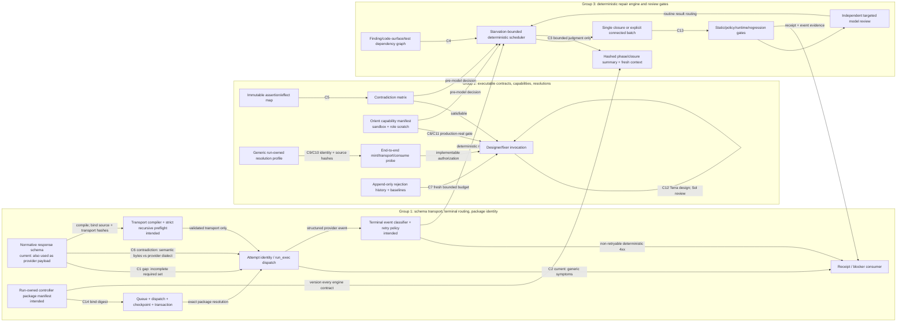

# implement-v13-codex bounded remediation plan

Status: implementation-ready plan; no run state or installed skill has been changed

Revision record:

- Original plan SHA-256:
  `895379e2b5a22ac53e76e94e54317a48700fac212aa92bf5ed238f218e29f59f`.
- Adjudication SHA-256:
  `461c44a09ea691bf083fa4b88d818be29dd0f94046d03d092ba159cec8326700`.
- Incorporated critical findings: `J-R1-001`, `J-R1-002`.
- Not incorporated, with no plan change made in response to their target text:
  `J-R1-003`, `J-R1-004`, `J-R1-005`, `J-R1-006`, `J-R1-007`,
  `J-R1-008`, `J-R1-009`, `J-R1-010`, `J-R1-011`, `J-R1-012`.

Scope: adjudicated claims J-C1 through J-C14 in
`<user-home>/Documents/harness_labs/docs/development/implement-v13-codex-failure-analysis.md`.
This plan is deliberately limited to the installed `implement-v13-codex` and
`serial-implement-codex` controller packages, their schemas/tests, and the
minimum run-owned migration artifacts needed to resume feature run
`fr_0a8feb07a847488ea910a0ec5a2a99d7` safely after certification.

The implementation partition has three coherent groups. It does **not** create
a generalized snapshot framework, replace the feature lifecycle, refactor
unrelated state I/O, or change feature-repository behavior.

## Evidence convention

- **Fact** means directly established by the cited current source, test, or the
  adjudicated audit.
- **Inference** means a proposed design conclusion or a prediction that has not
  yet been demonstrated by implementation evidence.
- Source citations use absolute paths and inclusive line ranges as observed on
  2026-07-22. Stable symbols/tests are included so later line drift is
  detectable.
- Run evidence is read-only input to this plan. No queue, checkpoint,
  transaction, closure ledger, receipt, feature worktree, or installed skill
  was mutated while preparing it.

## Acceptance criteria defined before implementation

The remediation is acceptable only if all of the following are true.

### AC-1 — Provider response schemas fail locally, before attempt identity

1. `closure-test-result.schema.json` requires `effect_contract`.
2. The recursive response-schema validator rejects every object node whose
   `required` set is not exactly its `properties` keys, rejects unsupported
   provider keywords, and enforces the other provider object restrictions used
   by production.
3. Every canonical role-output schema is deterministically compiled from its
   normative schema to a provider transport schema and exercised through the
   same `_preflight`/binding path used by `run()`.
4. A rejected schema creates no receipt, attempt ID, subprocess, or closure
   budget consumption.

### AC-2 — Deterministic provider failures are classified and not model-retried

1. A terminal provider `error`/`turn.failed` event for a strict-schema 4xx
   produces receipt class `response_schema_transport_rejected`, with a
   normalized server message and HTTP/provider code.
2. Raw stdout remains hashed and diagnostics such as model-cache warnings remain
   separate from the terminal cause.
3. The retry router declares this class non-retryable across models and emits
   one blocker/event naming the actionable schema defect.

### AC-3 — A run has one explicit controller-package identity

1. New dispatches copy the complete bounded controller package required by the
   run—scripts, schemas, prompts, references, and package manifest—into a
   read-only run-owned package directory and compute a canonical manifest
   digest.
2. Queue feature state, dispatch, checkpoint, feature transaction, migration
   records, and every process receipt carry the same package digest.
3. Every controller/child path resolves from that run-owned package; resume
   rejects an absent or mismatched package.
4. A package change is possible only through an explicit old/new digest
   migration receipt that proves schema/state invariants and starts a fresh
   bounded coordinator context. Per-invocation hashes remain intact.
5. A resumed migrated run is dispatched only as
   `dispatch_action=resume_existing_run` to the run-owned `run_feature.py`;
   `start_planning.py` rejects this action. Resume and child launch remain
   excluded until one committed migration validates every bound authority.

### AC-4 — Contracts and capabilities are proven before model repair work

1. Each immutable assertion is mapped to one canonical lifecycle effect and a
   deterministic contradiction check runs before a designer or fixer.
2. Provider transport schemas are generated, never hand-copied by children.
3. Exact production sandbox and reviewer scratch capabilities are probed at
   orient/planning time and recorded; monkeypatched capability tests cannot
   satisfy certification.
4. Operator resolution profiles are generic, run-owned, source-hashed, bound to
   the active repository/closure/test identity, and proven end to end from
   controller-only minting through fail-closed consumption before resume.
5. The globally reusable controller contains no literal `testing_harness` path,
   test node, mutation bytes, or repository-specific fixture rule.
6. Historical rejection evidence remains append-only while an operator
   resolution can establish exactly one zero-based post-resolution design and
   fixer budget.

### AC-5 — Review repair scheduling is dependency-bound and starvation-bounded

1. Closure groups declare code surfaces and immutable test dependencies in an
   acyclic graph.
2. Unaffected ready closures may advance around a repeatedly failing cluster.
   An atomic multi-closure repair is allowed only for an explicit connected
   dependency component with one disjoint write set and independent reviewers.
3. Each repair batch runs one deterministic incremental regression suite for
   the affected dependency closure, rather than requiring a model reviewer to
   restate every then-closed peer result.
4. Forbidden reads/selectors, pre-communication output bounds,
   process-evidence validity, real sandbox smoke, and dependency-mapped tests
   pass before targeted model review.

### AC-6 — Routine orchestration is bounded and model judgment is measurable

1. Routine phase transitions, retry routing, closure routing, and artifact
   construction execute in a deterministic JSON-defined engine.
2. A coordinator is invoked only for an enumerated judgment reason.
3. Coordinator contexts roll at phase/closure boundaries through a hashed
   summary; hard per-context turn and context-slope limits fail closed and emit
   rollover telemetry.
4. Terra-medium remains the bounded repair-designer policy with independent
   Sol-medium design review. No quality superiority claim is made until a
   controlled equivalent-closure benchmark reports acceptance, rework, tokens,
   and runtime.

### AC-7 — Compatibility, recovery, and certification

1. Legacy ledgers/queues remain readable without deleting unknown fields or
   history. Migration is explicit, idempotent, hash-bound, and never silently
   changes an active run.
2. Existing per-invocation receipts remain immutable and valid evidence.
3. Unit, schema, adversarial, migration, serial/feature integration, production
   vertical-slice, and real-environment capability tests all pass.
4. The blocked run is not resumed during remediation. A dry-run migration and
   resume readiness report prove the exact safe-resume procedure below.
5. Documentation and machine-readable schemas change with behavior, and the
   final certification records commands, exit codes, package digest, test
   counts, and any skipped real-environment check.
6. The controller-owned migration command uses per-document compare-and-swap,
   including the closure-ledger CAS API, and is crash-recoverable by forward
   completion after every durable-write prefix. A `prepared` journal alone
   grants no resume or launch authority.

## Current-to-intended contract graph

The nodes below are deliberately grouped only where defects share the same
producer/consumer boundary. Claim labels on every edge preserve C1-C14
traceability.



### Source-bound node/edge inventory

| Contract node or edge | Current fact | Contradiction/gap | Intended downstream consumers |
|---|---|---|---|
| Canonical closure-test schema (C1) | `effect_contract` is a property but is absent from top-level `required`: `<user-home>/.codex/skills/implement-v13-codex/schemas/closure-test-result.schema.json:5-14`. | Provider strict-object completeness is not represented. | `_build_validator`, `_bind_expected_schema`, every closure-test invocation. |
| Recursive provider preflight (C1, C6) | `_check_codex_response_schema` checks explicit `type` for `const`/`enum` and array `items`, but not complete object `required`: `<user-home>/.codex/skills/implement-v13-codex/scripts/run_exec.py:207-226`; `_preflight` calls validation before dispatch at lines 288-325. | JSON Schema validity is treated as provider-dialect validity; no source-to-transport compilation contract exists. | `run_exec.run`, all role specs, attempt/receipt creation. |
| Canonical byte guard (C6) | Repair designers must supply bytes equal to the canonical repair schema: `<user-home>/.codex/skills/implement-v13-codex/scripts/review_closure.py:785-796`. Current tests only assert selected canonical repair schemas omit `uniqueItems`: `<user-home>/.codex/skills/implement-v13-codex/tests/test_run_exec.py:18-32` and `<user-home>/.codex/skills/implement-v13-codex/tests/test_review_closure.py:48-55`. | One artifact is both normative contract and provider transport; keyword deletion is a partial incident fix, not compilation. | Repair designer dispatch, provider, receipt hashes, later reproduction. |
| Terminal taxonomy (C2) | `_terminal_validation_errors` returns generic exit/thread/turn/output symptoms: `<user-home>/.codex/skills/implement-v13-codex/scripts/run_exec.py:362-411`. | Structured provider cause is not promoted into receipt-level routing data. | Retry router, blocker settlement, operator diagnostics, metrics. |
| Receipt provenance (C2, C14) | Per-invocation prompt/schema source hashes are compared at `<user-home>/.codex/skills/implement-v13-codex/scripts/run_exec.py:482-530`; receipt schema exposes `schema_source_sha256` at `<user-home>/.codex/skills/implement-v13-codex/schemas/process-receipt.schema.json:10-29`. | No full controller-package digest or normalized terminal cause is required. | Queue/checkpoint/transaction, resume validation, audit. |
| Dispatch/package identity (C14) | `prepare_dispatch` emits queue/run/path/planning fields, but no package digest: `<user-home>/.codex/skills/serial-implement-codex/scripts/serial_state.py:687-785`. Checkpoint and transaction schemas likewise do not require one: `<user-home>/.codex/skills/implement-v13-codex/schemas/checkpoint.schema.json:1-6`; `<user-home>/.codex/skills/implement-v13-codex/schemas/feature-transaction.schema.json:1-6`. | Continuation has local hashes but no coherent run-level version. | Serial resume, `run_feature.drive`, `run_exec`, all artifacts. |
| Same-thread recovery (C3, C14) | Recovery requires contiguous turns on exactly one thread: `<user-home>/.codex/skills/implement-v13-codex/scripts/run_feature.py:468-497`; drive loops coordinator-to-child-to-coordinator at lines 500-620. | No explicit package migration/context rollover boundary or hard turn/context limit. | Coordinator prompts, closure routing, critical-path latency. |
| Deterministic normal closure chain (C3 partial) | `run_closure_program` advances a normal author/design/review/fix/targeted-review chain without intervening coordinator turns: `<user-home>/.codex/skills/implement-v13-codex/scripts/closure_driver.py:49-178`; test: `<user-home>/.codex/skills/implement-v13-codex/tests/test_closure_driver.py:25-76`. | Rejections, escalations, scheduling, retries, and phase transitions still return to the long-lived coordinator. | Review scheduler and coordinator budget. |
| Effect-contract comparison (C5) | Canonical effects and prose-derived disposition comparison are defined at `<user-home>/.codex/skills/implement-v13-codex/scripts/review_closure.py:21-117` and applied at lines 312-400. | No assertion-to-effect mapping or executable satisfiability proof precedes design/fix. | Closure author, designer, fixer, independent reviewer. |
| Resolution validator (C9, C10) | `resolve_design_contradiction` enumerates exact `testing_harness` paths, nodes, bytes, and fixture channel at `<user-home>/.codex/skills/implement-v13-codex/scripts/review_closure.py:403-546`. | Structured declarations can be accepted without an executable end-to-end dataflow; generic global code contains project policy. | Blocked-resume authorization, fixer prompt, targeted reviewer. |
| Budget baseline (C7 partial/fixed) | Post-resolution design/attempt counts subtract baselines at `<user-home>/.codex/skills/implement-v13-codex/scripts/review_closure.py:226-251`; one-time recovery is at lines 547-602. Tests preserve history and grant a fresh budget at `<user-home>/.codex/skills/implement-v13-codex/tests/test_review_closure.py:573-643`. | Behavior exists, but the ledger schema does not declare baseline/history fields as required migration invariants: `<user-home>/.codex/skills/implement-v13-codex/schemas/review-closure-ledger.schema.json:15-35`. | Escalation calculation, legacy ledger migration, audit. |
| Capability permissions (C8, C11) | `run_exec` models only sandbox plus writable roots and launches Codex under the outer sandbox: `<user-home>/.codex/skills/implement-v13-codex/scripts/run_exec.py:247-263,605-660`. | There is no semantic production Seatbelt probe and no first-class per-role ephemeral scratch contract. | Orient/planning gate, reviewers, certification receipts. |
| Closure dependency scheduling (C4 partial) | Ledger creation accepts and cycle-checks `depends_on`/`related_closures`, but `_save` selects the first ready item: `<user-home>/.codex/skills/implement-v13-codex/scripts/review_closure.py:120-193,210-218`; test: `<user-home>/.codex/skills/implement-v13-codex/tests/test_review_closure.py:645-691`. | No code-surface/test dependency edges, starvation counter, affected-component batch, or reorder policy. | Repair scheduler, regression selection, write-set enforcement. |
| Regression closure (C4, C13) | Only one repair action may be batched: `<user-home>/.codex/skills/implement-v13-codex/scripts/run_feature.py:308-328`. Targeted review must report every other currently closed closure and reopens failed peers: `<user-home>/.codex/skills/implement-v13-codex/scripts/review_closure.py:655-697`. | Model review carries a global dynamic regression obligation; deterministic affected-surface gates do not precede it. | Closure ledger, later closures, targeted reviewers. |
| Reviewer mutation protection (C11/C13 partial) | Workspace-write reviewers are recognized and fingerprinted before execution: `<user-home>/.codex/skills/implement-v13-codex/scripts/run_feature.py:331-370`. | Mutation detection does not define/probe a dedicated scratch capability or the exact test runner. | Read-only independent reviewers and their receipts. |
| Model identity (C12 partial/fixed policy) | Current coordinator prompt mandates Terra-medium design and Sol-medium review: `<user-home>/.codex/skills/implement-v13-codex/scripts/run_feature.py:219-223`; invocation validation enforces Terra/Sol/Luna roles at `<user-home>/.codex/skills/implement-v13-codex/scripts/review_closure.py:775-784`; `run_exec` limits Luna-high to implementation/fix roles at `<user-home>/.codex/skills/implement-v13-codex/scripts/run_exec.py:663-687`. | Policy changed, but no controlled benchmark establishes Terra quality/cost advantage and deterministic stop gates remain incomplete. | Model policy evaluation and efficiency metrics. |
| Serial blocked resume (C9, C14) | Resume validates token, exact run identity, and checkpoint/transaction hashes, then records authorization: `<user-home>/.codex/skills/serial-implement-codex/scripts/serial_state.py:832-949`; adversarial identity tests are at `<user-home>/.codex/skills/serial-implement-codex/tests/test_serial_state.py:581-686`. | Resume evidence does not bind controller migration/package digest or executable resolution proof. | Queue lease, checkpoint resume, run launch. |

## Bounded implementation partition and critical path

```text
Group 1 (must land first)
  schema compiler/preflight + terminal taxonomy + package identity/migration primitive
        |
        v
Group 2
  executable contract/capability/resolution gates + baseline schema invariant
        |
        v
Group 3
  dependency scheduler + early repair gates + bounded coordinator contexts
        |
        v
full certification -> dry-run legacy migration -> operator-authorized safe resume
```

Group 1 is the critical path: C1/C2 are the immediate blocker, while C14 must be
fixed before any resumed run consumes the repaired controller. Group 2 must
precede Group 3 because scheduling may only route work after contract,
capability, and resolution gates have deterministic outcomes. Group 3 can
reuse, but must not weaken, Group 1 terminal routing and Group 2 gate results.

Only one implementation owner writes a group at a time. Independent review may
run concurrently because it is read-only; no two implementation groups share a
writable checkout.

## Group 1 — Provider boundary and immutable control-plane identity

### Objective and claims

Fix C1, C2, C6, and C14 as one coupled provider/provenance boundary. This group
also supplies the package identity consumed by Groups 2 and 3.

### Exact write set and symbols

`implement-v13-codex`:

- `<user-home>/.codex/skills/implement-v13-codex/schemas/closure-test-result.schema.json`
  — top-level `required`.
- Add
  `<user-home>/.codex/skills/implement-v13-codex/scripts/response_schema.py`
  — `compile_transport_schema`, `validate_provider_schema`,
  `canonical_schema_hashes`.
- `<user-home>/.codex/skills/implement-v13-codex/scripts/run_exec.py`
  — `_check_codex_response_schema`, `_build_validator`, `_preflight`,
  `_terminal_validation_errors`, `_finalize_receipt`,
  `_assert_receipt_matches`, `run`.
- `<user-home>/.codex/skills/implement-v13-codex/scripts/run_feature.py`
  — `_write_turn_inputs`, `_recover_coordinator_position`, `drive`; package
  resolution and explicit rollover hook only, not the Group 3 scheduler.
- Add
  `<user-home>/.codex/skills/implement-v13-codex/scripts/controller_package.py`
  — bounded manifest, copy, verify, migration command/coordinator, fixed
  authority lock order, journal state machine, and forward recovery for these
  two skills only.
- `<user-home>/.codex/skills/implement-v13-codex/scripts/state_io.py`
  — ordered authority-lock context and locked revision/hash CAS primitives used
  only by the controller migration command.
- `<user-home>/.codex/skills/implement-v13-codex/scripts/review_closure.py`
  — replace repair-design byte comparison with normative/transport hash
  comparison in `validate_invocation_spec`; add `cas_save_ledger` with an
  expected `state_revision` witness for migration.
- `<user-home>/.codex/skills/implement-v13-codex/schemas/process-receipt.schema.json`
  — require source/transport hashes, package digest, terminal cause object, and
  diagnostics.
- `<user-home>/.codex/skills/implement-v13-codex/schemas/checkpoint.schema.json`
  and
  `<user-home>/.codex/skills/implement-v13-codex/schemas/feature-transaction.schema.json`
  — package digest/version and optional migration receipt hash.
- Add
  `<user-home>/.codex/skills/implement-v13-codex/schemas/controller-package-manifest.schema.json`
  and
  `<user-home>/.codex/skills/implement-v13-codex/schemas/controller-migration.schema.json`.

`serial-implement-codex`:

- `<user-home>/.codex/skills/serial-implement-codex/scripts/serial_state.py`
  — `prepare_dispatch`, `_expected_resume_identity`,
  `_validate_resume_artifacts`, `resume_blocked_feature`, and
  `cas_migrate_feature_locked`. All serial queue byte construction and writes
  remain inside this module.
- Its existing queue is intentionally not given a generalized new schema
  subsystem; add only package/migration fields to the existing validated
  feature contract in `validate_queue`.

Tests:

- `<user-home>/.codex/skills/implement-v13-codex/tests/test_run_exec.py`
- Add
  `<user-home>/.codex/skills/implement-v13-codex/tests/test_response_schema.py`
- `<user-home>/.codex/skills/implement-v13-codex/tests/test_review_closure.py`
- `<user-home>/.codex/skills/implement-v13-codex/tests/test_run_feature.py`
- `<user-home>/.codex/skills/implement-v13-codex/tests/test_production_vertical_slice.py`
- Add
  `<user-home>/.codex/skills/implement-v13-codex/tests/test_controller_migration.py`
- `<user-home>/.codex/skills/serial-implement-codex/tests/test_serial_state.py`

### Contract changes

1. Normative schema bytes remain the semantic authority. A deterministic
   compiler produces provider transport bytes in the run artifact. Both hashes,
   compiler version, and canonical source path are recorded. Children never
   select or author the transport copy.
2. Provider validation recursively enforces the documented strict subset at
   every object/array/combinator node. A package-level test enumerates every
   `schemas/*-result.schema.json` used as `--output-schema`; ordinary state
   schemas such as `flow.schema.json` are not incorrectly forced into the
   provider subset.
3. Terminal cause becomes a closed machine-readable union. Initial required
   members are `response_schema_transport_rejected`,
   `provider_auth_rejected`, `provider_rate_limited`, `wall_timeout`,
   `child_process_failure`, `terminal_protocol_failure`, and
   `output_validation_failure`; the retry table is explicit and tested.
4. The package manifest includes relative path, SHA-256, mode/executable bit,
   package protocol, and manifest digest. It excludes caches, receipts, and
   mutable run state. This is a purpose-built controller-package copy, not a
   reusable filesystem snapshot abstraction.
5. A controller migration record contains old identity (or explicit
   `legacy_unfrozen` evidence set), new digest, state-schema versions,
   pre/post artifact hashes, invariant results, reason, authorization hash, and
   coordinator rollover receipt.
6. The run-owned command is exactly:
   `python RUN_PACKAGE/scripts/controller_package.py migrate-run --proposal
   PROPOSAL.json --queue QUEUE.json --dispatch DISPATCH.json --checkpoint
   CHECKPOINT.json --transaction TRANSACTION.json --ledger LEDGER.json
   --journal JOURNAL.json --expected-queue-revision N
   --expected-dispatch-sha256 H --expected-checkpoint-revision N
   --expected-transaction-revision N --expected-ledger-revision N
   --certified-package-digest H --authorization-evidence AUTH.json
   (--dry-run | --commit)`. `--commit` validates absolute paths, exact
   queue/run/worktree identity, the blocked `REVIEWING/fix` checkpoint,
   transaction `prepared`, proposal and authorization hashes, every supplied
   CAS witness, and the certified run-owned package before writing.
7. `migrate-run --commit` holds the run migration authority lock for the whole
   operation and acquires document authorities in this fixed order:
   serial queue, dispatch, checkpoint, transaction, closure ledger, then
   journal. The command invokes authority-specific locked CAS functions; in
   particular, only `serial_state.cas_migrate_feature_locked` may construct or
   write queue bytes, and `review_closure.cas_save_ledger` rejects a stale
   ledger revision. Reversed or partial lock acquisition fails closed.
8. The durable journal states are `prepared`, `validated`, and `committed`.
   `prepared` records the ordered write plan, all pre/post hashes and revisions,
   and authorization hash, but is explicitly non-authoritative. Resume,
   `prepare_dispatch`, and every child-launch path acquire the migration
   authority lock and require `committed` plus read-back equality for every
   bound post-hash. No dispatch lease becomes launch-selectable before that
   check.
9. After authorized serial resume, `prepare_dispatch` emits only
   `dispatch_action=resume_existing_run` for this migrated in-progress feature,
   with the committed journal hash, package digest, coordinator ID, and lease ID.
   Its sole executable consumer is:
   `python RUN_PACKAGE/scripts/run_feature.py DISPATCH.json
   --resume-existing-run --expected-migration-sha256 H
   --expected-package-digest H --coordinator-id ID --lease-id ID`.
   `run_feature.py` rejects a missing flag, non-run-owned script/package path,
   lease mismatch, non-committed journal, document hash mismatch, or
   non-blocked/non-`REVIEWING/fix` checkpoint. It consumes the one authorized
   lease, reopens only that checkpoint detail, and starts a fresh coordinator
   from the rollover summary. `start_planning.py` must never receive or consume
   `resume_existing_run` and must fail closed if it is supplied.

### Migration and backward compatibility

- New runs require the package digest at dispatch.
- Legacy nonterminal runs without a digest are **not** silently adopted. A
  one-time `legacy_unfrozen -> <certified digest>` migration must identify the
  immutable receipts/schema hashes available for the old run, preserve them,
  validate current queue/checkpoint/transaction/ledger identities, and record
  the epistemic limitation that no complete old package digest exists.
- A prepared or partially written migration is recovered only by rerunning
  `migrate-run --commit` with the same proposal and authorization. Under the
  fixed locks, it verifies each recorded pre/post witness, performs the next
  missing CAS write, validates all final documents, and commits the journal;
  a conflicting witness blocks recovery.
- Existing receipts remain byte-immutable. Readers treat missing new fields as
  legacy receipt v1 only; writers emit receipt v2. Revalidation may add a
  separate signed/hash-bound migration index but may not rewrite old receipts.
- The canonical schema compiler can read current normative schemas. It never
  accepts an ad hoc provider-compatible child copy.

### Deterministic and adversarial tests

Positive:

1. Enumerate every production response schema, compile it, bind expected
   identity, and pass the exact production `_preflight`.
2. Assert the closure-test transport requires nullable-or-present
   `effect_contract` as its normative semantics dictate.
3. Parse a fixture matching attempts 14-16 into
   `response_schema_transport_rejected`; assert the server message and raw
   stdout hash are retained and retry is false.
4. Dispatch a fixture run, verify all state artifacts and receipts carry one
   package digest, stop, and resume from the run-owned package after the global
   installed directory is modified in a disposable test copy.
5. Migrate a legacy fixture once; rerunning produces byte-identical/no-op
   outcome.
6. From an existing feature worktree and a blocked `REVIEWING/fix` checkpoint,
   commit the migration, perform authorized `serial_state.resume_blocked_feature`,
   assert `prepare_dispatch` returns `resume_existing_run`, and invoke the
   run-owned `run_feature.py` CLI through lease consumption and reopening only
   `REVIEWING/fix` until the first deterministic post-migration gate, strict
   response-schema preflight, succeeds. Assert no planning entrypoint, model
   call, child launch, or attempt identity occurs before that gate.
7. Inject a crash after every durable write: prepared journal; each queue,
   dispatch, checkpoint, transaction, and ledger CAS; each corresponding
   journal acknowledgement; rollover summary and its acknowledgement; final
   validation record; and committed journal. For every prefix, assert resume and
   child launch are unselectable, rerun the same command, and prove forward
   completion to exactly one committed migration with all post-hashes valid.

Negative/adversarial:

1. Nested object missing one `required` property; unexpected
   `additionalProperties`; unsupported keyword; array missing `items`;
   malformed combinator; compiler nondeterminism.
2. Provider 400 plus misleading cache warning: cause remains schema rejection,
   warning remains diagnostic, and no model switch is scheduled.
3. Same server message delivered only on stderr or malformed JSON: classify
   conservatively without fabricating a schema cause.
4. Package path escape, symlink escape, mode change, one-byte script/schema
   mutation, missing manifest entry, digest mismatch at queue/checkpoint/
   transaction/receipt.
5. Resume with current global package instead of run-owned package; migration
   missing old/new proof; attempt to reuse the old coordinator thread after
   migration.
6. Route `resume_existing_run` through `start_planning.py`; omit the recovery
   flag; substitute the package, migration hash, coordinator, or lease; present
   a prepared/uncommitted journal; reuse the consumed lease.
7. Crash at every write boundary with one stale CAS witness or a competing
   dispatch attempt; assert no rollback, resume, or child launch is selected and
   the migration remains recoverably blocked.

### Ownership, dependencies, and exit gates

- Owner: control-plane boundary implementer.
- Writable paths: exactly the Group 1 list. No run artifacts or feature
  worktrees.
- Dependencies: none; first critical-path group. Within Group 1, the ledger and
  serial queue CAS APIs plus migration launch exclusion precede the migration
  command; the committed migration contract precedes resumed-run dispatch; the
  resumed-run E2E gate precedes Group 1 exit.
- Independent review: provider-schema correctness and migration/provenance
  reviewer.
- Exit gates: AC-1, AC-2, and AC-3 pass; all production schemas pass compiled
  preflight; legacy migration dry-run, every-write crash recovery, and blocked
  `REVIEWING/fix` resumed-run E2E fixtures pass; no installed
  `testing_harness` cleanup is attempted yet (owned by Group 2); full existing
  tests remain green.

## Group 2 — Executable repair contracts, capabilities, and generic resolutions

### Objective and claims

Fix C5, C8, C9, C10, and C11; promote the already implemented C7 baseline and
C12 model policy into explicit schemas/gates. These are coupled because each
decides whether repair model work is lawful and executable.

### Exact write set and symbols

- Add
  `<user-home>/.codex/skills/implement-v13-codex/schemas/repair-assertion-map.schema.json`.
- Add
  `<user-home>/.codex/skills/implement-v13-codex/schemas/capability-manifest.schema.json`.
- Add
  `<user-home>/.codex/skills/implement-v13-codex/schemas/operator-resolution-profile.schema.json`.
- `<user-home>/.codex/skills/implement-v13-codex/schemas/review-closure-ledger.schema.json`
  — declare assertion maps, resolution artifact references/hashes, baseline
  invariants, and capability evidence references.
- Add
  `<user-home>/.codex/skills/implement-v13-codex/scripts/repair_preflight.py`
  — `validate_assertion_effects`, `solve_effect_constraints`,
  `probe_role_capabilities`, `validate_resolution_dataflow`.
- `<user-home>/.codex/skills/implement-v13-codex/scripts/review_closure.py`
  — `record_test`, `_authoritative_effect_contract`,
  `resolve_design_contradiction`, `_post_resolution_*`,
  `validate_invocation_spec`.
- `<user-home>/.codex/skills/implement-v13-codex/scripts/closure_driver.py`
  — call pre-model gates before design/fix and return structured deterministic
  outcomes.
- `<user-home>/.codex/skills/implement-v13-codex/scripts/start_planning.py`
  — write the orient/planning capability manifest before model implementation.
- `<user-home>/.codex/skills/implement-v13-codex/scripts/run_exec.py`
  — accept controller-owned `ephemeral_scratch` separately from repository
  `writable_roots`, pass it to the child, and record it.
- `<user-home>/.codex/skills/implement-v13-codex/schemas/process-receipt.schema.json`
  — granted scratch root and capability-manifest hash.
- `<user-home>/.codex/skills/implement-v13-codex/tests/test_review_closure.py`
- `<user-home>/.codex/skills/implement-v13-codex/tests/test_closure_driver.py`
- `<user-home>/.codex/skills/implement-v13-codex/tests/test_start_planning.py`
- `<user-home>/.codex/skills/implement-v13-codex/tests/test_run_exec.py`
- Add
  `<user-home>/.codex/skills/implement-v13-codex/tests/test_repair_preflight.py`.

### Contract changes

1. Closure-test output supplies assertion IDs, exact test node/command, governed
   artifact/effect, expected disposition, observation source, and immutable
   test/source hash. The deterministic solver rejects an effect assigned
   incompatible dispositions for the same canonical input.
2. The capability manifest is created once against the actual execution path.
   It separates repository write authority from ephemeral scratch. Mandatory
   OS sandbox enforcement names its owner: controller/host broker, never an
   inner role when the environment forbids nesting.
3. Real Seatbelt/sandbox probes use the same broker/outer sandbox as
   production. A failed required probe blocks at orient with
   `external_capability_unavailable`; a monkeypatched test carries
   `simulation_only=true` and cannot satisfy certification.
4. Operator resolutions become run-owned JSON artifacts. Generic validation
   checks repository identity, active closure/test, source/test hashes,
   controller-only and non-caller-selectable minting, transport, lifetime,
   consumption, absence/reuse/mismatch rejection, and an end-to-end probe
   receipt. The installed controller contains no project literals.
5. `design_rejection_baseline` and `attempt_rejection_baseline` are explicit
   nullable ledger fields plus a one-time activation history. Counts can be
   rebased once per new resolution hash; historical arrays are append-only.
6. Model invocation is downstream of all deterministic gates. Terra-medium
   design, Luna-high fix, and independent Sol-medium review remain current
   policy; benchmark output is evidence, not a release gate for this
   correctness remediation.

### Migration and backward compatibility

- Ledger protocol gains a versioned migration. Existing closure tests without
  assertion maps cannot advance into a new fixer; they require a deterministic
  backfill artifact authored from immutable test evidence and independently
  verified. Existing accepted/closed attempts are not reopened merely because
  the field is absent unless their dependency component is affected by a new
  repair.
- Extract the `testing_harness` resolution values currently present in the
  legacy ledger/controller into a run-owned profile during the C14 migration.
  Do not infer missing hashes or execution proof: if absent, safe-resume
  readiness remains blocked until they are measured.
- Preserve every contract resolution, design rejection, attempt, escalation,
  and recovery record. The migration adds references/hashes and baselines; it
  does not normalize away historical shapes.
- Roles that need no scratch remain read-only. Reviewer scratch is a
  controller-created, per-invocation empty directory outside repository write
  authority, removed only after its contents/hash are recorded.

### Deterministic and adversarial tests

Positive:

1. Assertion map with controller-owned failure persistence satisfies the
   immutable failure-state tests and reaches design; the prior byte-identity
   assignment is rejected before designer invocation.
2. Real environment probe distinguishes available broker enforcement,
   unavailable nested enforcement, and reviewer pytest scratch needs.
3. A generic fixture resolution binds exact repo/closure/test/source hashes,
   mints through an anonymous pipe owned by the controller, consumes once, and
   fails closed for ordinary dispatch.
4. Migrated C7 fixture preserves four old design rejections and three old fixer
   rejections while allowing exactly one fresh post-resolution budget.
5. Model policy fixture routes deterministic failures to zero model calls and a
   satisfiable closure to Terra design plus Sol review.

Negative/adversarial:

1. Two assertions assign the same effect both unchanged and persisted; an
   assertion names an unknown effect; test hash changes after mapping.
2. Capability probe is monkeypatched, run in a different sandbox, or grants
   repository write access under the label “scratch”.
3. Resolution names the wrong active test, caller-selectable profile,
   role-minted token, reusable token, visible secret, mismatched source hash,
   path escape, stale closure, missing consumption proof, or a probe that never
   exercises absence/reuse.
4. Insert `testing_harness`, its known node IDs, mutation bytes, or fixture name
   anywhere under installed `scripts/` or `schemas/`; a repository-literal
   guard must fail.
5. Activate either rejection baseline twice, reduce a baseline, delete history,
   or reuse a baseline after a different resolution hash.
6. Claim Terra advantage without a controlled benchmark; schema validation
   rejects the benchmark as comparative evidence.

### Ownership, dependencies, and exit gates

- Owner: repair-contract and capability implementer.
- Writable paths: exactly the Group 2 list; Group 1 must be merged/frozen first.
- Dependencies: Group 1 transport compiler and package identity.
- Independent review: security/authority reviewer plus executable-contract
  reviewer; neither may write implementation paths.
- Exit gates: AC-4 passes; C7 legacy fixtures prove append-only exactly-once
  reset; no repository literal remains in generic controller code; real
  capability smoke runs in the managed environment; simulated smoke is clearly
  non-certifying; all existing tests remain green.

## Group 3 — Dependency-aware repair engine, early gates, bounded coordination

### Objective and claims

Fix C3, C4, and C13 without redesigning the full lifecycle. Extend the existing
closure driver and dependency fields into a deterministic review-repair
sub-engine; retain model coordination only for explicit judgment.

### Exact write set and symbols

- Add
  `<user-home>/.codex/skills/implement-v13-codex/schemas/repair-dependency-graph.schema.json`.
- Add
  `<user-home>/.codex/skills/implement-v13-codex/schemas/repair-batch.schema.json`.
- Add
  `<user-home>/.codex/skills/implement-v13-codex/schemas/coordinator-rollover.schema.json`.
- `<user-home>/.codex/skills/implement-v13-codex/schemas/review-closure-ledger.schema.json`
  — code surfaces, test dependencies, ready age/starvation count, batch and
  regression evidence.
- `<user-home>/.codex/skills/implement-v13-codex/scripts/review_closure.py`
  — `create_ledger`, `_save`, `next_action`, `record_review`; replace first-ready
  and global closed-peer recheck behavior with affected-component scheduling.
- `<user-home>/.codex/skills/implement-v13-codex/scripts/closure_driver.py`
  — execute rejected-design/escalation/retry routing and batch gates without
  returning to the coordinator for routine transitions.
- Add
  `<user-home>/.codex/skills/implement-v13-codex/scripts/repair_gates.py`
  — forbidden-read/selector checks, streaming/pre-communication bound check,
  process-evidence validation, production sandbox smoke, and dependency-mapped
  regression command selection.
- `<user-home>/.codex/skills/implement-v13-codex/scripts/run_feature.py`
  — `_requested_specs`, `_recover_coordinator_position`, `drive`; invoke the
  deterministic sub-engine, enumerate judgment reasons, apply hard limits, and
  roll contexts through hash-bound summaries.
- `<user-home>/.codex/skills/implement-v13-codex/schemas/feature-coordinator-result.schema.json`
  — enumerated judgment reason and rollover fields.
- `<user-home>/.codex/skills/implement-v13-codex/tests/test_review_closure.py`
- `<user-home>/.codex/skills/implement-v13-codex/tests/test_closure_driver.py`
- Add
  `<user-home>/.codex/skills/implement-v13-codex/tests/test_repair_gates.py`
- `<user-home>/.codex/skills/implement-v13-codex/tests/test_run_feature.py`
- `<user-home>/.codex/skills/implement-v13-codex/tests/test_production_vertical_slice.py`
- `<user-home>/.codex/skills/implement-v13-codex/tests/test_q12_observed_repairs.py`.

### Contract changes

1. Each closure declares `write_surfaces`, `read_surfaces`,
   `immutable_test_nodes`, and dependency edge reasons. The graph is acyclic and
   source-bound. “Related” alone does not authorize a shared repair.
2. Scheduler priority is dependency-ready first, then highest ready age, with a
   bounded retry penalty that lets unrelated work advance. A blocked dependency
   blocks only its descendants, not every later closure.
3. A multi-closure batch is legal only for one connected affected component,
   one declared union write set, no excluded fingerprint overlap, and
   independent originating reviewers. Maximum batch remains three closures;
   this is not general parallel repair.
4. Deterministic regression selection is the transitive affected test set from
   changed surfaces. `record_review` consumes a gate receipt and reviewer
   disposition for affected findings; it no longer requires a reviewer-authored
   Boolean for every then-closed unrelated closure.
5. Early gates run after the fix in the same controlled batch and before
   targeted model review. Any deterministic failure rejects/blocks with its
   exact gate class and consumes no targeted-review call.
6. Routine outcomes are JSON state transitions. Allowed coordinator judgment
   reasons are limited to `novel_contract_choice`,
   `ambiguous_dependency_decomposition`, `semantic_conflict_resolution`, and
   `integration_risk_judgment`.
7. Default hard limits are configuration fields in the run-owned package:
   maximum coordinator turns per context, maximum cumulative input-token slope
   over a bounded window, and mandatory rollover at phase/closure boundary.
   Values must be selected from certification data; this plan does not invent
   numeric thresholds.
8. A rollover summary hashes the checkpoint, ledger, dependency graph, recent
   receipts, decisions, unresolved judgments, and package digest. The next
   coordinator is a fresh thread and must echo those hashes before judgment.

### Migration and backward compatibility

- Existing ledger `depends_on` edges remain valid. Migration derives no code
  surface edge without evidence; an active legacy closure must receive a
  reviewed dependency graph artifact before the scheduler can batch or skip it.
- Legacy closed-peer regression evidence remains immutable. New repairs use the
  affected-component gate contract. Closed closures outside an affected
  component are not reopened.
- An old coordinator thread may finish no further turn after package migration.
  Its receipts are retained; the migration/rollover summary starts a fresh
  context.
- Single-closure behavior remains the default. Multi-closure mode is opt-in per
  explicit graph component and never relaxes independent review.

### Deterministic and adversarial tests

Positive:

1. Two independent closures advance around a repeatedly rejected architectural
   closure; its descendants wait; no starvation counter exceeds the selected
   bound.
2. A connected two-closure shared-surface repair runs one incremental suite and
   receives two independent dispositions.
3. A changed surface selects exactly its transitive immutable tests and no
   unrelated closed-peer reviewer Boolean.
4. Forbidden read/selector, output bound, process evidence, and real sandbox
   gates run before targeted review and emit receipts.
5. Routine rejection, redesign, retry, escalation, and next-ready routing
   complete through `closure_driver` with zero coordinator turns.
6. Phase/closure rollover starts a fresh thread and verifies the summary/package
   hashes; telemetry records turns avoided and rollover cause.

Negative/adversarial:

1. Dependency cycle, unbound surface, path overlap outside union write set,
   disconnected multi-closure batch, excluded fingerprint overlap, reviewer
   self-approval, or batch size greater than three.
2. Repeated failure attempts to monopolize scheduling while an unrelated
   closure is ready.
3. A change to a shared controller surface with an intentionally omitted
   dependent test; graph completeness guard rejects it.
4. Fix performs forbidden global read, caller-selectable profile, output bound
   only after `communicate()`, incomplete process evidence, or simulated sandbox
   smoke; targeted reviewer invocation count remains zero.
5. Coordinator attempts a routine transition, exceeds turn/context limit,
   resumes the pre-rollover thread, or supplies a summary with one stale hash.

### Ownership, dependencies, and exit gates

- Owner: review-engine/scheduling implementer.
- Writable paths: exactly the Group 3 list; Groups 1 and 2 are read-only inputs.
- Dependencies: Groups 1 and 2 complete and certified.
- Independent review: scheduling/state-machine reviewer plus high-blast-radius
  policy/runtime reviewer.
- Exit gates: AC-5 and AC-6 pass; initial three-group implementation behavior
  remains intact; deterministic closure routing covers normal and rejection
  paths; no unrelated lifecycle or snapshot refactor appears in the diff; full
  package and serial integration tests pass.

## Full certification gate

After all three groups, certification must run from a clean dedicated
worktree/branch and bind output to the candidate package digest.

1. Validate every JSON schema with the pinned non-project validator.
2. Run all tests under:
   `<user-home>/.codex/skills/implement-v13-codex/tests` and
   `<user-home>/.codex/skills/serial-implement-codex/tests`.
3. Run the production vertical slice, runtime smoke, and synthetic phase flow.
4. Run production-real managed-environment probes for host-owned sandboxing and
   reviewer scratch. Any unavailable mandatory capability is a failed gate, not
   a skip.
5. Scan generic installed scripts/schemas for the known `testing_harness`
   literals, nodes, mutation paths/bytes, and reject any match.
6. Run mutation tests for nested incomplete `required`, deterministic provider
   4xx no-retry, package byte drift, migration replay, resolution subject swap,
   scratch-to-repository escape, missing dependency edge, and stale rollover
   summary.
7. Run the migration crash matrix after every durable write and the
   blocked-`REVIEWING/fix` existing-worktree resume E2E through strict schema
   preflight. Prove `start_planning.py` is unreachable and no launch is
   selectable before a committed journal validates every authority.
8. Perform independent source review against AC-1 through AC-7 and C1-C14.
9. Produce a structured certification summary: package digest; commit; commands;
   exit codes; passed/failed/skipped counts; real versus simulated capability
   evidence; elapsed time, agent time, tokens, tool calls, retries, diff churn,
   and observed coordinator turns.

No installation or blocked-run migration is authorized until every gate passes.

## Precise safe-resume phase for `fr_0a8feb07a847488ea910a0ec5a2a99d7`

This section is a post-certification procedure, **not authorization to execute
it now**.

### SR-0 — Freeze observation and verify the subject

Under the serial queue lock, read and hash without modification:

- queue
  `<user-home>/.codex/worktrees/harness-labs-testing-base/docs/development/serial_implementation_queue.json`;
- checkpoint
  `<user-home>/.codex/worktrees/harness-labs-testing-base/.claude/worktrees/impl-codex-fr_0a8feb07a847488ea910a0ec5a2a99d7/docs/development/current_implementation_checkpoint.json`;
- transaction and run artifacts beneath
  `<user-home>/.codex/worktrees/harness-labs-testing-base/handoff/serial-runs/qr_405df6b197f24c7fbd2e157278458e15/fr_0a8feb07a847488ea910a0ec5a2a99d7`;
- feature worktree HEAD, branch, tracked diff, untracked-file manifest, closure
  ledger, dispatch, and all coordinator/attempt receipts.

Require the exact identities `qr_405df6b197f24c7fbd2e157278458e15`
and `fr_0a8feb07a847488ea910a0ec5a2a99d7`, first unfinished/blocked queue position,
no other in-progress feature, checkpoint `REVIEWING/fix`, transaction
`prepared`, and the expected active closure. The audit observed queue revision
23, checkpoint revision 88, and ledger revision 124, but these numbers are
preconditions only if the read-back still matches; do not overwrite newer
state to recreate them.

If any identity, hash, Git state, active closure, or transaction state differs,
stop with `legacy_resume_state_drift`.

### SR-1 — Build a migration proposal without changing live state

1. Copy the certified controller package into the run-owned package directory
   and verify its manifest digest.
2. Generate, but do not yet apply, a
   `legacy_unfrozen -> certified_package_digest` migration proposal.
3. Inventory every historical `schema_source_sha256`, prompt hash, executable
   hash, and thread ID. State explicitly that these provide per-invocation
   provenance but do not reconstruct a missing old full-package digest.
4. Generate ledger migration output in a temporary sibling path: preserve all
   124 revisions' current durable content, all attempts 14-16 and their raw
   provider failures, design/attempt rejection history, resolution history, and
   baselines. Extract project-specific resolution data into a run-owned generic
   profile; require measured source/test hashes and end-to-end channel proof.
5. Create the assertion map, capability manifest, and dependency graph required
   for the active closure and its affected component. Do not infer missing
   facts; an incomplete artifact leaves readiness blocked.
6. Validate old/new queue, checkpoint, transaction, and ledger identity/state
   invariants and run the exact current-blocker transport schema through the
   certified production preflight.
7. Produce a read-only readiness report with every proposed pre/post hash and
   certification evidence.

### SR-2 — Independent approval and atomic migration

Only after independent review of the readiness report and explicit operator
authorization:

1. Invoke the exact Group 1 `controller_package.py migrate-run --commit` command.
   It acquires the run migration authority lock, then queue, dispatch,
   checkpoint, transaction, closure-ledger, and journal locks in that fixed
   order, and rechecks every SR-0 hash and supplied revision/hash witness.
2. Persist the `prepared` journal containing the complete ordered write plan.
   It is a recovery plan only, not a migration receipt and not resume authority.
3. Execute the fixed durable-write sequence: prepared journal; queue CAS through
   `serial_state.cas_migrate_feature_locked`; journal queue acknowledgement;
   dispatch hash-CAS; journal dispatch acknowledgement; checkpoint revision-CAS;
   journal checkpoint acknowledgement; transaction revision-CAS; journal
   transaction acknowledgement; ledger revision-CAS through
   `review_closure.cas_save_ledger`; journal ledger acknowledgement; rollover
   summary; journal rollover acknowledgement; validated journal; committed
   journal. Every acknowledgement contains the observed post-hash.
4. Bind the certified package digest and migration journal hash in all updated
   state documents. Preserve transaction state `prepared` and feature Git state.
   No module other than `serial_state.py` constructs or writes queue state.
5. Before `validated`, read back every authority under the held locks and match
   its post-hash, revision, queue/run/worktree identity, and package digest to
   the proposal. The final `committed` journal hash is the authoritative
   migration receipt. Mark the old coordinator thread historical; do not resume
   it.
6. Crash or CAS failure after any durable-write prefix leaves launch excluded.
   Recovery reruns the same command and authorization, validates every completed
   prefix witness, and moves forward from the first missing write. A conflicting
   pre/post witness blocks without rollback or launch. Append
   `controller_migration_completed` only after committed read-back succeeds.

### SR-3 — Token-gated serial resume and first bounded action

1. Construct serial `resolution_evidence` containing the exact existing resume
   token authorization, expected queue/run/worktree/checkpoint/transaction
   identity, current artifact hashes, certified package digest, migration
   receipt hash, resolution-dataflow proof hash, capability-manifest hash, and
   rollover-summary hash.
2. Call the normal `serial_state.resume_blocked_feature` path with a new
   coordinator/lease identity. Its validator must reject any omitted or
   mismatched migration/package field or any journal state other than
   `committed`. Resume authorization records the migration and package hashes
   but does not itself launch a child.
3. Under the same migration launch-exclusion protocol, `prepare_dispatch` must
   validate the committed journal and all authority post-hashes, consume the
   new lease's one `launch_authorized` bit, and return
   `dispatch_action=resume_existing_run` for the same feature and certified
   run-owned package. It must never return fresh `launch` for this path.
4. Execute only the run-owned recovery CLI specified in Group 1. The
   `--resume-existing-run` flag is mandatory, and its migration, package,
   coordinator, and lease arguments must equal the dispatch. Routing through
   `start_planning.py` is prohibited and fails closed because the existing
   worktree is a resumed run, not a fresh planning launch.
5. `run_feature.py` reacquires launch exclusion, revalidates committed migration
   and lease ownership, consumes the lease once, reopens only the blocked
   `REVIEWING/fix` detail, and starts a **fresh** bounded coordinator context
   from the rollover summary.
6. Before any model call, run strict schema preflight as the first deterministic
   post-migration gate, followed by terminal retry classification, effect
   satisfiability, capability, resolution, dependency, and early repair gates.
7. Attempts 14-16 remain immutable historical failures. Do not renumber,
   delete, or reinterpret them as role reasoning. The next action follows the
   migrated closure ledger and creates an attempt identity only after all
   deterministic preflight passes.
8. Stop again on any failed invariant or deterministic gate. Do not fall back
   to the global installed package, old coordinator thread, ad hoc schema copy,
   or cross-model retry.

### SR-4 — Resume evidence and completion

For the first successful post-migration action, require a receipt with the
certified package digest, both schema hashes, fresh thread ID, migration and
capability hashes, structured terminal cause (empty/success), gate receipts,
and no repository mutation by reviewers. Continue the ordinary bounded
lifecycle only while these identities remain stable. Final reporting must
distinguish historical pre-migration evidence from post-migration evidence.

## Rollback and recovery

1. Package installation is content-addressed and additive. Keep the previously
   installed package until certification and migration complete; switching the
   active pointer back is permitted only for new/unmigrated runs. A migrated run
   remains bound to its run-owned digest.
2. Before live migration, store hash-addressed byte copies of queue, checkpoint,
   transaction, dispatch, and ledger in the run migration directory. These are
   audit/reconstruction inputs, not rollback authority and not a generalized
   snapshot facility.
3. Migration uses the fixed lock/write order, per-document CAS, and journal
   states defined in Group 1 and SR-2. The `prepared` journal and every strict
   prefix through `validated` are non-authoritative: resume, dispatch, and child
   launch remain excluded.
4. Recovery is forward-only for every durable-write prefix. With the same
   proposal and authorization, reacquire locks in the fixed order; validate each
   completed write against its recorded pre/post hash and revision; replay a
   missing acknowledgement when the document already has the expected
   post-hash; otherwise perform the next missing authority-specific CAS; then
   complete read-back validation and commit. A stale or third-party value
   blocks for new operator adjudication rather than restoring bytes. After
   `committed`, any change requires a new explicit forward migration.
5. No recovery rewrites receipts, Git history, feature source, rejection
   history, or operator evidence.
6. A capability, resolution, dependency, or package mismatch returns the queue
   to/keeps it in `blocked` with the specific class and recovery condition.
7. If base branch or feature worktree Git identity moved, stop. This remediation
   does not authorize rebasing, merging, resetting, or cleaning the feature
   worktree.

## Observability requirements

All new events are append-only, carry queue/feature IDs, package digest, state
revision, timestamp, and evidence hashes, and use the repository's event and
decision schemas where applicable.

Required event classes:

- `response_schema_compiled`, `response_schema_preflight_failed`;
- `provider_terminal_classified`, `retry_suppressed`;
- `controller_package_bound`, `controller_migration_prepared`,
  `controller_migration_completed`, `controller_migration_recovered`;
- `repair_effect_satisfiability_checked`;
- `capability_probe_completed`, including `production_real` versus
  `simulation_only`;
- `operator_resolution_dataflow_validated`;
- `post_resolution_budget_activated`;
- `repair_dependency_graph_validated`, `repair_batch_selected`,
  `repair_starvation_reordered`;
- `repair_gate_completed`, one per deterministic gate;
- `coordinator_judgment_requested`, `coordinator_context_rolled`,
  `coordinator_limit_blocked`.

Required receipt/summary metrics include units and denominators:

- schema count compiled/passed/failed and preflight time in milliseconds;
- provider terminal counts by class and retries suppressed;
- coordinator turns per phase/closure/context, cumulative input/output/cached
  tokens, token slope window, rollovers, and judgment reason;
- closures ready/blocked/closed, ready age in scheduler decisions, affected
  component size, regression tests selected/run, and reopen count;
- gate pass/fail count and elapsed time, real versus simulated capability
  probes;
- design/fix/review calls, acceptance rate, rework calls, agent-seconds, wall
  seconds, and tokens by model/reasoning;
- migration documents, pre/post hashes, retries, recovery action, and
  integration latency;
- outcome correctness, gate pass rate, escaped defects, diff churn, tool calls,
  and parallelism under the definitions in
  `<user-home>/Documents/harness_labs/docs/observability/logging-and-metrics.md`.

Sensitive prompts, tokens, pipe contents, credentials, and user data must not be
logged. Store only hashes and non-secret classifications where proof is needed.

## Claim-to-plan traceability

| Claim | Adjudicated final defect | Current status | Remediation location | Acceptance/evidence |
|---|---|---|---|---|
| C1 | Incomplete strict response schema escaped local preflight. | **Missing**; `effect_contract` is still not required and recursive completeness is absent. | Group 1: schema fix, compiler, strict preflight. | AC-1; nested-required mutations; all canonical transport schemas through production preflight. |
| C2 | Provider rejection hidden from routing/retry, though preserved in stdout. | **Missing**; terminal validation still emits generic symptoms. | Group 1: terminal taxonomy and non-retry table. | AC-2; attempts-14–16 fixture; warning-separation adversary. |
| C3 | Long-lived repeated coordinator amplified time/context; avoidable share unmeasured. | **Partially fixed** by `closure_driver` normal path; no context/turn cap or general deterministic routing. | Group 3: deterministic repair engine, judgment reasons, hashed rollover. | AC-6; zero-turn routine paths; forced rollover/limit tests and telemetry. |

Post-implementation resume evidence: a completed closure activated a different
ready closure, but `closure_driver` mislabeled that cross-closure boundary as a
same-closure `retry_fix` and emitted `routine_program_missing`. The bounded fix
requires different-closure actions to return `next_ready` to the outer
controller, while retaining the blocker for missing same-closure retry or
redesign programs. This is source-bound to
`skills/codex/implement-v13-codex/scripts/closure_driver.py` and regression-bound
to `test_closed_closure_returns_next_ready_without_requiring_another_program`.

The v9 resume then exposed an unsound legacy closure-005 assertion-map claim:
its immutable test proved target non-mutation but not the four controller-owned
failure-persistence effects. The independent verifier blocked as designed. The
bounded v10 follow-up adds a hashed operator recovery transition that preserves
all legacy evidence and reopens only a supplemental immutable test/design cycle;
it does not weaken or rewrite the canonical effect contract.

The v10 supplemental-test resume exposed a second contradictory authority
contract: `review_closure.py` correctly required the originating reviewer to
perform `author_test`, while `run_feature.py` treated every workspace-write role
containing `reviewer` as mutation-protected. The broker therefore rejected the
required test before a model or fixer attempt. The bounded v11 correction makes
`author_test` the only reviewer write exception, requires one to four explicit
normalized repository-relative `allowed_write_paths`, compares exact pre/post
tracked and untracked file state, and emits a terminal scope violation for any
other changed path. Design review and targeted review retain the original
no-mutation gate. Regression evidence is bound to the allowed-path success,
out-of-scope rejection, and targeted-review rejection tests in
`skills/codex/implement-v13-codex/tests/test_run_feature.py`.

The first v11 live author-test then exposed that the prior `test_runner_scratch`
probe was only a temporary-file approximation. Real pytest correctly created
its standard `pytest-current` symlink to another directory inside the private
scratch root, while the terminal auditor rejected every symlink without checking
its resolved authority boundary. The bounded follow-up executes the exact
Python pytest entry point during capability certification, permits and hashes
only symlinks resolving inside the private scratch root, and continues to reject
broken, cyclic, or escaping links. The failed v11 author receipt and retained
scratch tree are the source evidence; focused acceptance tests cover both the
internal pytest link and an external escape.
| C4 | Serial repair plus then-closed peer rechecks amplified regressions and contributed to starvation. | **Partially fixed** by dependency fields/cycle checks; scheduler remains first-ready, single-repair, global closed-peer recheck. | Group 3: surface graph, starvation scheduler, connected batch, incremental affected regression. | AC-5; unrelated advancement and connected-batch adversarial tests. |
| C5 | Effect gate missed design-versus-immutable-assertion contradiction. | **Partially fixed** at prose effect comparison only. | Group 2: assertion map and executable contradiction solver. | AC-4.1; closure-3 conflicting assignment fixture blocks before model. |
| C6 | Normative canonical schema and provider transport schema were conflated. | **Partially fixed** by deleting known `uniqueItems`; canonical byte guard remains and no compiler exists. | Group 1: deterministic transport compilation and dual hashes. | AC-1.3; source/transport drift and ad hoc copy rejection. |
| C7 | Historical rejections consumed fresh authorized budget. | **Behavior fixed, contract partially missing**; baseline logic/tests exist, schema invariant is weak. | Group 2: ledger schema/migration invariant, exactly-once resolution-hash binding. | AC-4.6; append-only legacy fixtures and double-activation rejection. |
| C8 | Production nested Seatbelt path incompatible; no early capability gate. | **Missing**; outer sandbox launch exists, production-real capability contract does not. | Group 2: orient capability manifest and host-owned enforcement probe. | AC-4.3; real rc/path probe; monkeypatch cannot certify. |
| C9 | Resolutions accepted before exact subject/dataflow implementability. | **Partially fixed declarations only**; current hard-coded validator still lacks generic end-to-end proof. | Group 2: generic profile and mint/transport/consume/fail-closed probe. | AC-4.4; wrong-subject/reuse/caller-selectable adversaries. |
| C10 | Project recovery policy lives in global reusable skill. | **Still present** at exact cited literals. | Group 2: remove literals; run-owned source-hashed profiles. | AC-4.5; repository-literal scan and generic fixture tests. |
| C11 | Reviewer scratch mismatch prevented certification and consumed an attempt. | **Partially fixed operationally** by workspace-write reviewer fingerprinting/profile use; scratch is not first-class or preflighted. | Group 2: ephemeral scratch permission and exact test-runner probe. | AC-4.3; scratch/repository escape and no-scratch pytest tests. |
| C12 | Luna-heavy policy was costly, but model quality was not proven root cause. | **Policy partially fixed**: Terra-medium design and Sol review are enforced; comparative benchmark absent. | Group 2 keeps policy and stops deterministic failures; certification/observability adds controlled benchmark contract. | AC-6.4; equivalent-closure metrics, no unsupported quality claim. |
| C13 | Decisive policy/runtime gates ran after expensive review for shared-controller repairs. | **Partially fixed** by reviewer mutation fingerprint and some focused tests; decisive gates are absent or late. | Group 3: deterministic early gates and dependency-mapped regressions. | AC-5.4; each known bad pattern stops before targeted review. |
| C14 | Run-level control plane changed across resumes without package digest/migration. | **Missing**; only per-invocation hashes and same-thread recovery exist. | Group 1: run-owned package digest and explicit migration; Group 3 fresh context rollover. | AC-3 and AC-7; global-package drift, legacy migration, stale-thread adversaries. |

Every adjudicated item C1 through C14 is covered exactly once in the primary
implementation grouping above; cross-group dependencies are noted without
creating a fourth group.

## Open assumptions and unresolved facts

1. The provider's exact strict response-schema dialect and stable machine-readable
   4xx event fields must be confirmed from the production Codex/API contract
   during implementation. The audit proves the complete-`required` rule and
   `uniqueItems` rejection observed here, but not an exhaustive dialect.
2. It is unknown whether a byte-complete historical controller package for the
   start of `fr_0a8feb07a847488ea910a0ec5a2a99d7` exists. Per-invocation hashes do
   not reconstruct it. The migration must state `legacy_unfrozen` rather than
   invent an old digest if none is found.
3. The current live queue/checkpoint/ledger revisions and active closure must be
   reread at safe-resume time. The audit's 23/88/124 values are observations,
   not authority to overwrite later state.
4. The current blocker’s exact active closure identifier is not asserted by
   this plan because it was not included in the adjudication text. SR-0 must
   read it from the ledger and bind all artifacts to it.
5. The exact mandatory host-owned sandbox mechanism supported by the managed
   environment is unknown. The implementation must probe it; it may legitimately
   produce an external-capability blocker.
6. Numeric coordinator turn, token-slope, ready-age/starvation, and benchmark
   thresholds lack controlled baseline data. Certification must select and
   record bounded values; this plan does not invent them.
7. It is unknown whether every immutable test assertion can be mapped
   mechanically. Unmappable assertions require independent evidence and remain
   blocked rather than being assigned a guessed effect.
8. The exact location/schema of repository event logs for installed-skill
   certification may require alignment with
   `<user-home>/Documents/harness_labs/schemas/`; no new logging
   schema should be invented if an existing one applies.
9. A controlled Terra-medium versus Luna design-quality comparison has not been
   performed. This plan preserves the current Terra policy but makes no
   superiority claim.
10. The existing resume token and operator authorization material are not read
    or reproduced by this planning task. SR-2/SR-3 require valid authorization
    through the normal serial interface.
11. This plan assumes the remediation will be implemented in a dedicated
    worktree/branch and installed only after certification, consistent with the
    repository contract. The exact base commit must be recorded by the
    implementation owner before editing.
