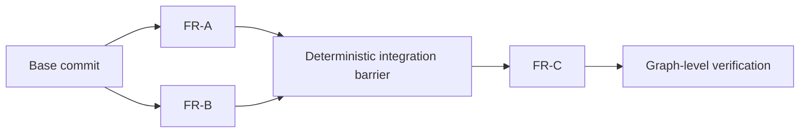
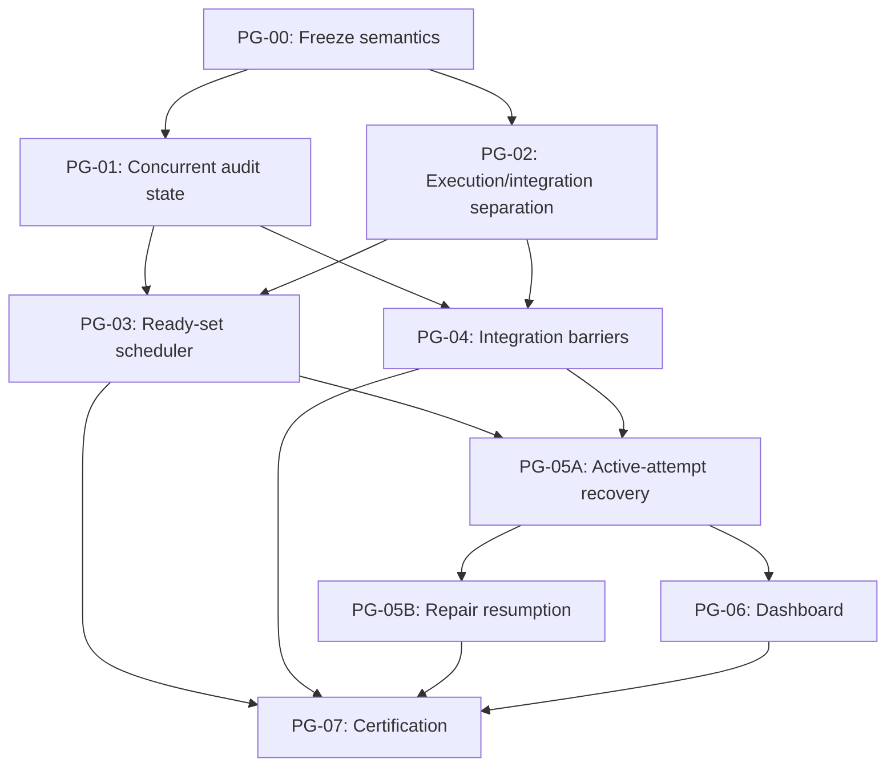

# PlanGraph Parallelization Implementation Plan

Status: proposed

Date: 2026-08-10

## Problem statement

The current PlanGraph implementation is structurally serial. It topologically
sorts nodes, but feeds each completed candidate commit into the next node even
when those nodes are unrelated. Its recovery validation also requires completed
nodes to form a sequential prefix.

Parallel execution therefore requires coordinated changes to scheduling,
candidate-commit lineage, integration ownership, durable audit state, recovery,
and dashboard observability. Wrapping the existing loop in worker threads would
not be safe because sibling completion order would determine repository history.

The existing Git layer is also branch-oriented in a way that prevents this
model. `GitWorktreeTransaction.create()` in
`harness_labs/git_transaction.py` resolves a named local base branch and requires
the base repository to have that branch checked out. A PlanGraph dependency
produces an immutable commit, not a suitable shared checked-out branch. Removing
that global mutable precondition is a foundation of this program, not an
incidental scheduler detail.

## Existing-code impact map

| Concern | Primary implementation | Primary tests |
| --- | --- | --- |
| Graph validation, ordering, launch loop, and result projection | `harness_labs/plan_graph.py` | `tests/test_plan_graph.py` |
| Graph events, checkpoint, final manifest | `harness_labs/plan_graph_audit.py`, `harness_labs/audit.py` | `tests/test_plan_graph_observability.py`, `tests/test_audit.py` |
| Commit-based worktree creation and integration receipts | `harness_labs/git_transaction.py` | `tests/test_git_transaction.py` |
| PlanGraph FeatureRun launch profile | `harness_labs/feature_run.py` | `tests/test_feature_run.py` |
| CLI configuration and incompatible legacy import retirement | `scripts/run_plan_graph.py`, `scripts/import_plan_graph_state.py` | CLI integration tests in `tests/test_plan_graph.py` |
| Liveness and dashboard projection | `harness_labs/run_catalog.py`, `harness_labs/dashboard_server.py` | `tests/test_run_catalog.py`, `tests/test_dashboard_api.py`, `tests/test_dashboard_e2e.py` |
| Ref-retention operations | new `docs/development/plan-graph-operations.md` | Documentation/contract review in PG-07 |

## Target execution model

The execution model must obey these rules:

- A node becomes ready only after all declared dependencies have succeeded.
- Independent ready nodes may run concurrently, bounded by `max_parallelism`.
- Each child runs from a dependency-derived immutable base, never from whichever
  sibling happened to finish first.
- Children return isolated candidate commits and do not merge into a shared
  graph branch.
- PlanGraph is the single integration owner.
- Downstream nodes start only after the required dependency integration commit
  exists.
- Audit mutations remain serialized through the controller even while child
  processes execute concurrently.

## Frozen behavioral rules

The following rules must be frozen before scheduler implementation:

1. Root nodes use the graph's declared base commit.
2. A node with one dependency uses that dependency's integrated commit.
3. Multiple dependency candidates are merged in stable declared-plan order.
4. A merge conflict blocks the integration barrier and is never silently
   resolved.
5. After a child fails or blocks, the scheduler stops dispatching new work but
   permits already-running children to finish and records their output as
   evidence reusable by a later attempt of the same logical graph.
6. A resumed controller may reuse independently completed nodes after validating
   their durable evidence, node-input digest, dependency lineage, verification
   result, and protected Git ref.
7. `max_parallelism=1` remains supported as serial compatibility mode.
8. Graph-level functionality tests run once against the final integrated graph
   commit.
9. Worktree creation for PlanGraph children accepts a verified commit object
   directly and does not depend on the base repository's checked-out branch.
10. A join commit that will feed another node must pass the stable de-duplicated
    union of its direct dependencies' `verification_argv` before the downstream
    node launches. A required join with no such commands is invalid. The final
    terminal-leaf integration is instead covered by graph functionality tests.
11. Every live controller and external child attempt has an attempt-scoped
    liveness lease containing PID, process-start token, and heartbeat. The child
    process—not its launcher thread—owns and updates the lease in its `run_dir`.
    Recovery must probe process identity even when the heartbeat is stale. A
    stale heartbeat with a matching live PID/start token is ambiguous and must
    never be redispatched automatically; only a missing process or mismatched
    start token is eligible for dead-attempt reconciliation. Missing, remote, or
    otherwise ambiguous liveness blocks for operator action.
12. Candidate and integration commits are protected by refs under
    `refs/plan-graph/<logical-graph-id>/<graph-attempt-id>/...`, written with
    compare-and-swap updates. The refs remain for the lifetime of the logical
    graph's audit history and are not silently deleted during failure recovery.
13. Each graph attempt is immutable after finalization, but a failed or blocked
    attempt does not terminalize the logical PlanGraph. Resume creates a new
    correlated attempt, reuses eligible successful nodes, and reruns only the
    selected retry frontier and its dependency descendants. The logical graph
    becomes terminal only when it succeeds or an operator explicitly abandons
    it.
14. The durable checkpoint/event schema, child outcome and manifest evidence
    schema, liveness lease, ref naming, and scheduler/integrator interface are
    frozen in PG-00 before parallel implementation begins.
15. `max_parallelism` counts both executing FeatureRuns and barrier-verification
    jobs. Independent barrier verifications may run concurrently when slots are
    available; Git integration construction itself does not occupy a long-lived
    slot. Construction runs synchronously on the controller under the
    integrator's serialization and bounded Git-command timeouts, and must
    complete before its verification job becomes ready.
16. Repository-mutating control-plane operations are serialized across child
    processes and the controller with `flock` on
    `<git-common-dir>/harness-plan-graph-mutation.lock`. The lock covers
    worktree/branch creation and removal, integration object/ref publication,
    and ref cleanup, but is never held while a FeatureRun or test command
    executes. A crashed holder releases the OS lock automatically. Production
    execution assumes the Git common directory is on a local filesystem where
    advisory `flock` semantics are reliable.
17. Attempt allocation uses an advisory lock under the run root keyed by the
    logical-graph ID at
    `<run-root>/.plan-graph-locks/<sha256(logical-graph-id)>.lock`. While holding
    it, the controller selects the next monotonic attempt number and atomically
    creates `<logical-graph-id>-attempt-<ordinal>` before writing its initial
    descriptor/checkpoint; an existing target is never overwritten.
18. The verified terminal child manifest in the reserved `run_dir` is the
    canonical FeatureRun outcome. Stdout is only a completion notification and
    may duplicate the reservation identity, run directory, and manifest hash;
    any duplicated outcome fields must match the verified manifest. A controller
    may accept success only after verifying the journal/manifest and projecting
    the candidate commit from its bound Git receipts.
19. Ambiguous in-attempt liveness has an explicit audited force-reconcile
    operation. Its directive binds the logical graph, graph attempt, node and
    child-attempt identities, observed liveness snapshot, operator identity,
    reason, and evidence reference. It supersedes the old child attempt and uses
    a new attempt-scoped branch/worktree/ref identity. It must refuse while a
    local PID/start token still proves the child live; the operator must first
    terminate that process. Missing or remotely unverifiable liveness may be
    overridden only by explicit attestation. A late manifest from a superseded
    child is recorded but cannot become the node outcome.
20. PG-00 freezes the versioned schemas, not an unversioned shape forever. Any
    implementation-discovered schema change after PG-00 requires an ADR
    amendment, a protocol/schema version bump, updated compatibility fixtures,
    and an explicit addition of the versioned schema file to the owning PG's
    file list before that PG proceeds.

## Adopted-child and force-reconcile state machine

When a replacement controller finds a reserved child, it follows this durable
state machine rather than relying on the lost stdout pipe:

1. A fresh child-owned lease moves the reservation to `adopted_running`. The
   child continues to consume one execution slot, and the controller watches its
   canonical manifest and lease in `run_dir`.
2. A valid terminal manifest is verified and projected into the node outcome;
   the child is never redispatched.
3. A dead process with no terminal manifest enters normal dead-attempt
   reconciliation. Its recorded failure evidence is the reconciliation event,
   process/lease observations, and any verifiable partial journal or artifacts;
   stdout cannot substitute for the missing canonical manifest.
4. Ambiguous liveness enters `recovery_blocked` and remains there until durable
   evidence resolves it or an operator submits a valid force-reconcile
   directive.
5. Force reconciliation emits the attestation and supersession events before a
   replacement child identity is reserved. Any later output from the superseded
   identity is quarantined as late evidence and ignored for scheduling.

## Failed-attempt resumption model

`logical_graph_id` identifies the durable PlanGraph across repair attempts.
Every execution receives a monotonically increasing `graph_attempt_id`; its
journal, checkpoint, and terminal manifest remain immutable. A failed or blocked
attempt leaves the logical graph in `repairable` state rather than forcing a new
unrelated graph.

A resume directive must identify the blocker evidence and the retry frontier:

- A failed or blocked node defaults to retrying that node.
- A join conflict or join-verification failure requires the operator or recovery
  policy to select at least one direct producer to rerun with the barrier evidence
  included in its bounded context packet.
- A final functionality failure requires an explicit node retry frontier because
  the controller cannot safely guess which producer owns the defect.
- Every descendant of a retried node is invalidated and recomputed.
- Successful nodes outside the invalidated closure are reused only after their
  manifests, input digests, dependency commits, verification receipts, and
  protected refs pass validation.

Resume does not permit acceptance-criteria reinterpretation or plan revision. A
changed approved plan or base commit creates a new logical graph. General
content-addressed caching between unrelated logical graphs remains out of scope.

## FeatureRuns

### PG-00 — Freeze parallel execution semantics

Define the scheduler, integration, failure, and recovery contract before
implementation. Capture the frozen decisions in an architectural decision
record and executable contract tests.

Deliverables:

- PlanGraph integration-ownership rule.
- Dependency-derived base-commit rules.
- Deterministic sibling integration order.
- Failure draining and dispatch-stop rules.
- Conflict and interruption terminal-state rules.
- Serial compatibility behavior.
- Commit-based worktree creation contract and compatibility wrapper for existing
  branch-based FeatureRuns.
- Versioned checkpoint/event, child-evidence, liveness, ref, and
  scheduler/integrator schemas.
- Join-verification selection and failure-attribution rules.
- Logical-graph and immutable-attempt identity schemas, including predecessor
  correlation and monotonic attempt numbering.
- Resume-directive schema containing blocker evidence, selected retry frontier,
  invalidated closure, and node-reuse decisions.
- Retry rule: failed/blocked attempts are resumable within the same logical graph;
  reuse across unrelated logical graphs is not supported.
- Child-owned lease protocol and recovery classification table, including the
  stale-heartbeat/live-process ambiguous state.
- Manifest-canonical child-outcome schema and stdout notification schema.
- Force-reconcile directive, child-supersession, late-outcome quarantine, and
  adopted-child state-transition schemas.
- Global execution-slot accounting for FeatureRuns and barrier verification.
- Repository-mutation lock scope/order and atomic attempt-allocation protocol.

Primary files:

- `docs/decisions/`
- New PlanGraph JSON Schemas under `schemas/` for checkpoint state, child
  outcomes/notifications, integration receipts, resume/force-reconcile
  directives, and attempt allocation.
- `schemas/controller-liveness.schema.json` and
  `schemas/run-descriptor.schema.json` only where their versioned contracts must
  represent child ownership or graph-attempt correlation.
- New contract fixtures under `schemas/examples/`.
- New schema/contract tests; production modules under `harness_labs/` are
  read-only implementation anchors during PG-00 and must not be edited.

Verification:

- Schema fixtures and fake scheduler/integrator implementations exercise roots,
  chains, forks, joins, failures, and interruptions. PG-00 does not implement
  production scheduling or Git integration.
- No acceptance rule depends on child completion timing.
- The contract identifies PlanGraph as the only integration owner.
- Schema fixtures validate every frozen controller/child boundary.
- Tests prove that join verification occurs before downstream dispatch.
- Tests distinguish in-attempt interruption recovery, post-attempt repair resume,
  logical-graph success, and explicit abandonment.
- Liveness truth-table tests prove that a stale heartbeat with a matching process
  identity cannot enter the redispatchable state.
- Manifest fixtures prove stdout alone cannot establish success and that a valid
  manifest projects one unambiguous candidate outcome.
- State-machine fixtures cover adopted completion, dead-child reconciliation,
  ambiguous blocking, force-reconcile supersession, and late-manifest quarantine.
- Two allocation contenders produce distinct monotonic attempts or one explicit
  loser; neither can overwrite the other's directory.

### PG-01 — Make audit state concurrency-capable

Replace serial checkpoint concepts with graph-wide and per-node state.

Required state:

- Distinguish stable `logical_graph_id` from immutable `graph_attempt_id` and
  record the predecessor attempt plus resume reason in the run descriptor.
- Store every attempt as its own canonical audited run under `logs/runs/` so it
  receives an independent terminal manifest and remains dashboard-discoverable.
- Serialize new-attempt allocation for one logical graph and reject concurrent
  resume controllers.
- Replace `current_node_id` with `active_node_ids`.
- Record each node's status, input commit, candidate commit, integrated commit,
  attempt, timestamps, and child reservation identity.
- Record integration barriers, their dependency inputs, and resulting commits.
- Add durable events for dispatch, completion, integration, conflict,
  interruption, cancellation, retry-frontier selection, node invalidation, and
  node reuse.
- Record the frozen child-evidence protocol and attempt-scoped liveness identity
  without treating checkpoint state itself as proof of liveness.
- Ensure every terminal outcome writes a valid manifest.
- Keep journal writes on the controller thread rather than worker threads.
- Retire `scripts/import_plan_graph_state.py`: its sequential-prefix state lacks
  the manifests, dependency lineage, verification receipts, protected refs, and
  attempt identity required for safe reuse. It must not synthesize a valid
  parallel checkpoint from unverifiable legacy commits.

Primary files:

- `harness_labs/plan_graph_audit.py`
- `harness_labs/audit.py`
- `scripts/import_plan_graph_state.py`
- `tests/test_plan_graph_observability.py`
- `tests/test_audit.py`

Verification:

- Direct audit-adapter calls apply `node_started(A)` then `node_started(B)` and
  prove the checkpoint contains both active node IDs; PG-01 does not invoke a
  launcher or implement concurrent scheduling.
- Direct audit-adapter sequences complete A-then-B and B-then-A, then validate
  both event journals and checkpoints with `AuditJournal.verify()`.
- Success, failure, blocked, and interrupted terminal states create readable
  manifests.
- A failed attempt manifest remains immutable while its successor attempt has a
  distinct run directory and a descriptor correlation back to it.
- Two controllers racing to resume one logical graph cannot both reserve the
  next attempt number.
- Reused-node events bind the predecessor manifest, node-input digest,
  dependency lineage, verification receipt, and protected ref.
- Pre-parallel PlanGraph checkpoints are rejected with an explicit
  unsupported-version error. Migration is not part of this bounded program.
- Invoking the retired legacy importer exits with an explicit incompatibility
  message and cannot create a parallel PlanGraph audit directory.

### PG-02 — Separate child execution from integration

Change the launcher contract so every child receives one immutable base commit,
works in its own branch and worktree, and returns an unmerged candidate commit.
The child must not update any shared graph integration ref.

Add a commit-based transaction entry point, such as
`GitWorktreeTransaction.create_at_commit()`, which verifies
`<base_commit>^{commit}` and creates the feature worktree from that object without
requiring a base branch to be checked out or the base repository worktree to be
clean. Preserve `create(base_branch=...)` as the compatibility wrapper for
ordinary FeatureRuns. The PlanGraph launch profile must use the commit-based
entry point with `merge=False`.

`GitWorktreeTransaction` and the PlanGraph integrator must share the frozen
repository-mutation lock helper resolved from Git's common directory. Creation
holds it only across branch/ref validation and `git worktree add`; ordinary child
execution proceeds after releasing it. Lock acquisition is bounded and emits
wait/timeout evidence rather than surfacing an unexplained transient Git lock
failure.

The FeatureRun process must own its `run_dir` heartbeat and terminal manifest.
Its stdout notification is not authoritative. The PlanGraph outcome adapter must
verify the manifest/journal, correlate it to the reservation, and extract
sufficient identity, ancestry, verification, and Git-receipt evidence to prove
that the candidate belongs to the reserved child and descends from the assigned
base.

Primary files:

- `harness_labs/git_transaction.py`
- `harness_labs/feature_run.py`
- `harness_labs/plan_graph.py` launcher request/outcome types only
- `tests/test_git_transaction.py`
- `tests/test_feature_run.py`

Verification:

- Two children launched from one base cannot alter each other's branch or
  worktree.
- Two children launched from different immutable commits succeed concurrently
  while the base repository remains on an unrelated branch.
- A candidate with mismatched reservation or ancestry is rejected.
- A forged successful stdout notification without a valid terminal manifest is
  rejected; a valid manifest remains sufficient when the stdout pipe is absent.
- Conflicting stdout and manifest fields reject the child outcome.
- Killing the parent launcher does not stop the living child from heartbeating
  its own lease and eventually writing its terminal manifest.
- Child completion order cannot change either child's assigned base.
- Child failure leaves graph integration state unchanged.
- Existing branch-based FeatureRun transaction tests continue to pass.
- Two concurrent worktree creations serialize their mutation windows, then both
  succeed with distinct branches; a latch inside the transaction fixture proves
  that the critical sections never overlap.
- A process terminated while holding the advisory lock does not permanently
  prevent a later transaction from acquiring it.

PG-01 and PG-02 are parallelizable because their primary ownership areas are,
respectively, durable state and the child/integration authority boundary. PG-00
must first freeze their shared evidence and liveness schemas. Their only shared
production file is the frozen request/outcome type boundary in
`harness_labs/plan_graph.py`; PG-02 owns that narrow edit and PG-01 consumes the
schema without changing it.

### PG-03 — Implement bounded ready-set scheduling

Replace the sequential loop with a scheduler that tracks nodes in these states:

- `queued`
- `ready`
- `running`
- `waiting_for_integration`
- `succeeded`
- `failed` or `blocked`

Use a bounded executor around the blocking launcher. Dispatch ready nodes in
stable plan order, while ensuring that completion order has no semantic effect.
The standard subprocess launcher must expose an attempt-scoped process handle
for the controller's reservation record, while the launched FeatureRun process
creates and heartbeats its own lease inside its `run_dir`. The controller thread
must never impersonate child liveness. An arbitrary injected launcher remains
usable for in-process tests but cannot claim recoverable external liveness.
PG-03 owns the `PlanGraph` wiring to the frozen integration-provider interface;
PG-04 implements that provider without independently editing the scheduler.

Add:

- `PlanGraph(max_parallelism=N)`.
- CLI option `--max-parallelism`.
- Validation that `N >= 1`.
- Submission-time validation in `PlanGraph.validate()` that every interior join
  has a non-empty stable union of its direct dependencies' `verification_argv`;
  reject the graph before creating an audit run or launching any child. A graph
  with multiple terminal leaves likewise requires graph functionality tests for
  its final integration.
- An initial default of `1` for compatibility and controlled rollout.
- One ready-work queue containing child-execution and barrier-verification jobs;
  both consume the same global execution-slot budget.
- Concurrent dispatch of independent barrier verifications, subject to the same
  dependency and slot rules as FeatureRuns.

Primary files:

- `harness_labs/plan_graph.py`
- `scripts/run_plan_graph.py`
- `tests/test_plan_graph.py`

Verification:

- A latch-controlled launcher proves two independent roots reach `running`
  before either is released; wall-clock thresholds are not used.
- A dependent node never starts before its dependencies and integration barrier
  complete.
- An interior join with no derived verification command, or a multi-leaf graph
  with no final functionality test, fails `validate()` and invokes neither the
  launcher nor integrator.
- Active child count never exceeds the configured limit.
- `max_parallelism=1` preserves serial execution.
- A failure stops new dispatch while already-running siblings drain and are
  recorded.
- A live matching child lease suppresses duplicate dispatch; a stale lease enters
  reconciliation only when process identity proves it dead. A stale heartbeat
  with a matching live process, plus missing or remote liveness, blocks safely.
- With `max_parallelism=2`, one FeatureRun plus one independent barrier
  verification fills both slots and a third ready job remains queued.
- Two independent barrier verifications may occupy both slots concurrently;
  barrier verification never exceeds the global limit.

### PG-04 — Add deterministic integration barriers

Introduce a dedicated integration component outside the scheduler. It must:

- Start from the required common base without changing the user's checked-out
  branch or worktree.
- Perform sequential pairwise merges in stable declared-plan order; octopus
  merges are not used.
- Use Git plumbing (`merge-tree --write-tree` followed by `commit-tree`) or an
  equivalently isolated mechanism so conflicts are detected without mutating the
  base repository. If porcelain merge is retained, invoke it with rerere and
  rerere autoupdate explicitly disabled.
- Acquire the shared repository-mutation lock only while writing integration
  objects and publishing CAS-protected refs; release it before verification.
- Record exact inputs and the resulting commit.
- Protect each child candidate and join result with compare-and-swap refs under
  `refs/plan-graph/<logical-graph-id>/<graph-attempt-id>/nodes/...` and
  `refs/plan-graph/<logical-graph-id>/<graph-attempt-id>/joins/...` before
  releasing its worktree.
- Reuse a verified integration commit during recovery when its inputs match.
- Produce structured conflict evidence and leave repository state clean after a
  failed merge.
- Before releasing a nonterminal join to a downstream node, check commit/tree
  ancestry and run the frozen join-verification command set against the join
  commit in an isolated checkout. Verification failure is attributed to the join
  barrier, not to the downstream FeatureRun.

If the graph has multiple terminal leaves, use the same mechanism to produce one
final candidate before graph-level verification.

Determinism here means stable ordered inputs and an equivalent resulting tree.
The implementation must not promise that independently recreated merge commits
have the same SHA unless author/committer metadata is also frozen. Recovery
normally reuses the protected recorded commit rather than recreating it.

Primary files:

- New bounded component `harness_labs/plan_graph_integration.py`
- `harness_labs/git_transaction.py` shared Git validation helpers only
- New `tests/test_plan_graph_integration.py`

Verification:

- Reversed child-completion order yields the same integration sequence.
- Reversed child-completion order yields the same joined tree even if commit
  metadata differs.
- Disjoint sibling changes merge successfully.
- Conflicting sibling changes block the graph with file-level evidence.
- A diamond graph integrates each required candidate exactly once.
- Final functionality tests receive the integrated commit rather than the last
  child commit to finish.
- A join's verification commands finish successfully before its downstream
  launch event; a failing command blocks the join and no downstream launch is
  emitted.
- Independent join-verification jobs overlap when the scheduler grants separate
  slots, while their short Git publication critical sections remain serialized.
- Protected refs survive worktree removal and make every audited commit
  reachable to `git fsck`.

PG-03 and PG-04 may run in parallel after PG-01 and PG-02, provided PG-00 freezes
their scheduler/integrator interface.

### PG-05A — Recover an interrupted active attempt

Remove the sequential-prefix recovery requirement for a nonterminal attempt. On
controller restart, PlanGraph must:

- Validate every successful node independently, including dependency closure,
  recorded input commit, verification receipt, and protected ref.
- Reuse verified candidate and integration commits within the same attempt.
- Reconcile formerly running children from their durable manifests and
  child-owned leases.
- Adopt a child with a fresh matching lease, count it against
  `max_parallelism`, and watch its lease plus canonical manifest at a bounded
  polling interval. Loss of the original stdout pipe is irrelevant.
- Probe PID/start-token identity even when a heartbeat is stale. Reconcile as
  dead only when the process is absent or its start token differs; block on a
  live process with a stale heartbeat, missing lease, remote host, or any other
  ambiguous state.
- Use attempt-scoped branch, worktree, and ref names so a reconciled retry cannot
  collide with an earlier child attempt.
- Reconstruct the ready work queue and occupied execution slots from checkpoint
  and reconciled state.
- Never infer completion only from an existing branch or worktree.
- Expose an audited force-reconcile CLI for ambiguous children. The command must
  require exact graph/node/child identities, operator identity, reason, and an
  evidence reference; record the observed liveness snapshot; refuse a proven
  live local process; supersede the prior child attempt before replacement; and
  quarantine any late prior manifest.

The existing `harness-controller-liveness/1` vocabulary in
`harness_labs/run_catalog.py` should be reused or versioned rather than replaced
with a second unrelated PID-file convention.

Primary files:

- `harness_labs/plan_graph.py`
- `harness_labs/plan_graph_audit.py`
- `harness_labs/run_catalog.py` shared liveness classification
- `scripts/run_plan_graph.py`
- `tests/test_plan_graph.py`
- `tests/test_plan_graph_observability.py`

Verification:

- Recover after one of two parallel roots succeeds.
- Recover after both roots succeed but before their join is committed.
- Recover after the join without rerunning its children.
- Reject corrupt or mismatched child evidence.
- Repeated in-attempt recovery is idempotent.
- A fresh PID with a mismatched process-start token is dead/reconcilable.
- A stale heartbeat with a matching PID/start token is ambiguous and cannot
  cause duplicate child dispatch.
- Missing or remote liveness cannot cause duplicate child dispatch.
- A helper child held alive after its original launcher exits is adopted by a
  replacement controller; after release it writes its manifest and the graph
  continues without redispatch.
- Force reconcile refuses a locally proven live child, accepts an explicit
  attestation for missing or remotely unverifiable liveness, and emits bound
  attestation and supersession events before replacement dispatch.
- A terminal manifest arriving after supersession is retained as late evidence
  but cannot alter node state or the replacement reservation.

### PG-05B — Resume a finalized failed or blocked attempt

Build post-terminal repair resumption on PG-05A's evidence validation and
liveness rules. PlanGraph must:

- Atomically allocate a new attempt under the same `logical_graph_id` using the
  frozen run-root allocation lock and exclusive directory creation protocol.
- Validate the resume directive, compute the selected retry frontier's descendant
  closure, and reject reuse for every invalidated node.
- Import only eligible predecessor nodes through explicit reuse receipts; never
  copy checkpoint state wholesale into the successor attempt.
- Preserve the predecessor manifest unchanged and correlate the successor
  descriptor and initial events to it.
- Reject concurrent resume allocation, plan-digest changes, and base-commit
  changes.

The CLI must expose an explicit resume operation accepting a logical graph ID,
one or more retry-frontier node IDs where required, and a blocker/remediation
evidence reference. Abandonment is a separate explicit operation; ordinary
failure never implies abandonment.

Primary files:

- `harness_labs/plan_graph.py`
- `harness_labs/plan_graph_audit.py`
- `scripts/run_plan_graph.py`
- `tests/test_plan_graph.py`
- `tests/test_plan_graph_observability.py`

Verification:

- Resume after a finalized node failure reuses an independent successful sibling,
  retries the failed node, and invalidates only its descendants.
- Resume after a join conflict rejects an empty retry frontier and succeeds when
  a direct producer is selected for rerun with the conflict evidence.
- Resume after final functionality failure requires an explicit retry frontier.
- Two concurrent resume requests cannot allocate the same attempt or overwrite
  an existing attempt directory.
- A changed plan digest or base commit is rejected as a resume and must start a
  new logical graph.
- Explicit abandonment terminalizes the logical graph without altering any
  attempt manifest.

PG-05B is required for PG-07 and release. The split bounds ownership and creates
a clean integration checkpoint; it does not defer repair resumption to a later
version.

### PG-06 — Add dashboard and operator observability

Expose:

- Logical graph status (`running`, `repairable`, `succeeded`, or `abandoned`) and
  its ordered immutable attempt history.
- Ready, running, completed, blocked, and dependency-blocked nodes.
- Configured concurrency, current concurrency, and peak observed parallelism.
- Each node's assigned base and candidate commit.
- Integration barriers and conflicts.
- Critical path, elapsed wall time, summed child time, and integration latency.
- Recovery state and the last durable checkpoint.
- Adopted-child state, ambiguous-liveness reason, superseded child attempts, and
  whether an audited force-reconcile directive is required. The dashboard may
  present the CLI parameters but must not silently perform the attestation.

Primary files:

- `harness_labs/run_catalog.py`
- `harness_labs/dashboard_server.py`
- New `docs/development/plan-graph-operations.md`
- `tests/test_run_catalog.py`
- `tests/test_dashboard_api.py`
- `tests/test_dashboard_e2e.py`

Verification:

- The dashboard shows multiple active nodes concurrently.
- Completed parallel nodes remain visible after restart.
- A failed attempt remains visible while the logical graph offers a resumable
  state and identifies the required retry-frontier input.
- Reused nodes and invalidated descendants are visibly distinguished in the
  successor attempt.
- An adopted child remains shown as running and consumes a displayed slot even
  though its original launcher/controller is gone.
- An ambiguous child displays the observed liveness evidence and exact
  force-reconcile inputs; a superseded child's late manifest is shown only as
  quarantined evidence.
- Join conflicts identify the affected nodes and files.
- Every terminal run is discoverable through its canonical manifest.
- Fixture events containing two active node IDs render both as running without
  inheriting one undifferentiated parent liveness state.
- The operations document states that PlanGraph refs are not automatically
  pruned. Manual deletion is safe only when the corresponding logical graph's
  audit evidence is intentionally retired under repository retention policy;
  otherwise operators must preserve the refs.
- The operations document states that repository mutation locking requires a
  local Git common directory; network-filesystem repositories are refused unless
  a separately validated locking backend is introduced.
- The operations document also declares a run root shared across hosts
  unsupported in v1. A remote-host lease is therefore treated as anomalous,
  blocks automatically, and may proceed only through the audited attestation
  path rather than implying distributed-worker support.

PG-06 depends on PG-05A's final liveness projection as well as PG-03's scheduler
vocabulary and PG-04's barrier records. PG-06 and PG-05B may run in parallel
after PG-05A completes because their production-file ownership is disjoint.

### PG-07 — End-to-end certification

Exercise these graph shapes and failure modes:

- Two independent roots.
- Linear chain.
- Fork and join.
- Diamond.
- A wide graph exceeding the concurrency limit.
- Two independent joins whose verification jobs are deliberately long relative
  to their producers.
- Parallel child failure.
- Sibling merge conflict.
- Controller interruption and resume.
- Controller loss while a child remains live, followed by manifest-based
  adoption and completion without redispatch.
- Missing/ambiguous child liveness followed by audited force reconciliation and
  late-manifest quarantine.
- Terminal failed attempt, targeted repair resume, and selective node reuse.
- Final functionality failure requiring an operator-selected retry frontier.
- Explicit logical-graph abandonment.

Release gates:

- The event/checkpoint record proves independent nodes were simultaneously
  running; no release assertion depends on wall-clock timing thresholds.
- No dependency starts early.
- Peak concurrency never exceeds the configured limit.
- Completion timing cannot alter candidate lineage or integration order.
- A successful graph produces one verified final candidate commit.
- Every terminal outcome has a valid manifest.
- Serial mode remains compatible.
- Every candidate and integration commit referenced by the audit is reachable
  through its protected PlanGraph ref.
- No live or ambiguously live child is dispatched twice during recovery.
- A valid terminal child manifest is canonical when stdout is lost; stdout alone
  can never establish success.
- Every force reconciliation binds an operator attestation and supersedes the
  exact old child identity before replacement dispatch.
- A fixable blocker can be resumed without rerunning validated nodes outside the
  invalidated descendant closure.
- Every reused node has a complete reuse receipt; tampering with any bound input
  makes it ineligible.
- Latch-controlled tests prove independent barrier verifications share the
  global slot budget and may overlap without using timing thresholds.
- Certification reports child execution time, barrier-verification execution
  time, slot-wait time, integration latency, serial-baseline elapsed time, and
  parallel elapsed time for the same fixed benchmark graph. These measurements
  are reported as efficiency evidence rather than converted into a flaky CI
  timing assertion.

Primary verification files:

- `tests/test_plan_graph.py`
- `tests/test_plan_graph_integration.py`
- `tests/test_plan_graph_observability.py`
- `tests/test_run_catalog.py`
- `tests/test_dashboard_e2e.py`

## Implementation dependency graph

The genuinely parallel implementation lanes are:

1. PG-01 and PG-02 after PG-00.
2. PG-03 and PG-04 after PG-01 and PG-02 converge.
3. PG-05A after the scheduler and integration barrier converge.
4. PG-05B and PG-06 in parallel after PG-05A.
5. PG-07 as the final integrated release gate; repair resumption remains a
   mandatory release dependency.

## Scope boundaries

This program changes PlanGraph orchestration only. It must not introduce a
generalized workflow engine, generalized snapshot framework, unrelated FeatureRun
phase changes, or child-agent internal parallelism. The required capability is
bounded DAG scheduling with isolated child execution, deterministic integration,
durable recovery, and observable evidence.

V1 also excludes candidate caching between unrelated logical graphs, reuse after
plan or base-commit changes, automatic cleanup of audited Git refs, arbitrary
distributed-worker leases, and speculative downstream execution. Those
capabilities would materially expand the authority and failure model and require
separate plans.
