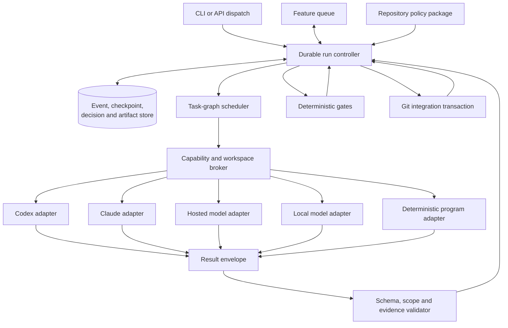

# Platform-agnostic autonomous development workflow

Status: proposed

## Purpose

This note proposes a platform-neutral successor to the Claude
`implement-v13`/`serial-implement` workflow. The target preserves its strongest
properties:

- autonomous execution from dispatch to integration or a genuine blocker;
- isolated Git worktrees and guarded integration;
- durable crash recovery and queue resumption;
- independent planning, implementation, verification, review, and integration;
- evidence-backed stopping rather than agent self-report;
- complete, structured audit history;
- bounded hierarchy, retries, permissions, time, and cost;
- enough adapter flexibility to use Codex, Claude, hosted model APIs, local model
  servers, or deterministic programs.

The successor must not encode required lifecycle behavior only in a prompt.
Prompts may guide judgment; executable controllers must own state transitions,
budgets, retries, handoffs, gates, and terminal settlement.

## Design thesis

Separate the workflow into three concerns:

1. **Policy:** repository-owned declarations of what is allowed and what evidence
   is required.
2. **Control:** a deterministic state machine that schedules work, validates
   results, applies policy, and persists every transition.
3. **Execution:** replaceable providers that perform one bounded invocation using
   a model, an agent runtime, a script, or a human-approved external action.

An execution provider never owns the global lifecycle. It receives a contract,
returns a result, and may recommend a next action. Only the controller can
promote evidence, advance the run, retry an attempt, or integrate a change.

## Target architecture



### 1. Repository policy package

Version a portable policy package with:

- lifecycle and permitted state transitions;
- role definitions and separation requirements;
- task, context, result, finding, decision, event, checkpoint, verification,
  integration, and queue schemas;
- acceptance criteria and the gates that discharge each criterion;
- permission profiles and capability requirements;
- retry, escalation, timeout, fan-out, depth, and cost limits;
- Git isolation, commit, merge, conflict, and base-advancement policy;
- redaction, artifact retention, and logging policy;
- provider-selection constraints expressed as capabilities rather than model
  product names.

The package is declarative input to the controller. Provider prompts may quote
relevant policy, but prompt text is not the enforcement point.

### 2. Durable controller

Implement the lifecycle as an executable transition system:

```text
orient -> plan -> implement -> verify -> review -> integrate -> report
   |        |         |          |         |          |
   +--------+---------+----------+---------+----------+--> blocked/failed
                                  blocked/failed --> recovering --> prior phase
```

For every transition, the controller must:

1. read the current checkpoint and verify its monotonic revision;
2. validate phase exit predicates against stored evidence;
3. select the next task or terminal outcome;
4. atomically append the transition event and replace the checkpoint;
5. assign a verifiably live owner to every nonterminal task;
6. reject stale results whose attempt, repository revision, or context hash no
   longer matches.

The controller is the sole checkpoint writer. Workers emit proposed state changes
inside results; they do not edit lifecycle state directly.

### 3. Task-graph scheduler

Represent each phase as a bounded directed acyclic graph of tasks and gates.
Dependencies, writable paths, and role-separation requirements determine which
tasks may run concurrently. The scheduler must:

- serialize overlapping write sets unless an explicit integration owner exists;
- cap hierarchy depth, fan-out, retries, wall time, tokens, and tool calls;
- issue unique attempt and lease identifiers;
- distinguish task readiness from executor liveness;
- retry only after recording a changed hypothesis, input, provider, or method;
- preserve blocked tasks rather than silently skipping them;
- allow queue-level serial execution to reuse the same task/run protocol.

### 4. Provider adapters

Define a narrow adapter interface rather than a lowest-common-denominator prompt.
Each adapter advertises a capability manifest, for example:

- structured-output fidelity;
- tool calling;
- filesystem and shell access;
- patch application;
- browser or UI control;
- context-window and output limits;
- streaming, cancellation, and resume support;
- sandbox and network controls;
- model identity and reasoning controls;
- usage and cost telemetry.

The scheduler matches task requirements to capabilities. Examples:

- a Codex adapter may launch `codex exec` in an isolated worktree;
- a Claude adapter may invoke Claude Code with an equivalent permission profile;
- an OpenAI-compatible adapter may call a hosted API and expose tools through the
  broker;
- a local adapter may call an Ollama, vLLM, llama.cpp, or other local endpoint;
- a program adapter may run tests, linters, schema validators, or Git checks
  without a model.

If a provider cannot meet a required capability, dispatch fails before execution.
The adapter must not simulate a capability or weaken the task contract.

### 5. Capability and workspace broker

Place tools behind a broker controlled by the task's authority:

- create and identify the dedicated worktree and feature branch;
- expose only approved writable paths and ephemeral scratch;
- allowlist commands, network destinations, secrets, and external mutations;
- record command, exit status, duration, and bounded stdout/stderr receipts;
- enforce cancellation and timeout independently of the model;
- hash produced patches and artifacts;
- prevent reviewers from mutating the candidate unless their task explicitly
  grants repair authority.

Credentials remain broker-managed and are never embedded in prompts, context
packets, logs, or model results.

### 6. Evidence and artifact store

Use an append-only event stream plus atomically replaced checkpoint:

```text
logs/runs/<run-id>/
├── events.jsonl
├── decisions.jsonl
├── checkpoint.json
├── summary.json
└── artifacts/
```

Every artifact has a media type, byte size, SHA-256 digest, producer attempt, and
evidence classification. Store concise model outputs and decisions, not private
reasoning transcripts. Required evidence must not live only in a temporary
directory or an agent message.

### 7. Verification and review

Treat verification as typed gates, not prose conclusions.

- Deterministic gates run through program adapters and produce machine-readable
  receipts.
- Acceptance criteria map explicitly to one or more gates.
- A verifier cannot satisfy a gate by claiming that it ran.
- Reviewers return structured findings with evidence, affected contract, severity,
  confidence, proposed remedy, and remedy cost.
- A finding ledger gives every finding a stable identity and disposition history.
- Fix tasks and re-review tasks are separate attempts.
- The controller, not the builder, decides whether required gates are satisfied.
- Material implementation and final review use logically independent executors or
  explicitly record why separation was waived for low-risk work.

Review scores may prioritize work, but a threshold must not close a proven
security, privacy, data-loss, correctness, or acceptance-contract violation.

### 8. Git integration transaction

Integration is a first-class controller operation:

1. record base branch, base commit, candidate branch, and candidate commit;
2. verify candidate scope and required gates;
3. read the current base head and detect advancement;
4. reconcile or revalidate against the new head;
5. require a clean target checkout and an allowed merge strategy;
6. refuse semantic conflict resolution without an explicit decision;
7. merge without rewriting history;
8. read back the resulting base commit and prove candidate ancestry;
9. only then mark the feature complete and clean up its worktree.

A missing checkpoint is not completion proof. The queue acknowledges success only
after reading a valid integration receipt and final run result.

### 9. Serial and higher-level composition

`serial-implement` becomes a queue controller that creates one feature run at a
time. It uses the same event, lease, result, and acknowledgment contracts as the
feature controller. The queue:

- is atomically versioned with a monotonic revision;
- distinguishes pending, running, blocked, failed, integrated, and reported;
- verifies the feature's integration receipt before advancing;
- stops on a blocker by default;
- may later allow dependency-aware continuation only when repository policy
  explicitly proves that later features are independent.

## The basic compositional unit

The basic unit is **not an Agent**. It is a **Task Attempt**: one immutable,
bounded invocation of a task contract against a specific context, repository
snapshot, authority grant, executor, and budget.

An **Agent** is one possible executor of a Task Attempt. A test runner, schema
validator, Git integrator, browser driver, hosted model, or local model can execute
the same abstraction. Treating the agent as the unit would couple workflow
semantics to a provider's session model, memory, tools, and nesting rules.

The composition hierarchy is:

```text
Queue
└── Run
    └── Phase
        └── Task
            └── Task Attempt
```

- A **Task** is the stable logical obligation and may have several attempts.
- A **Task Attempt** is the atomic unit of dispatch, evidence, retry, and audit.
- A **Gate** is a controller-evaluated predicate over one or more attempt results
  and stored artifacts.
- A **Phase** is complete only when its required tasks and gates are satisfied.

### Task Attempt inputs

Inputs are immutable after dispatch and content-addressed where practical:

| Input | Purpose |
|---|---|
| Identity | `run_id`, `task_id`, `attempt_id`, parent task, phase, role |
| Objective | One bounded outcome expressed independently of a provider |
| Acceptance contract | Criteria assigned to this task and required evidence |
| Scope | Allowed files, symbols, services, and explicit exclusions |
| Repository snapshot | Repository identity, worktree, branch, base and candidate commits |
| Context packet | Ordered source references, hashes, upstream decisions, known uncertainty, deliberate exclusions |
| Authority | Writable paths, tools, network, secrets, external side effects, prohibited actions |
| Capability requirements | Structured output, shell, browser, patching, context size, or other required abilities |
| Execution profile | Role instructions and a capability class such as `strong_planner` or `read_only_reviewer`, not necessarily a vendor model name |
| Dependencies | Validated upstream result and artifact references |
| Budget | Wall time, tokens, tool calls, retries, output bytes, and monetary ceiling |
| Output contract | Result schema, artifact requirements, and evidence format |
| Stop contract | Success, blocked, retryable failure, terminal failure, cancellation, and escalation conditions |
| Idempotency data | Input digest, attempt sequence, lease, and stale-result rejection keys |

The complete input is hashed. A retry with changed input is a new attempt; a
verbatim replay retains a link to the original attempt and must not create duplicate
external effects.

### Task Attempt outputs

Every executor returns a schema-valid **Result Envelope**:

| Output | Purpose |
|---|---|
| Identity | Exact run, task, attempt, executor, adapter, and input digest |
| Terminal status | `succeeded`, `blocked`, `retryable_failure`, `terminal_failure`, or `cancelled` |
| Claims | Concise assertions, each marked observed or inferred |
| Evidence | Artifact and receipt references supporting each material claim |
| Changes | Patch or commit reference, files touched, and write-scope declaration |
| Commands and tools | Structured invocation receipts with exit status and duration |
| Verification | Checks executed, results, coverage of assigned criteria, and omissions |
| Findings | Stable finding records for review or investigation tasks |
| Decisions | Material alternatives, choice, rationale, consequences, and evidence |
| Risks and blockers | Unresolved issues, missing authority or context, and exact escalation need |
| Usage | Tokens, time, tool calls, retries, output size, and provider-reported cost |
| Recommendation | Suggested next transition or follow-up task; advisory only |
| Output digest | Hash binding the envelope to its artifacts |

An executor may report that its assigned task succeeded. It cannot declare the
phase, feature, queue entry, or run complete. The controller validates schema,
identity, scope, evidence, and gates before promoting the result.

### Attempt lifecycle

```text
created
  -> leased
  -> dispatched
  -> running
  -> result_received
  -> validated
  -> accepted

result_received -> rejected_stale
result_received -> rejected_invalid
running -> timed_out/cancelled
validated -> retry_scheduled/blocked/failed
```

Only the controller mutates lifecycle state. The adapter reports liveness and
results; it does not write the checkpoint.

## Translating the Claude workflow

| Claude workflow mechanism | Platform-agnostic form |
|---|---|
| Large command Markdown | Declarative workflow spec plus executable controller |
| Claude subagent | Provider-backed Task Attempt |
| Agent final text | Result Envelope |
| Disk-bus reviewer report | Hashed finding artifact referenced by a result |
| Checkpoint edited by several agents | Controller-owned atomic checkpoint |
| `GROUP_DONE:`/`BLOCKED:` strings | Typed terminal attempt status |
| Prompt-enforced score and cycle rules | Controller policy and finding ledger |
| `bypassPermissions` | Explicit capability grant enforced by broker |
| Phase-scoped fresh orchestrator | New task attempts with minimal context packets |
| `caffeinate` and mtime polling | Runtime supervisor heartbeat, lease, timeout, and cancellation |
| Worktree scan and merge shell recipe | Git workspace and integration services |
| Run manifest on base as done token | Signed or hashed integration receipt plus final result |
| Serial queue JSON edited in place | Revisioned queue state owned by queue controller |

## Delivery strategy

Follow an execution-first sequence.

### Stage 1: One uninterrupted production slice

Implement one repository, one feature, one provider adapter, and the real path:

```text
dispatch -> isolated worktree -> plan -> implement -> deterministic verification
-> independent review -> guarded integration -> report -> queue acknowledgment
```

Use deterministic stub model responses in the integration test, but exercise the
real CLI, controller, adapter interface, worktree, artifacts, gates, checkpoint,
integration receipt, and queue. Do not build generalized recovery or a large phase
catalog before this path works.

### Stage 2: Contract and boundary hardening

Add schemas, capability enforcement, immutable context packets, write-scope
validation, independent review, finding disposition, budget enforcement, and
base-advancement revalidation. Add a second adapter to prove portability without
changing workflow semantics.

### Stage 3: Recovery and resumption

Add atomic checkpoint recovery, stale-result rejection, leases, cancellation,
retry classification, controller restart, orphaned-integration recovery, and queue
resume. Test crashes at every state boundary against the real production entrypoint.

### Stage 4: Provider diversity

Add Codex, Claude, hosted API, and local-model adapters incrementally. Maintain a
versioned capability conformance suite. Compare providers on identical Task Attempt
fixtures and end-to-end feature suites; never weaken acceptance gates to accommodate
a provider.

### Stage 5: Optimization

Only after correctness:

- tune context packets and phase boundaries;
- choose providers by measured capability, latency, and cost;
- parallelize independent tasks;
- cache deterministic gate results bound to exact content hashes;
- introduce risk-based review budgets while preserving hard-boundary checks;
- compare changes on an accuracy-and-efficiency Pareto frontier.

## Initial acceptance criteria

The first implementation of this strategy is acceptable only when:

1. the real production CLI completes one feature without another operator message;
2. every nonterminal checkpoint has a live or durably resumable controller owner;
3. a provider can be replaced without changing lifecycle or result semantics;
4. all Task Attempt inputs and outputs validate against versioned schemas;
5. unauthorized writes and stale results are rejected;
6. deterministic failed gates prevent integration;
7. implementation and material review are independently executed;
8. interruption resumes from the last verified checkpoint;
9. integration proves the resulting base commit contains the candidate;
10. the queue advances only after the integration receipt and final result validate;
11. events, decisions, artifacts, metrics, and failure evidence are complete and
    contain no secrets;
12. the same production path passes with deterministic stub execution and at least
    two real provider adapters.

## Recommended first artifact

Before adding more workflow phases, define and implement:

1. `task.schema.json`;
2. `task-attempt.schema.json`;
3. `context-packet.schema.json`;
4. `result-envelope.schema.json`;
5. an `ExecutorAdapter` interface;
6. a controller that dispatches one Task Attempt, validates its Result Envelope,
   stores its artifacts, and advances one real production transition.

That vertical slice establishes the correct compositional boundary. Everything
else—agents, phases, queues, review loops, recovery, and provider routing—then
composes around the same audited unit.
